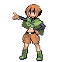
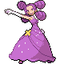

# Trainer Rosters

### Generic Trainers

| Trainer | P1 | P2 | P3 | P4 | P5 | P6 |
|:-------:|:--:|:--:|:--:|:--:|:--:|:--:|
|  Leader Roark |  Sudowoodo Lv. 81 |  Probopass Lv. 81 |  Golem Lv. 81 |  Aerodactyl Lv. 81 |  Tyranitar Lv. 81 |  Rampardos Lv. 82 |
|  Leader Gardenia |  Cherrim Lv. 81 |  Tangrowth Lv. 81 |  Bellossom Lv. 81 |  Torterra Lv. 81 |  Breloom Lv. 81 |  Roserade Lv. 82 |
|  Leader Fantina |  Drifblim Lv. 81 |  Dusknoir Lv. 81 |  Banette Lv. 81 |  Spiritomb Lv. 81 |  Gengar Lv. 81 |  Mismagius Lv. 82 |
|  Leader Maylene |  Medicham Lv. 82 |  Machamp Lv. 82 |  Infernape Lv. 82 |  Toxicroak Lv. 82 |  Gallade Lv. 82 |  Lucario Lv. 83 |
|  Leader Wake |  Quagsire Lv. 81 |  Gyarados Lv. 81 |  Poliwrath Lv. 81 |  Ludicolo Lv. 81 |  Sharpedo Lv. 81 |  Floatzel Lv. 82 |
|  Leader Byron |  Bronzong Lv. 81 |  Magnezone Lv. 81 |  Steelix Lv. 81 |  Forretress Lv. 81 |  Aggron Lv. 81 |  Bastiodon Lv. 82 |
|  Leader Candice |  Abomasnow Lv. 81 |  Weavile Lv. 81 |  Glaceon Lv. 81 |  Walrein Lv. 81 |  Mamoswine Lv. 81 |  Froslass Lv. 82 |
|  Leader Volkner |  Jolteon Lv. 81 |  Raichu Lv. 81 |  Rotom Lv. 81 |  Rotom Lv. 81 |  Luxray Lv. 81 |  Electivire Lv. 82 |
|  PKMN Trainer Cheryl |  Wobbuffet Lv. 81 |  Snorlax Lv. 81 |  Drifblim Lv. 81 |  Hariyama Lv. 81 |  Wailord Lv. 81 |  Blissey Lv. 82 |
|  PKMN Trainer Mira |  Togekiss Lv. 81 |  Gengar Lv. 81 |  Exeggutor Lv. 81 |  Magnezone Lv. 81 |  Porygon-Z Lv. 81 |  Alakazam Lv. 82 |
|  PKMN Trainer Riley |  Absol Lv. 81 |  Ursaring Lv. 81 |  Metagross Lv. 81 |  Salamence Lv. 81 |  Slaking Lv. 81 |  Lucario Lv. 82 |
|  PKMN Trainer Marley |  Starmie Lv. 81 |  Electrode Lv. 81 |  Sceptile Lv. 81 |  Crobat Lv. 81 |  Weavile Lv. 81 |  Arcanine Lv. 82 |
|  PKMN Trainer Buck |  Torkoal Lv. 81 |  Shuckle Lv. 81 |  Umbreon Lv. 81 |  Dusknoir Lv. 81 |  Cloyster Lv. 81 |  Claydol Lv. 82 |
|  PKMN Trainer Barry |  Staraptor Lv. 84 |  Heracross Lv. 84 |  Snorlax Lv. 84 |  Azumarill Lv. 84 |  Arcanine Lv. 84 |  Torterra Lv. 85 |
|  PKMN Trainer Barry |  Staraptor Lv. 84 |  Heracross Lv. 84 |  Snorlax Lv. 84 |  Azumarill Lv. 84 |  Breloom Lv. 84 |  Infernape Lv. 85 |
|  PKMN Trainer Barry |  Staraptor Lv. 84 |  Heracross Lv. 84 |  Snorlax Lv. 84 |  Breloom Lv. 84 |  Arcanine Lv. 84 |  Empoleon Lv. 85 |
|  PKMN Trainer Dawn |  Alakazam Lv. 83 |  Mamoswine Lv. 83 |  Clefable Lv. 83 |  Lopunny Lv. 83 |  Vaporeon Lv. 83 |  Torterra Lv. 84 |
|  PKMN Trainer Dawn |  Alakazam Lv. 83 |  Mamoswine Lv. 83 |  Clefable Lv. 83 |  Lopunny Lv. 83 |  Jolteon Lv. 83 |  Infernape Lv. 84 |
|  PKMN Trainer Dawn |  Alakazam Lv. 83 |  Mamoswine Lv. 83 |  Clefable Lv. 83 |  Lopunny Lv. 83 |  Flareon Lv. 83 |  Empoleon Lv. 84 |
|  PKMN Trainer Lucas |  Alakazam Lv. 83 |  Mamoswine Lv. 83 |  Granbull Lv. 83 |  Lickilicky Lv. 83 |  Vaporeon Lv. 83 |  Torterra Lv. 84 |
|  PKMN Trainer Lucas |  Alakazam Lv. 83 |  Mamoswine Lv. 83 |  Granbull Lv. 83 |  Lickilicky Lv. 83 |  Jolteon Lv. 83 |  Infernape Lv. 84 |
|  PKMN Trainer Lucas |  Alakazam Lv. 83 |  Mamoswine Lv. 83 |  Granbull Lv. 83 |  Lickilicky Lv. 83 |  Flareon Lv. 83 |  Empoleon Lv. 84 |
|  Commander Mars |  Crobat Lv. 81 |  Yanmega Lv. 81 |  Bronzong Lv. 81 |  Electivire Lv. 81 |  Kangaskhan Lv. 81 |  Purugly Lv. 82 |
|  Commander Jupiter |  Bronzong Lv. 81 |  Sableye Lv. 81 |  Crobat Lv. 81 |  Tangrowth Lv. 81 |  Gastrodon Lv. 81 |  Skuntank Lv. 82 |
|  Commander Saturn |  Bronzong Lv. 81 |  Octillery Lv. 81 |  Alakazam Lv. 81 |  Rhyperior Lv. 81 |  Magmortar Lv. 81 |  Toxicroak Lv. 82 |
|  Galactic Boss Cyrus |  Crobat Lv. 83 |  Honchkrow Lv. 83 |  Houndoom Lv. 83 |  Gyarados Lv. 83 |  Magnezone Lv. 83 |  Weavile Lv. 84 |

