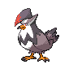
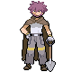

# Important Trainers

---

## City

### PKMN Trainer Barry

=== "Turtwig"

	| Pokémon | Attributes | Item | Moves |
	|:-------:|------------|:----:|-------|
	|  | **Lv. 48** Azumarill **Ability:** Huge Power ? |  Life Orb | **1.** Aqua Tail **2.** Play Rough **3.** Ice Punch **4.** Aqua Jet |
	|  | **Lv. 49** Torterra **Ability:** Overgrow ? |  Sitrus Berry | **1.** Wood Hammer **2.** Earthquake **3.** Crunch **4.** Iron Head |
	|  | **Lv. 48** Staraptor **Ability:** Reckless ? |  Choice Band | **1.** Double-Edge **2.** Brave Bird **3.** Close Combat **4.** U-turn |
	|  | **Lv. 48** Heracross **Ability:** Guts ? |  Muscle Band | **1.** Megahorn **2.** Close Combat **3.** Rock Slide **4.** Night Slash |
	|  | **Lv. 48** Snorlax **Ability:** Thick Fat ? |  Leftovers | **1.** Curse **2.** Body Slam **3.** Crunch **4.** Slack Off |
	
=== "Chimchar"

	| Pokémon | Attributes | Item | Moves |
	|:-------:|------------|:----:|-------|
	|  | **Lv. 48** Arcanine **Ability:** Intimidate ? |  Expert Belt | **1.** Flare Blitz **2.** Extreme Speed **3.** Crunch **4.** Close Combat |
	|  | **Lv. 49** Infernape **Ability:** Iron Fist ? |  Sitrus Berry | **1.** Fire Blast **2.** Close Combat **3.** Fake Out **4.** Thunder Punch |
	|  | **Lv. 48** Staraptor **Ability:** Reckless ? |  Choice Band | **1.** Double-Edge **2.** Brave Bird **3.** Close Combat **4.** U-turn |
	|  | **Lv. 48** Heracross **Ability:** Guts ? |  Muscle Band | **1.** Megahorn **2.** Close Combat **3.** Rock Slide **4.** Night Slash |
	|  | **Lv. 48** Snorlax **Ability:** Thick Fat ? |  Leftovers | **1.** Curse **2.** Body Slam **3.** Crunch **4.** Slack Off |
	
=== "Piplup"

	| Pokémon | Attributes | Item | Moves |
	|:-------:|------------|:----:|-------|
	|  | **Lv. 48** Breloom **Ability:** Technician ? |  Focus Sash | **1.** Bullet Seed **2.** Force Palm **3.** Spore **4.** Stone Edge |
	|  | **Lv. 49** Empoleon **Ability:** Torrent ? |  Sitrus Berry | **1.** Surf **2.** Flash Cannon **3.** Grass Knot **4.** Agility |
	|  | **Lv. 48** Staraptor **Ability:** Reckless ? |  Choice Band | **1.** Double-Edge **2.** Brave Bird **3.** Close Combat **4.** U-turn |
	|  | **Lv. 48** Heracross **Ability:** Guts ? |  Muscle Band | **1.** Megahorn **2.** Close Combat **3.** Rock Slide **4.** Night Slash |
	|  | **Lv. 48** Snorlax **Ability:** Thick Fat ? |  Leftovers | **1.** Curse **2.** Body Slam **3.** Crunch **4.** Slack Off |
	

---

## Gym

### Leader Byron

| Pokémon | Attributes | Item | Moves |
|:-------:|------------|:----:|-------|
|  | **Lv. 52** Bronzong **Ability:** Levitate **Nature:** Impish |  Light Clay | **1.** Gyro Ball **2.** Stealth Rock **3.** Reflect **4.** Light Screen |
|  | **Lv. 52** Magnezone **Ability:** Magnet Pull **Nature:** Quiet |  Wise Glasses | **1.** Thunderbolt **2.** Flash Cannon **3.** Signal Beam **4.** Thunder Wave |
|  | **Lv. 52** Steelix **Ability:** Rock Head **Nature:** Adamant |  Muscle Band | **1.** Gyro Ball **2.** Earthquake **3.** Stone Edge **4.** Explosion |
|  | **Lv. 52** Forretress **Ability:** Sturdy **Nature:** Impish |  Sitrus Berry | **1.** Gyro Ball **2.** Spikes **3.** Toxic Spikes **4.** Explosion |
|  | **Lv. 52** Aggron **Ability:** Rock Head **Nature:** Naughty |  Focus Sash | **1.** Head Smash **2.** Iron Head **3.** Aqua Tail **4.** Low Kick |
|  | **Lv. 53** Bastiodon **Ability:** Soundproof **Nature:** Sassy |  Leftovers | **1.** Iron Head **2.** Toxic **3.** Protect **4.** Metal Burst |

