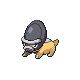

# Trainer Rosters

---

## Gym

### Generic Trainers

| Trainer | P1 | P2 | P3 | P4 | P5 | P6 |
|:-------:|:--:|:--:|:--:|:--:|:--:|:--:|
|  Black Belt Ricky |  Steelix Lv. 51 |
|  Worker Gary |  Magnemite Lv. 46 |  Aron Lv. 46 |  Bronzor Lv. 46 |  Beldum Lv. 46 |  Shieldon Lv. 46 |
|  Worker Jackson |  Magneton Lv. 48 |  Lairon Lv. 48 |  Metang Lv. 48 |
|  Ace Trainer Cesar |  Empoleon Lv. 50 |  Scizor Lv. 50 |  Metagross Lv. 50 |
|  Worker Gerardo |  Probopass Lv. 49 |  Forretress Lv. 49 |
|  Black Belt David |  Lucario Lv. 51 |
|  Ace Trainer Breanna |  Skarmory Lv. 50 |  Mawile Lv. 50 |  Wormadam Lv. 50 |

