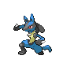

# Canalave City — Trainer Rosters

---

## City

### Important Trainers

1. [PKMN Trainer Barry](important_trainers.md#pkmn-trainer-barry)

---

## Gym

### Generic Trainers

| Trainer | P1 | P2 | P3 | P4 | P5 | P6 |
|:-------:|:--:|:--:|:--:|:--:|:--:|:--:|
|  Black Belt Ricky |  [Steelix](../../pokemon/steelix.md/) Lv. 51 |
|  Worker Gary |  [Magnemite](../../pokemon/magnemite.md/) Lv. 46 |  [Aron](../../pokemon/aron.md/) Lv. 46 |  [Bronzor](../../pokemon/bronzor.md/) Lv. 46 |  [Beldum](../../pokemon/beldum.md/) Lv. 46 |  [Shieldon](../../pokemon/shieldon.md/) Lv. 46 |
|  Worker Jackson |  [Magneton](../../pokemon/magneton.md/) Lv. 48 |  [Lairon](../../pokemon/lairon.md/) Lv. 48 |  [Metang](../../pokemon/metang.md/) Lv. 48 |
|  Ace Trainer Cesar |  [Empoleon](../../pokemon/empoleon.md/) Lv. 50 |  [Scizor](../../pokemon/scizor.md/) Lv. 50 |  [Metagross](../../pokemon/metagross.md/) Lv. 50 |
|  Worker Gerardo |  [Probopass](../../pokemon/probopass.md/) Lv. 49 |  [Forretress](../../pokemon/forretress.md/) Lv. 49 |
|  Black Belt David |  [Lucario](../../pokemon/lucario.md/) Lv. 51 |
|  Ace Trainer Breanna |  [Skarmory](../../pokemon/skarmory.md/) Lv. 50 |  [Mawile](../../pokemon/mawile.md/) Lv. 50 |  [Wormadam](../../pokemon/wormadam-plant.md/) Lv. 50 |

### Important Trainers

1. [Leader Byron](important_trainers.md#leader-byron)
