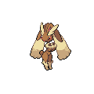

# Trainer Rosters

---

## Generic Trainers

| Trainer | P1 | P2 | P3 | P4 | P5 | P6 |
|:-------:|:--:|:--:|:--:|:--:|:--:|:--:|
|  Camper Lawrence |  Charmeleon Lv. 46 |  Ambipom Lv. 46 |  Floatzel Lv. 46 |
|  Picnicker Summer |  Grovyle Lv. 46 |  Fearow Lv. 46 |  Raichu Lv. 46 |
|  Worker Noel |  Donphan Lv. 48 |
|  Worker Braden |  Camerupt Lv. 48 |
|  Hiker Damon |  Pupitar Lv. 46 |  Probopass Lv. 46 |  Steelix Lv. 46 |
|  Hiker Maurice |  Rhydon Lv. 47 |  Golem Lv. 47 |
|  Black Belt Kendal |  Poliwrath Lv. 48 |  Hariyama Lv. 48 |
|  Battle Girl Tyler |  Hitmontop Lv. 48 |  Primeape Lv. 48 |
|  Worker Brendon |  Magneton Lv. 47 |  Machoke Lv. 47 |
|  Worker Quentin |  Lairon Lv. 47 |  Graveler Lv. 47 |
|  Ace Trainer Jonah |  Masquerain Lv. 48 |  Cradily Lv. 48 |  Hippowdon Lv. 48 |
|  Ace Trainer Brenda |  Gardevoir Lv. 48 |  Lopunny Lv. 48 |  Medicham Lv. 48 |
|  Galactic Grunt |  Golbat Lv. 46 |  Houndoom Lv. 46 |  Muk Lv. 46 |
|  Galactic Grunt |  Purugly Lv. 46 |  Toxicroak Lv. 46 |  Skuntank Lv. 46 |
