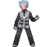

# Celestic Town — Important Trainers

### Galactic Boss Cyrus

| Pokémon | Attributes | Item | Moves |
|:-------:|------------|:----:|-------|
|  | **Lv. 45** [Crobat](../../pokemon/crobat.md/) **Ability:** Inner Focus **Nature:** ?   |  Wise Glasses | 1. Sludge Bomb 2. Air Slash 3. Giga Drain 4. Hypnosis |
|  | **Lv. 45** [Honchkrow](../../pokemon/honchkrow.md/) **Ability:** Super Luck **Nature:** ?   |  Scope Lens | 1. Brave Bird 2. Night Slash 3. Swagger 4. Torment |
|  | **Lv. 45** [Magnezone](../../pokemon/magnezone.md/) **Ability:** Magnet Pull **Nature:** ?   |  Life Orb | 1. Thunderbolt 2. Flash Cannon 3. Thunder Wave 4. Mirror Coat |
|  | **Lv. 46** [Weavile](../../pokemon/weavile.md/) **Ability:** Technician (!) **Nature:** ?   |  Expert Belt | 1. Feint Attack 2. Icicle Crash 3. Ice Shard 4. Swords Dance |

