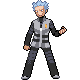

# Important Trainers

### Galactic Boss Cyrus

| Pokémon | Attributes | Item | Moves |
|:-------:|------------|:----:|-------|
|  | **Lv. 59** Crobat **Ability:** Inner Focus **Nature:** Jolly |  Choice Band | **1.** Brave Bird **2.** U-turn **3.** Cross Poison **4.** Zen Headbutt |
|  | **Lv. 59** Honchkrow **Ability:** Super Luck **Nature:** Naughty |  White Herb | **1.** Brave Bird **2.** Sucker Punch **3.** Thunder Wave **4.** Superpower |
|  | **Lv. 59** Houndoom **Ability:** Intimidate (!) **Nature:** Hasty |  Life Orb | **1.** Dark Pulse **2.** Flamethrower **3.** Sludge Bomb **4.** Nasty Plot |
|  | **Lv. 59** Gyarados **Ability:** Intimidate **Nature:** Jolly |  Muscle Band | **1.** Aqua Tail **2.** Stone Edge **3.** Ice Fang **4.** Dragon Dance |
|  | **Lv. 59** Magnezone **Ability:** Magnet Pull **Nature:** Modest |  Wise Glasses | **1.** Thunderbolt **2.** Flash Cannon **3.** Signal Beam **4.** Mirror Coat |
|  | **Lv. 60** Weavile **Ability:** Technician (!) **Nature:** Jolly |  Focus Sash | **1.** Feint Attack **2.** Icicle Crash **3.** Aerial Ace **4.** Swords Dance |

