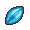

# Important Trainers

---

## Gym

### Leader Gardenia

| Pokémon | Attributes | Item | Moves |
|:-------:|------------|:----:|-------|
|  | **Lv. 25** Bellossom **Ability:** Chlorophyll **Nature:** Relaxed |  Wide Lens | **1.** Grass Knot **2.** Teeter Dance **3.** Dazzling Gleam **4.** Stun Spore |
|  | **Lv. 25** Tangela **Ability:** Chlorophyll **Nature:** Rash |  Coba Berry | **1.** Grass Knot **2.** Shock Wave **3.** Ancient Power **4.** Stun Spore |
|  | **Lv. 25** Cherrim **Ability:** Flower Gift **Nature:** Hasty |  Focus Sash | **1.** Grass Knot **2.** Sunny Day **3.** Weather Ball **4.** Morning Sun |
|  | **Lv. 25** Grotle **Ability:** Overgrow **Nature:** Adamant |  Leftovers | **1.** Seed Bomb **2.** Protect **3.** Leech Seed **4.** Bulldoze |
|  | **Lv. 25** Breloom **Ability:** Technician **Nature:** Naughty |  Muscle Band | **1.** Bullet Seed **2.** Mach Punch **3.** Thunder Punch **4.** Spore |
|  | **Lv. 26** Roserade **Ability:** Technician **Nature:** Timid |  Sitrus Berry | **1.** Magical Leaf **2.** Sludge **3.** Dazzling Gleam **4.** Extrasensory |

---

## Team Galactic Building

### Commander Jupiter

| Pokémon | Attributes | Item | Moves |
|:-------:|------------|:----:|-------|
|  | **Lv. 26** Golbat **Ability:** Inner Focus **Nature:** Jolly | No Item | **1.** Wing Attack **2.** Giga Drain **3.** Leech Life **4.** Confuse Ray |
|  | **Lv. 26** Sableye **Ability:** Magic Guard (!) **Nature:** Adamant |  Sitrus Berry | **1.** Fake Out **2.** Shadow Claw **3.** Knock Off **4.** Shadow Sneak |
|  | **Lv. 26** Tangela **Ability:** Chlorophyll **Nature:** Modest | No Item | **1.** Giga Drain **2.** Shock Wave **3.** Leech Seed **4.** Sleep Powder |
|  | **Lv. 27** Skuntank **Ability:** Aftermath **Nature:** Adamant |  Sitrus Berry | **1.** Poison Jab **2.** Night Slash **3.** Focus Energy **4.** Torment |

