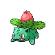
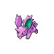

# Eterna City — Trainer Rosters

---

## Gym

### Generic Trainers

| Trainer | P1 | P2 | P3 | P4 | P5 | P6 |
|:-------:|:--:|:--:|:--:|:--:|:--:|:--:|
|  Lass Caroline |  [Lotad](../../pokemon/lotad.md/) Lv. 22 |  [Cacnea](../../pokemon/cacnea.md/) Lv. 22 |  [Exeggcute](../../pokemon/exeggcute.md/) Lv. 22 |  [Shroomish](../../pokemon/shroomish.md/) Lv. 22 |
|  Aroma Lady Jenna |  [Weepinbell](../../pokemon/weepinbell.md/) Lv. 23 |  [Ivysaur](../../pokemon/ivysaur.md/) Lv. 23 |  [Gloom](../../pokemon/gloom.md/) Lv. 23 |
|  Aroma Lady Angela |  [Roselia](../../pokemon/roselia.md/) Lv. 23 |  [Bayleef](../../pokemon/bayleef.md/) Lv. 23 |  [Skiploom](../../pokemon/skiploom.md/) Lv. 23 |

### Important Trainers

1. [Leader Gardenia](important_trainers.md#leader-gardenia)

---

## Team Galactic Building

### Generic Trainers

| Trainer | P1 | P2 | P3 | P4 | P5 | P6 |
|:-------:|:--:|:--:|:--:|:--:|:--:|:--:|
|  Galactic Grunt |  [Ledian](../../pokemon/ledian.md/) Lv. 24 |  [Ariados](../../pokemon/ariados.md/) Lv. 24 |
|  Galactic Grunt |  [Ekans](../../pokemon/ekans.md/) Lv. 23 |  [Glameow](../../pokemon/glameow.md/) Lv. 23 |  [Nidoran F](../../pokemon/nidoran-f.md/) Lv. 23 |
|  Galactic Grunt |  [Koffing](../../pokemon/koffing.md/) Lv. 23 |  [Stunky](../../pokemon/stunky.md/) Lv. 23 |  [Nidoran M](../../pokemon/nidoran-m.md/) Lv. 23 |
|  Galactic Grunt |  [Croagunk](../../pokemon/croagunk.md/) Lv. 24 |  [Golbat](../../pokemon/golbat.md/) Lv. 24 |
|  Galactic Grunt |  [Cleffa](../../pokemon/cleffa.md/) Lv. 23 |
|  Galactic Grunt |  [Houndour](../../pokemon/houndour.md/) Lv. 23 |  [Skorupi](../../pokemon/skorupi.md/) Lv. 23 |  [Beautifly](../../pokemon/beautifly.md/) Lv. 23 |
|  Scientist Travon |  [Drowzee](../../pokemon/drowzee.md/) Lv. 24 |  [Metang](../../pokemon/metang.md/) Lv. 24 |  [Kadabra](../../pokemon/kadabra.md/) Lv. 24 |

### Important Trainers

1. [Commander Jupiter](important_trainers.md#commander-jupiter)
