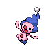

# Eterna Forest — Trainer Rosters

### Generic Trainers

| Trainer | P1 | P2 | P3 | P4 | P5 | P6 |
|:-------:|:--:|:--:|:--:|:--:|:--:|:--:|
|  Bug Catcher Jack |  [Surskit](../../pokemon/surskit.md/) Lv. 16 |  [Paras](../../pokemon/paras.md/) Lv. 16 |  [Venonat](../../pokemon/venonat.md/) Lv. 16 |
|  Lass Briana |  [Buneary](../../pokemon/buneary.md/) Lv. 17 |  [Marill](../../pokemon/marill.md/) Lv. 17 |
|  Psychic Lindsey |  [Slowpoke](../../pokemon/slowpoke.md/) Lv. 17 |  [Exeggcute](../../pokemon/exeggcute.md/) Lv. 17 |  [Natu](../../pokemon/natu.md/) Lv. 17 |
|  Psychic Elijah |  [Spoink](../../pokemon/spoink.md/) Lv. 17 |  [Drowzee](../../pokemon/drowzee.md/) Lv. 17 |  [Baltoy](../../pokemon/baltoy.md/) Lv. 17 |
|  Bug Catcher Philip |  [Combee](../../pokemon/combee.md/) Lv. 17 |  [Beedrill](../../pokemon/beedrill.md/) Lv. 19 |
|  Bug Catcher Donald |  [Nincada](../../pokemon/nincada.md/) Lv. 17 |  [Dustox](../../pokemon/dustox.md/) Lv. 19 |
|  Psychic Kody |  [Mime Jr.](../../pokemon/mime-jr.md/) Lv. 18 |  [Mr. Mime](../../pokemon/mr-mime.md/) Lv. 20 |
|  Psychic Rachael |  [Chingling](../../pokemon/chingling.md/) Lv. 18 |  [Chimecho](../../pokemon/chimecho.md/) Lv. 20 |

### Important Trainers

1. [PKMN Trainer Cheryl](important_trainers.md#pkmn-trainer-cheryl)
