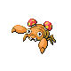
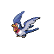

### Walking

| Sprite | Pokémon | Encounter Type | Level | Chance |
|:------:|---------|:--------------:|-------|--------|
|  | [Buneary](../../pokemon/buneary.md/) | {: style='max-width: 24px;' } | 14 - 16 | 30% |
|  | [Shroomish](../../pokemon/shroomish.md/) | {: style='max-width: 24px;' } | 14 - 16 | 20% |
|  | [Paras](../../pokemon/paras.md/) | {: style='max-width: 24px;' } | 14 - 16 | 20% |
|  | [Slakoth](../../pokemon/slakoth.md/) | {: style='max-width: 24px;' } | 14 - 16 | 10% |
|  | [Nincada](../../pokemon/nincada.md/) | {: style='max-width: 24px;' } | 14 - 16 | 10% |
|  | [Taillow](../../pokemon/taillow.md/) | {: style='max-width: 24px;' } | 14 - 16 | 10% |
|  | [Buneary](../../pokemon/buneary.md/) | {: style='max-width: 24px;' } | 14 - 16 | 30% |
|  | [Shroomish](../../pokemon/shroomish.md/) | {: style='max-width: 24px;' } | 14 - 16 | 20% |
|  | [Paras](../../pokemon/paras.md/) | {: style='max-width: 24px;' } | 14 - 16 | 20% |
|  | [Slakoth](../../pokemon/slakoth.md/) | {: style='max-width: 24px;' } | 14 - 16 | 10% |
|  | [Nincada](../../pokemon/nincada.md/) | {: style='max-width: 24px;' } | 14 - 16 | 10% |
|  | [Taillow](../../pokemon/taillow.md/) | {: style='max-width: 24px;' } | 14 - 16 | 10% |
|  | [Buneary](../../pokemon/buneary.md/) | {: style='max-width: 24px;' } | 14 - 16 | 30% |
|  | [Shroomish](../../pokemon/shroomish.md/) | {: style='max-width: 24px;' } | 14 - 16 | 20% |
|  | [Murkrow](../../pokemon/murkrow.md/) | {: style='max-width: 24px;' } | 14 - 16 | 10% |
|  | [Misdreavus](../../pokemon/misdreavus.md/) | {: style='max-width: 24px;' } | 14 - 16 | 10% |
|  | [Slakoth](../../pokemon/slakoth.md/) | {: style='max-width: 24px;' } | 14 - 16 | 10% |
|  | [Nincada](../../pokemon/nincada.md/) | {: style='max-width: 24px;' } | 14 - 16 | 10% |
|  | [Taillow](../../pokemon/taillow.md/) | {: style='max-width: 24px;' } | 14 - 16 | 10% |
|  | [Beautifly](../../pokemon/beautifly.md/) | {: style='max-width: 24px;' } | 14 - 16 | 11% |
|  | [Dustox](../../pokemon/dustox.md/) | {: style='max-width: 24px;' } | 14 - 16 | 11% |

---

## Outside

### Honey Tree

| Sprite | Pokémon | Encounter Type | Level | Chance |
|:------:|---------|:--------------:|-------|--------|
|  | [Beedrill](../../pokemon/beedrill.md/) | {: style='max-width: 24px;' } | 15 | 100% |

