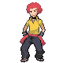

# Fight Area — Trainer Rosters

### Generic Trainers

| Trainer | P1 | P2 | P3 | P4 | P5 | P6 |
|:-------:|:--:|:--:|:--:|:--:|:--:|:--:|
|  Leader Volkner |  [Raichu](../../pokemon/raichu.md/) Lv. 74 |  [Jolteon](../../pokemon/jolteon.md/) Lv. 74 |  [Electivire](../../pokemon/electivire.md/) Lv. 75 |
|  Elite Four Flint |  [Arcanine](../../pokemon/arcanine.md/) Lv. 74 |  [Flareon](../../pokemon/flareon.md/) Lv. 74 |  [Magmortar](../../pokemon/magmortar.md/) Lv. 75 |
|  PKMN Trainer Barry |  [Staraptor](../../pokemon/staraptor.md/) Lv. 74 |  [Heracross](../../pokemon/heracross.md/) Lv. 74 |  [Snorlax](../../pokemon/snorlax.md/) Lv. 74 |  [Azumarill](../../pokemon/azumarill.md/) Lv. 74 |  [Arcanine](../../pokemon/arcanine.md/) Lv. 74 |  [Torterra](../../pokemon/torterra.md/) Lv. 75 |
|  PKMN Trainer Barry |  [Staraptor](../../pokemon/staraptor.md/) Lv. 74 |  [Heracross](../../pokemon/heracross.md/) Lv. 74 |  [Snorlax](../../pokemon/snorlax.md/) Lv. 74 |  [Azumarill](../../pokemon/azumarill.md/) Lv. 74 |  [Breloom](../../pokemon/breloom.md/) Lv. 74 |  [Infernape](../../pokemon/infernape.md/) Lv. 75 |
|  PKMN Trainer Barry |  [Staraptor](../../pokemon/staraptor.md/) Lv. 74 |  [Heracross](../../pokemon/heracross.md/) Lv. 74 |  [Snorlax](../../pokemon/snorlax.md/) Lv. 74 |  [Breloom](../../pokemon/breloom.md/) Lv. 74 |  [Arcanine](../../pokemon/arcanine.md/) Lv. 74 |  [Empoleon](../../pokemon/empoleon.md/) Lv. 75 |

