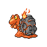

# Trainer Rosters

### Generic Trainers

| Trainer | P1 | P2 | P3 | P4 | P5 | P6 |
|:-------:|:--:|:--:|:--:|:--:|:--:|:--:|
|  Worker Dillan |  Machop Lv. 42 |  Machoke Lv. 43 |  Machamp Lv. 44 |
|  Worker Holden |  Magnemite Lv. 42 |  Magnemite Lv. 42 |  Steelix Lv. 45 |
|  Worker Conrad |  Magmar Lv. 43 |  Magcargo Lv. 43 |  Rapidash Lv. 43 |

