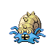

# Trainer Rosters

---

## Generic Trainers

| Trainer | P1 | P2 | P3 | P4 | P5 | P6 |
|:-------:|:--:|:--:|:--:|:--:|:--:|:--:|
|  Fisherman Miguel (!) |  Huntail Lv. 44 |  Gorebyss Lv. 44 |
|  Fisherman Luc |  Crawdaunt Lv. 45 |
|  Sailor Skyler |  Omastar Lv. 43 |  Kabutops Lv. 43 |  Relicanth Lv. 43 |
|  Guitarist Tony (!) |  Kricketune Lv. 44 |  Exploud Lv. 44 |
