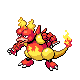
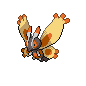

# Fuego Ironworks — Wild Pokémon

### Walking

| Sprite | Pokémon | Encounter Type | Level | Chance |
|:------:|---------|:--------------:|-------|--------|
|  | [Magnemite](../../pokemon/magnemite.md/) | {: style='max-width: 24px;' } | 36 - 40 | 30% |
|  | [Magmar](../../pokemon/magmar.md/) | {: style='max-width: 24px;' } | 36 - 40 | 20% |
|  | [Magneton](../../pokemon/magneton.md/) | {: style='max-width: 24px;' } | 36 - 40 | 20% |
|  | [Manectric](../../pokemon/manectric.md/) | {: style='max-width: 24px;' } | 36 - 40 | 15% |
|  | [Forretress](../../pokemon/forretress.md/) | {: style='max-width: 24px;' } | 36 - 40 | 15% |
|  | [Magnemite](../../pokemon/magnemite.md/) | {: style='max-width: 24px;' } | 36 - 40 | 30% |
|  | [Magmar](../../pokemon/magmar.md/) | {: style='max-width: 24px;' } | 36 - 40 | 20% |
|  | [Magneton](../../pokemon/magneton.md/) | {: style='max-width: 24px;' } | 36 - 40 | 20% |
|  | [Manectric](../../pokemon/manectric.md/) | {: style='max-width: 24px;' } | 36 - 40 | 15% |
|  | [Forretress](../../pokemon/forretress.md/) | {: style='max-width: 24px;' } | 36 - 40 | 15% |
|  | [Magnemite](../../pokemon/magnemite.md/) | {: style='max-width: 24px;' } | 36 - 40 | 30% |
|  | [Magmar](../../pokemon/magmar.md/) | {: style='max-width: 24px;' } | 36 - 40 | 20% |
|  | [Magneton](../../pokemon/magneton.md/) | {: style='max-width: 24px;' } | 36 - 40 | 20% |
|  | [Manectric](../../pokemon/manectric.md/) | {: style='max-width: 24px;' } | 36 - 40 | 15% |
|  | [Forretress](../../pokemon/forretress.md/) | {: style='max-width: 24px;' } | 36 - 40 | 15% |
|  | [Weezing](../../pokemon/weezing.md/) | {: style='max-width: 24px;' } | 36 - 40 | 22% |

### Surfing

| Sprite | Pokémon | Encounter Type | Level | Chance |
|:------:|---------|:--------------:|-------|--------|
|  | [Shellos](../../pokemon/shellos.md/) | {: style='max-width: 24px;' } | 30 - 45 | 60% |
|  | [Tentacool](../../pokemon/tentacool.md/) | {: style='max-width: 24px;' } | 30 - 45 | 30% |
|  | [Gastrodon](../../pokemon/gastrodon.md/) | {: style='max-width: 24px;' } | 30 - 45 | 5% |
|  | [Tentacruel](../../pokemon/tentacruel.md/) | {: style='max-width: 24px;' } | 30 - 45 | 5% |

### Fishing

| Sprite | Pokémon | Encounter Type | Level | Chance |
|:------:|---------|:--------------:|-------|--------|
|  | [Magikarp](../../pokemon/magikarp.md/) | {: style='max-width: 24px;' } | 10 | 100% |
|  | [Magikarp](../../pokemon/magikarp.md/) | {: style='max-width: 24px;' } | 25 | 65% |
|  | [Finneon](../../pokemon/finneon.md/) | {: style='max-width: 24px;' } | 25 | 35% |
|  | [Gyarados](../../pokemon/gyarados.md/) | {: style='max-width: 24px;' } | 50 | 60% |
|  | [Lumineon](../../pokemon/lumineon.md/) | {: style='max-width: 24px;' } | 50 | 35% |
|  | [Shellder](../../pokemon/shellder.md/) | {: style='max-width: 24px;' } | 50 | 5% |

### Honey Tree

| Sprite | Pokémon | Encounter Type | Level | Chance |
|:------:|---------|:--------------:|-------|--------|
|  | [Combee](../../pokemon/combee.md/) | {: style='max-width: 24px;' } | 40 | 30% |
|  | [Forretress](../../pokemon/forretress.md/) | {: style='max-width: 24px;' } | 40 | 10% |
|  | [Wormadam](../../pokemon/wormadam-plant.md/) | {: style='max-width: 24px;' } | 40 | 10% |
|  | [Mothim](../../pokemon/mothim.md/) | {: style='max-width: 24px;' } | 40 | 10% |
|  | [Beautifly](../../pokemon/beautifly.md/) | {: style='max-width: 24px;' } | 40 | 10% |
|  | [Dustox](../../pokemon/dustox.md/) | {: style='max-width: 24px;' } | 40 | 10% |
|  | [Heracross](../../pokemon/heracross.md/) | {: style='max-width: 24px;' } | 40 | 10% |
|  | [Vespiquen](../../pokemon/vespiquen.md/) | {: style='max-width: 24px;' } | 40 | 10% |

