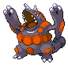

# Important Trainers

### Galactic Boss Cyrus

| Pokémon | Attributes | Item | Moves |
|:-------:|------------|:----:|-------|
|  | **Lv. 57** Crobat **Ability:** Inner Focus **Nature:** ? |  Choice Band | **1.** Brave Bird **2.** U-turn **3.** Cross Poison **4.** Zen Headbutt |
|  | **Lv. 57** Honchkrow **Ability:** Super Luck **Nature:** ? |  Scope Lens | **1.** Brave Bird **2.** Night Slash **3.** Thunder Wave **4.** Heat Wave |
|  | **Lv. 57** Houndoom **Ability:** Intimidate (!) **Nature:** ? |  Life Orb | **1.** Dark Pulse **2.** Flamethrower **3.** Sludge Bomb **4.** Nasty Plot |
|  | **Lv. 57** Magnezone **Ability:** Magnet Pull **Nature:** ? |  Wise Glasses | **1.** Thunderbolt **2.** Flash Cannon **3.** Signal Beam **4.** Mirror Coat |
|  | **Lv. 58** Weavile **Ability:** Technican (!) **Nature:** ? |  Expert Belt | **1.** Crunch **2.** Icicle Crash **3.** Aerial Ace **4.** X-Scissor |

### Commander Saturn

| Pokémon | Attributes | Item | Moves |
|:-------:|------------|:----:|-------|
|  | **Lv. 56** Bronzong **Ability:** Levitate **Nature:** ? |  Light Clay | **1.** Zen Headbutt **2.** Gyro Ball **3.** Reflect **4.** Light Screen |
|  | **Lv. 56** Octillery **Ability:** Suction Cups **Nature:** ? |  Expert Belt | **1.** Hydro Pump **2.** Blizzard **3.** Fire Blast **4.** Energy Ball |
|  | **Lv. 56** Alakazam **Ability:** Magic Guard **Nature:** ? |  Life Orb | **1.** Psychic **2.** Shadow Ball **3.** Dazzling Gleam **4.** Focus Blast |
|  | **Lv. 56** Rhyperior **Ability:** Solid Rock **Nature:** ? |  Choice Band | **1.** Stone Edge **2.** Earthquake **3.** Megahorn **4.** — |
|  | **Lv. 56** Magmortar **Ability:** Flame Body **Nature:** ? |  Choice Specs | **1.** Fire Blast **2.** Thunderbolt **3.** Aura Sphere **4.** Psychic |
|  | **Lv. 57** Toxicroak **Ability:** Dry Skin **Nature:** ? |  Focus Sash | **1.** Cross Chop **2.** Gunk Shot **3.** Ice Punch **4.** Fake Out |

