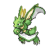
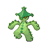

# Galactic HQ — Trainer Rosters

### Generic Trainers

| Trainer | P1 | P2 | P3 | P4 | P5 | P6 |
|:-------:|:--:|:--:|:--:|:--:|:--:|:--:|
|  Galactic Grunt |  [Golbat](../../pokemon/golbat.md/) Lv. 53 |  [Dustox](../../pokemon/dustox.md/) Lv. 53 |  [Parasect](../../pokemon/parasect.md/) Lv. 53 |
|  Galactic Grunt |  [Murkrow](../../pokemon/murkrow.md/) Lv. 54 |  [Houndoom](../../pokemon/houndoom.md/) Lv. 54 |
|  Galactic Grunt |  [Beautifly](../../pokemon/beautifly.md/) Lv. 53 |  [Purugly](../../pokemon/purugly.md/) Lv. 53 |  [Vespiquen](../../pokemon/vespiquen.md/) Lv. 53 |
|  Galactic Grunt |  [Toxicroak](../../pokemon/toxicroak.md/) Lv. 54 |  [Skuntank](../../pokemon/skuntank.md/) Lv. 54 |
|  Scientist Fredrick |  [Kirlia](../../pokemon/kirlia.md/) Lv. 53 |  [Kadabra](../../pokemon/kadabra.md/) Lv. 53 |  [Magneton](../../pokemon/magneton.md/) Lv. 53 |
|  Galactic Grunt |  [Scyther](../../pokemon/scyther.md/) Lv. 54 |  [Skuntank](../../pokemon/skuntank.md/) Lv. 54 |
|  Galactic Grunt |  [Pinsir](../../pokemon/pinsir.md/) Lv. 54 |  [Toxicroak](../../pokemon/toxicroak.md/) Lv. 54 |
|  Galactic Grunt |  [Golbat](../../pokemon/golbat.md/) Lv. 53 |  [Mightyena](../../pokemon/mightyena.md/) Lv. 53 |  [Ariados](../../pokemon/ariados.md/) Lv. 53 |
|  Galactic Grunt |  [Golbat](../../pokemon/golbat.md/) Lv. 53 |  [Venomoth](../../pokemon/venomoth.md/) Lv. 53 |  [Cacturne](../../pokemon/cacturne.md/) Lv. 53 |
|  Scientist Darrius |  [Porygon-Z](../../pokemon/porygon-z.md/) Lv. 55 |
|  Galactic Grunt |  [Muk](../../pokemon/muk.md/) Lv. 54 |  [Arbok](../../pokemon/arbok.md/) Lv. 54 |
|  Galactic Grunt |  [Forretress](../../pokemon/forretress.md/) Lv. 53 |  [Seviper](../../pokemon/seviper.md/) Lv. 53 |  [Yanmega](../../pokemon/yanmega.md/) Lv. 53 |

### Important Trainers

1. [Galactic Boss Cyrus](important_trainers.md#galactic-boss-cyrus)
1. [Commander Saturn](important_trainers.md#commander-saturn)
