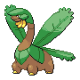

# Great Marsh — Wild Pokémon

---

## Area 1/2

### Walking

| Sprite | Pokémon | Encounter Type | Level | Chance |
|:------:|---------|:--------------:|-------|--------|
|  | [Bibarel](../../pokemon/bibarel.md/) | {: style='max-width: 24px;' } | 33 - 36 | 30% |
|  | [Quagsire](../../pokemon/quagsire.md/) | {: style='max-width: 24px;' } | 33 - 36 | 20% |
|  | [Tropius](../../pokemon/tropius.md/) | {: style='max-width: 24px;' } | 33 - 36 | 20% |
|  | [Tangela](../../pokemon/tangela.md/) | {: style='max-width: 24px;' } | 33 - 36 | 20% |
|  | [Carnivine](../../pokemon/carnivine.md/) | {: style='max-width: 24px;' } | 33 - 36 | 10% |
|  | [Bibarel](../../pokemon/bibarel.md/) | {: style='max-width: 24px;' } | 33 - 36 | 30% |
|  | [Quagsire](../../pokemon/quagsire.md/) | {: style='max-width: 24px;' } | 33 - 36 | 20% |
|  | [Tropius](../../pokemon/tropius.md/) | {: style='max-width: 24px;' } | 33 - 36 | 20% |
|  | [Tangela](../../pokemon/tangela.md/) | {: style='max-width: 24px;' } | 33 - 36 | 20% |
|  | [Carnivine](../../pokemon/carnivine.md/) | {: style='max-width: 24px;' } | 33 - 36 | 10% |
|  | [Bibarel](../../pokemon/bibarel.md/) | {: style='max-width: 24px;' } | 33 - 36 | 30% |
|  | [Quagsire](../../pokemon/quagsire.md/) | {: style='max-width: 24px;' } | 33 - 36 | 20% |
|  | [Tropius](../../pokemon/tropius.md/) | {: style='max-width: 24px;' } | 33 - 36 | 20% |
|  | [Tangela](../../pokemon/tangela.md/) | {: style='max-width: 24px;' } | 33 - 36 | 20% |
|  | [Carnivine](../../pokemon/carnivine.md/) | {: style='max-width: 24px;' } | 33 - 36 | 10% |

### Surfing

| Sprite | Pokémon | Encounter Type | Level | Chance |
|:------:|---------|:--------------:|-------|--------|
|  | [Wooper](../../pokemon/wooper.md/) | {: style='max-width: 24px;' } | 20 - 40 | 90% |
|  | [Quagsire](../../pokemon/quagsire.md/) | {: style='max-width: 24px;' } | 20 - 40 | 10% |

### Fishing

| Sprite | Pokémon | Encounter Type | Level | Chance |
|:------:|---------|:--------------:|-------|--------|
|  | [Magikarp](../../pokemon/magikarp.md/) | {: style='max-width: 24px;' } | 10 | 60% |
|  | [Barboach](../../pokemon/barboach.md/) | {: style='max-width: 24px;' } | 10 | 30% |
|  | [Carvanha](../../pokemon/carvanha.md/) | {: style='max-width: 24px;' } | 10 | 10% |
|  | [Magikarp](../../pokemon/magikarp.md/) | {: style='max-width: 24px;' } | 25 | 60% |
|  | [Barboach](../../pokemon/barboach.md/) | {: style='max-width: 24px;' } | 25 | 30% |
|  | [Carvanha](../../pokemon/carvanha.md/) | {: style='max-width: 24px;' } | 25 | 10% |
|  | [Gyarados](../../pokemon/gyarados.md/) | {: style='max-width: 24px;' } | 50 | 60% |
|  | [Whiscash](../../pokemon/whiscash.md/) | {: style='max-width: 24px;' } | 50 | 30% |
|  | [Sharpedo](../../pokemon/sharpedo.md/) | {: style='max-width: 24px;' } | 50 | 10% |

---

## Area 3/4

### Walking

| Sprite | Pokémon | Encounter Type | Level | Chance |
|:------:|---------|:--------------:|-------|--------|
|  | [Parasect](../../pokemon/parasect.md/) | {: style='max-width: 24px;' } | 33 - 36 | 30% |
|  | [Exeggcute](../../pokemon/exeggcute.md/) | {: style='max-width: 24px;' } | 33 - 36 | 20% |
|  | [Croagunk](../../pokemon/croagunk.md/) | {: style='max-width: 24px;' } | 33 - 36 | 20% |
|  | [Toxicroak](../../pokemon/toxicroak.md/) | {: style='max-width: 24px;' } | 33 - 36 | 10% |
|  | [Kangaskhan](../../pokemon/kangaskhan.md/) | {: style='max-width: 24px;' } | 33 - 36 | 10% |
|  | [Yanma](../../pokemon/yanma.md/) | {: style='max-width: 24px;' } | 33 - 36 | 10% |
|  | [Parasect](../../pokemon/parasect.md/) | {: style='max-width: 24px;' } | 33 - 36 | 30% |
|  | [Exeggcute](../../pokemon/exeggcute.md/) | {: style='max-width: 24px;' } | 33 - 36 | 20% |
|  | [Croagunk](../../pokemon/croagunk.md/) | {: style='max-width: 24px;' } | 33 - 36 | 20% |
|  | [Toxicroak](../../pokemon/toxicroak.md/) | {: style='max-width: 24px;' } | 33 - 36 | 10% |
|  | [Kangaskhan](../../pokemon/kangaskhan.md/) | {: style='max-width: 24px;' } | 33 - 36 | 10% |
|  | [Yanma](../../pokemon/yanma.md/) | {: style='max-width: 24px;' } | 33 - 36 | 10% |
|  | [Parasect](../../pokemon/parasect.md/) | {: style='max-width: 24px;' } | 33 - 36 | 30% |
|  | [Exeggcute](../../pokemon/exeggcute.md/) | {: style='max-width: 24px;' } | 33 - 36 | 20% |
|  | [Croagunk](../../pokemon/croagunk.md/) | {: style='max-width: 24px;' } | 33 - 36 | 20% |
|  | [Toxicroak](../../pokemon/toxicroak.md/) | {: style='max-width: 24px;' } | 33 - 36 | 10% |
|  | [Kangaskhan](../../pokemon/kangaskhan.md/) | {: style='max-width: 24px;' } | 33 - 36 | 10% |
|  | [Yanma](../../pokemon/yanma.md/) | {: style='max-width: 24px;' } | 33 - 36 | 10% |

### Surfing

| Sprite | Pokémon | Encounter Type | Level | Chance |
|:------:|---------|:--------------:|-------|--------|
|  | [Wooper](../../pokemon/wooper.md/) | {: style='max-width: 24px;' } | 20 - 40 | 90% |
|  | [Quagsire](../../pokemon/quagsire.md/) | {: style='max-width: 24px;' } | 20 - 40 | 10% |

### Fishing

| Sprite | Pokémon | Encounter Type | Level | Chance |
|:------:|---------|:--------------:|-------|--------|
|  | [Magikarp](../../pokemon/magikarp.md/) | {: style='max-width: 24px;' } | 10 | 60% |
|  | [Barboach](../../pokemon/barboach.md/) | {: style='max-width: 24px;' } | 10 | 30% |
|  | [Carvanha](../../pokemon/carvanha.md/) | {: style='max-width: 24px;' } | 10 | 10% |
|  | [Magikarp](../../pokemon/magikarp.md/) | {: style='max-width: 24px;' } | 25 | 60% |
|  | [Barboach](../../pokemon/barboach.md/) | {: style='max-width: 24px;' } | 25 | 30% |
|  | [Carvanha](../../pokemon/carvanha.md/) | {: style='max-width: 24px;' } | 25 | 10% |
|  | [Gyarados](../../pokemon/gyarados.md/) | {: style='max-width: 24px;' } | 50 | 60% |
|  | [Whiscash](../../pokemon/whiscash.md/) | {: style='max-width: 24px;' } | 50 | 30% |
|  | [Sharpedo](../../pokemon/sharpedo.md/) | {: style='max-width: 24px;' } | 50 | 10% |

---

## Area 5/6

### Walking

| Sprite | Pokémon | Encounter Type | Level | Chance |
|:------:|---------|:--------------:|-------|--------|
|  | [Skorupi](../../pokemon/skorupi.md/) | {: style='max-width: 24px;' } | 33 - 36 | 30% |
|  | [Gulpin](../../pokemon/gulpin.md/) | {: style='max-width: 24px;' } | 33 - 36 | 20% |
|  | [Shroomish](../../pokemon/shroomish.md/) | {: style='max-width: 24px;' } | 33 - 36 | 20% |
|  | [Swalot](../../pokemon/swalot.md/) | {: style='max-width: 24px;' } | 33 - 36 | 10% |
|  | [Breloom](../../pokemon/breloom.md/) | {: style='max-width: 24px;' } | 33 - 36 | 10% |
|  | [Drapion](../../pokemon/drapion.md/) | {: style='max-width: 24px;' } | 33 - 36 | 10% |
|  | [Skorupi](../../pokemon/skorupi.md/) | {: style='max-width: 24px;' } | 33 - 36 | 30% |
|  | [Gulpin](../../pokemon/gulpin.md/) | {: style='max-width: 24px;' } | 33 - 36 | 20% |
|  | [Shroomish](../../pokemon/shroomish.md/) | {: style='max-width: 24px;' } | 33 - 36 | 20% |
|  | [Swalot](../../pokemon/swalot.md/) | {: style='max-width: 24px;' } | 33 - 36 | 10% |
|  | [Breloom](../../pokemon/breloom.md/) | {: style='max-width: 24px;' } | 33 - 36 | 10% |
|  | [Drapion](../../pokemon/drapion.md/) | {: style='max-width: 24px;' } | 33 - 36 | 10% |
|  | [Skorupi](../../pokemon/skorupi.md/) | {: style='max-width: 24px;' } | 33 - 36 | 30% |
|  | [Gulpin](../../pokemon/gulpin.md/) | {: style='max-width: 24px;' } | 33 - 36 | 20% |
|  | [Shroomish](../../pokemon/shroomish.md/) | {: style='max-width: 24px;' } | 33 - 36 | 20% |
|  | [Swalot](../../pokemon/swalot.md/) | {: style='max-width: 24px;' } | 33 - 36 | 10% |
|  | [Breloom](../../pokemon/breloom.md/) | {: style='max-width: 24px;' } | 33 - 36 | 10% |
|  | [Drapion](../../pokemon/drapion.md/) | {: style='max-width: 24px;' } | 33 - 36 | 10% |

### Surfing

| Sprite | Pokémon | Encounter Type | Level | Chance |
|:------:|---------|:--------------:|-------|--------|
|  | [Wooper](../../pokemon/wooper.md/) | {: style='max-width: 24px;' } | 20 - 40 | 90% |
|  | [Quagsire](../../pokemon/quagsire.md/) | {: style='max-width: 24px;' } | 20 - 40 | 10% |

### Fishing

| Sprite | Pokémon | Encounter Type | Level | Chance |
|:------:|---------|:--------------:|-------|--------|
|  | [Magikarp](../../pokemon/magikarp.md/) | {: style='max-width: 24px;' } | 10 | 60% |
|  | [Barboach](../../pokemon/barboach.md/) | {: style='max-width: 24px;' } | 10 | 30% |
|  | [Carvanha](../../pokemon/carvanha.md/) | {: style='max-width: 24px;' } | 10 | 10% |
|  | [Magikarp](../../pokemon/magikarp.md/) | {: style='max-width: 24px;' } | 25 | 60% |
|  | [Barboach](../../pokemon/barboach.md/) | {: style='max-width: 24px;' } | 25 | 30% |
|  | [Carvanha](../../pokemon/carvanha.md/) | {: style='max-width: 24px;' } | 25 | 10% |
|  | [Gyarados](../../pokemon/gyarados.md/) | {: style='max-width: 24px;' } | 50 | 60% |
|  | [Whiscash](../../pokemon/whiscash.md/) | {: style='max-width: 24px;' } | 50 | 30% |
|  | [Sharpedo](../../pokemon/sharpedo.md/) | {: style='max-width: 24px;' } | 50 | 10% |

