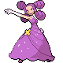
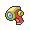

# Important Trainers

---

## Gym

### Leader Fantina

| Pokémon | Attributes | Item | Moves |
|:-------:|------------|:----:|-------|
|  | **Lv. 32** Drifblim **Ability:** Unburden **Nature:** Naive |  Starf Berry | **1.** Shadow Ball **2.** Air Slash **3.** Baton Pass **4.** Calm Mind |
|  | **Lv. 32** Dusclops **Ability:** Pressure **Nature:** Impish |  Leftovers | **1.** Shadow Punch **2.** Will-O-Wisp **3.** Protect **4.** Pain Split |
|  | **Lv. 32** Banette **Ability:** Insomnia **Nature:** Adamant |  Muscle Band | **1.** Shadow Claw **2.** Will-O-Wisp **3.** Sucker Punch **4.** Disable |
|  | **Lv. 32** Spiritomb **Ability:** Pressure **Nature:** Relaxed |  Zoom Lens | **1.** Shadow Ball **2.** Will-O-Wisp **3.** Dark Pulse **4.** Disable |
|  | **Lv. 32** Gengar **Ability:** Levitate **Nature:** Naive |  Wise Glasses | **1.** Shadow Ball **2.** Will-O-Wisp **3.** Sludge Bomb **4.** Dazzling Gleam |
|  | **Lv. 33** Mismagius **Ability:** Levitate **Nature:** Naive |  Sitrus Berry | **1.** Shadow Ball **2.** Power Gem **3.** Calm Mind **4.** Dazzling Gleam |

### PKMN Trainer Barry

=== "Turtwig"

	| Pokémon | Attributes | Item | Moves |
	|:-------:|------------|:----:|-------|
	|  | **Lv. 33** Grotle **Ability:** Overgrow ? |  Sitrus Berry | **1.** Seed Bomb **2.** Crunch **3.** Leech Seed **4.** Protect |
	|  | **Lv. 32** Staravia **Ability:** Reckless ? |  Muscle Band | **1.** Facade **2.** Aerial Ace **3.** Double Team **4.** Endeavor |
	|  | **Lv. 32** Heracross **Ability:** Guts ? |  Coba Berry | **1.** Bug Bite **2.** Brick Break **3.** Aerial Ace **4.** Knock Off |
	|  | **Lv. 32** Snorlax **Ability:** Thick Fat ? |  Leftovers | **1.** Body Slam **2.** Yawn **3.** Amnesia **4.** Rock Slide |
	
=== "Chimchar"

	| Pokémon | Attributes | Item | Moves |
	|:-------:|------------|:----:|-------|
	|  | **Lv. 33** Monferno **Ability:** Iron Fist ? |  Sitrus Berry | **1.** Flamethrower **2.** Low Kick **3.** Grass Knot **4.** Fake Out |
	|  | **Lv. 32** Staravia **Ability:** Reckless ? |  Muscle Band | **1.** Facade **2.** Aerial Ace **3.** Double Team **4.** Endeavor |
	|  | **Lv. 32** Heracross **Ability:** Guts ? |  Coba Berry | **1.** Bug Bite **2.** Brick Break **3.** Aerial Ace **4.** Knock Off |
	|  | **Lv. 32** Snorlax **Ability:** Thick Fat ? |  Leftovers | **1.** Body Slam **2.** Yawn **3.** Amnesia **4.** Rock Slide |
	
=== "Piplup"

	| Pokémon | Attributes | Item | Moves |
	|:-------:|------------|:----:|-------|
	|  | **Lv. 33** Prinplup **Ability:** Torrent ? |  Sitrus Berry | **1.** Scald **2.** Icy Wind **3.** Grass Knot **4.** Aerial Ace |
	|  | **Lv. 32** Staravia **Ability:** Reckless ? |  Muscle Band | **1.** Facade **2.** Aerial Ace **3.** Double Team **4.** Endeavor |
	|  | **Lv. 32** Heracross **Ability:** Guts ? |  Coba Berry | **1.** Bug Bite **2.** Brick Break **3.** Aerial Ace **4.** Knock Off |
	|  | **Lv. 32** Snorlax **Ability:** Thick Fat ? |  Leftovers | **1.** Body Slam **2.** Yawn **3.** Amnesia **4.** Rock Slide |
	
