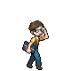

# Trainer Rosters

---

## Generic Trainers

| Trainer | P1 | P2 | P3 | P4 | P5 | P6 |
|:-------:|:--:|:--:|:--:|:--:|:--:|:--:|
|  Youngster Donny |  Gastly Lv. 27 |  Gastly Lv. 27 |  Gastly Lv. 27 |
|  Lass Molly |  Misdreavus Lv. 29 |
|  School Kid Chance |  Duskull Lv. 26 |  Shuppet Lv. 26 |  Duskull Lv. 26 |
|  School Kid Mackenzie |  Shuppet Lv. 26 |  Duskull Lv. 26 |  Shuppet Lv. 26 |
|  Ace Trainer Allen |  Haunter Lv. 29 |  Shedinja Lv. 29 |  Sableye Lv. 29 |
|  Ace Trainer Catherine |  Haunter Lv. 29 |  Rotom Lv. 29 |  Froslass Lv. 29 |
