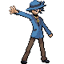

# Important Trainers

### PKMN Trainer Riley

| Pokémon | Attributes | Item | Moves |
|:-------:|------------|:----:|-------|
|  | **Lv. 49** Absol **Ability:** Super Luck **Nature:** ? |  Scope Lens | 1. Night Slash 2. Psycho Cut 3. Megahorn 4. Play Rough |
|  | **Lv. 49** Ursaring **Ability:** Guts **Nature:** ? |  Flame Orb | 1. Strength 2. Close Combat 3. Play Rough 4. Protect |
|  | **Lv. 49** Metagross **Ability:** Clear Body **Nature:** ? |  Liechi Berry | 1. Meteor Mash 2. Earthquake 3. Zen Headbutt 4. Agility |
|  | **Lv. 49** Salamence **Ability:** Intimidate **Nature:** ? |  Power Herb | 1. Dragon Rush 2. Fly 3. Crunch 4. Dragon Dance |
|  | **Lv. 49** Slaking **Ability:** Truant **Nature:** ? |  Sitrus Berry | 1. Body Slam 2. Hammer Arm 3. Play Rough 4. Slack Off |
|  | **Lv. 50** Lucario **Ability:** Adaptability **Nature:** ? |  Life Orb | 1. High Jump Kick 2. Meteor Mash 3. Blaze Kick 4. Bullet Punch |

