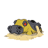

# Iron Island — Trainer Rosters

### Generic Trainers

| Trainer | P1 | P2 | P3 | P4 | P5 | P6 |
|:-------:|:--:|:--:|:--:|:--:|:--:|:--:|
|  Camper Lawrence |  [Charmeleon](../../pokemon/charmeleon.md/) Lv. 46 |  [Ambipom](../../pokemon/ambipom.md/) Lv. 46 |  [Floatzel](../../pokemon/floatzel.md/) Lv. 46 |
|  Picnicker Summer |  [Grovyle](../../pokemon/grovyle.md/) Lv. 46 |  [Fearow](../../pokemon/fearow.md/) Lv. 46 |  [Raichu](../../pokemon/raichu.md/) Lv. 46 |
|  Worker Noel |  [Donphan](../../pokemon/donphan.md/) Lv. 48 |
|  Worker Braden |  [Camerupt](../../pokemon/camerupt.md/) Lv. 48 |
|  Hiker Damon |  [Pupitar](../../pokemon/pupitar.md/) Lv. 46 |  [Probopass](../../pokemon/probopass.md/) Lv. 46 |  [Steelix](../../pokemon/steelix.md/) Lv. 46 |
|  Hiker Maurice |  [Rhydon](../../pokemon/rhydon.md/) Lv. 47 |  [Golem](../../pokemon/golem.md/) Lv. 47 |
|  Black Belt Kendal |  [Poliwrath](../../pokemon/poliwrath.md/) Lv. 48 |  [Hariyama](../../pokemon/hariyama.md/) Lv. 48 |
|  Battle Girl Tyler |  [Hitmontop](../../pokemon/hitmontop.md/) Lv. 48 |  [Primeape](../../pokemon/primeape.md/) Lv. 48 |
|  Worker Brendon |  [Magneton](../../pokemon/magneton.md/) Lv. 47 |  [Machoke](../../pokemon/machoke.md/) Lv. 47 |
|  Worker Quentin |  [Lairon](../../pokemon/lairon.md/) Lv. 47 |  [Graveler](../../pokemon/graveler.md/) Lv. 47 |
|  Ace Trainer Jonah |  [Masquerain](../../pokemon/masquerain.md/) Lv. 48 |  [Cradily](../../pokemon/cradily.md/) Lv. 48 |  [Hippowdon](../../pokemon/hippowdon.md/) Lv. 48 |
|  Ace Trainer Brenda |  [Gardevoir](../../pokemon/gardevoir.md/) Lv. 48 |  [Lopunny](../../pokemon/lopunny.md/) Lv. 48 |  [Medicham](../../pokemon/medicham.md/) Lv. 48 |
|  Galactic Grunt |  [Golbat](../../pokemon/golbat.md/) Lv. 46 |  [Houndoom](../../pokemon/houndoom.md/) Lv. 46 |  [Muk](../../pokemon/muk.md/) Lv. 46 |
|  Galactic Grunt |  [Purugly](../../pokemon/purugly.md/) Lv. 46 |  [Toxicroak](../../pokemon/toxicroak.md/) Lv. 46 |  [Skuntank](../../pokemon/skuntank.md/) Lv. 46 |

### Important Trainers

1. [PKMN Trainer Riley](important_trainers.md#pkmn-trainer-riley)
