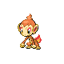

# Jubilife City — Important Trainers

### PKMN Trainer Dawn

=== "Turtwig"

	| Pokémon | Attributes | Item | Moves |
	|:-------:|------------|:----:|-------|
	|  | **Lv. 13** [Clefairy](../../pokemon/clefairy.md/) **Ability:** Cute Charm **Nature:** ? | No Item | 1. Double Slap 2. Encore 3. Sing 4. Disarming Voice |
	|  | **Lv. 14** [Chimchar](../../pokemon/chimchar.md/) **Ability:** Blaze **Nature:** ? | No Item | 1. Scratch 2. Ember 3. Taunt 4. Fury Swipes |
	
=== "Chimchar"

	| Pokémon | Attributes | Item | Moves |
	|:-------:|------------|:----:|-------|
	|  | **Lv. 13** [Clefairy](../../pokemon/clefairy.md/) **Ability:** Cute Charm **Nature:** ? | No Item | 1. Double Slap 2. Encore 3. Sing 4. Disarming Voice |
	|  | **Lv. 14** [Piplup](../../pokemon/piplup.md/) **Ability:** Torrent **Nature:** ? | No Item | 1. Pound 2. Bubble 3. Water Sport 4. Peck |
	
=== "Piplup"

	| Pokémon | Attributes | Item | Moves |
	|:-------:|------------|:----:|-------|
	|  | **Lv. 13** [Clefairy](../../pokemon/clefairy.md/) **Ability:** Cute Charm **Nature:** ? | No Item | 1. Double Slap 2. Encore 3. Sing 4. Disarming Voice |
	|  | **Lv. 14** [Turtwig](../../pokemon/turtwig.md/) **Ability:** Overgrow **Nature:** ? | No Item | 1. Tackle 2. Absorb 3. Razor Leaf 4. Curse |
	
### PKMN Trainer Lucas

=== "Turtwig"

	| Pokémon | Attributes | Item | Moves |
	|:-------:|------------|:----:|-------|
	|  | **Lv. 13** [Snubbull](../../pokemon/snubbull.md/) **Ability:** Intimidate **Nature:** ? | No Item | 1. Tackle 2. Charm 3. Lick 4. Bite |
	|  | **Lv. 14** [Chimchar](../../pokemon/chimchar.md/) **Ability:** Blaze **Nature:** ? | No Item | 1. Scratch 2. Ember 3. Taunt 4. Fury Swipes |
	
=== "Chimchar"

	| Pokémon | Attributes | Item | Moves |
	|:-------:|------------|:----:|-------|
	|  | **Lv. 13** [Snubbull](../../pokemon/snubbull.md/) **Ability:** Intimidate **Nature:** ? | No Item | 1. Tackle 2. Charm 3. Lick 4. Bite |
	|  | **Lv. 14** [Piplup](../../pokemon/piplup.md/) **Ability:** Torrent **Nature:** ? | No Item | 1. Pound 2. Bubble 3. Water Sport 4. Peck |
	
=== "Piplup"

	| Pokémon | Attributes | Item | Moves |
	|:-------:|------------|:----:|-------|
	|  | **Lv. 13** [Snubbull](../../pokemon/snubbull.md/) **Ability:** Intimidate **Nature:** ? | No Item | 1. Tackle 2. Charm 3. Lick 4. Bite |
	|  | **Lv. 14** [Turtwig](../../pokemon/turtwig.md/) **Ability:** Overgrow **Nature:** ? | No Item | 1. Tackle 2. Absorb 3. Razor Leaf 4. Curse |
	
