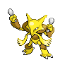

# Important Trainers

### Commander Saturn

| Pokémon | Attributes | Item | Moves |
|:-------:|------------|:----:|-------|
|  | **Lv. 52** Alakazam **Ability:** Magic Guard **Nature:** ? |  Wise Glasses | **1.** Psychic **2.** Calm Mind **3.** Recover **4.** Focus Blast |
|  | **Lv. 52** Octillery **Ability:** Suction Cups **Nature:** ? |  Expert Belt | **1.** Hydro Pump **2.** Seed Bomb **3.** Flamethrower **4.** Flash Cannon |
|  | **Lv. 52** Bronzong **Ability:** Levitate **Nature:** ? |  Bright Powder | **1.** Iron Head **2.** Zen Headbutt **3.** Shadow Ball **4.** Explosion |
|  | **Lv. 52** Rhydon **Ability:** Rock Head **Nature:** ? |  Muscle Band | **1.** Stone Edge **2.** Earthquake **3.** Hammer Arm **4.** Megahorn |
|  | **Lv. 53** Toxicroak **Ability:** Dry Skin **Nature:** ? |  Life Orb | **1.** Gunk Shot **2.** Cross Chop **3.** Fake Out **4.** Sucker Punch |

