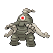

# Lake Valor — Wild Pokémon

### Walking

| Sprite | Pokémon | Encounter Type | Level | Chance |
|:------:|---------|:--------------:|-------|--------|
|  | [Staravia](../../pokemon/staravia.md/) | {: style='max-width: 24px;' } | 53 - 54 | 30% |
|  | [Bibarel](../../pokemon/bibarel.md/) | {: style='max-width: 24px;' } | 53 - 54 | 30% |
|  | [Masquerain](../../pokemon/masquerain.md/) | {: style='max-width: 24px;' } | 53 - 54 | 20% |
|  | [Lickitung](../../pokemon/lickitung.md/) | {: style='max-width: 24px;' } | 53 - 54 | 10% |
|  | [Golduck](../../pokemon/golduck.md/) | {: style='max-width: 24px;' } | 53 - 54 | 10% |
|  | [Staravia](../../pokemon/staravia.md/) | {: style='max-width: 24px;' } | 53 - 54 | 30% |
|  | [Bibarel](../../pokemon/bibarel.md/) | {: style='max-width: 24px;' } | 53 - 54 | 30% |
|  | [Masquerain](../../pokemon/masquerain.md/) | {: style='max-width: 24px;' } | 53 - 54 | 20% |
|  | [Lickitung](../../pokemon/lickitung.md/) | {: style='max-width: 24px;' } | 53 - 54 | 10% |
|  | [Golduck](../../pokemon/golduck.md/) | {: style='max-width: 24px;' } | 53 - 54 | 10% |
|  | [Staravia](../../pokemon/staravia.md/) | {: style='max-width: 24px;' } | 53 - 54 | 30% |
|  | [Bibarel](../../pokemon/bibarel.md/) | {: style='max-width: 24px;' } | 53 - 54 | 30% |
|  | [Masquerain](../../pokemon/masquerain.md/) | {: style='max-width: 24px;' } | 53 - 54 | 20% |
|  | [Lickitung](../../pokemon/lickitung.md/) | {: style='max-width: 24px;' } | 53 - 54 | 10% |
|  | [Golduck](../../pokemon/golduck.md/) | {: style='max-width: 24px;' } | 53 - 54 | 10% |
|  | [Wobbuffet](../../pokemon/wobbuffet.md/) | {: style='max-width: 24px;' } | 53 - 54 | 22% |

### Surfing

| Sprite | Pokémon | Encounter Type | Level | Chance |
|:------:|---------|:--------------:|-------|--------|
|  | [Surskit](../../pokemon/surskit.md/) | {: style='max-width: 24px;' } | 35 - 55 | 90% |
|  | [Masquerain](../../pokemon/masquerain.md/) | {: style='max-width: 24px;' } | 35 - 55 | 10% |

### Fishing

| Sprite | Pokémon | Encounter Type | Level | Chance |
|:------:|---------|:--------------:|-------|--------|
|  | [Magikarp](../../pokemon/magikarp.md/) | {: style='max-width: 24px;' } | 10 | 100% |
|  | [Magikarp](../../pokemon/magikarp.md/) | {: style='max-width: 24px;' } | 25 | 100% |
|  | [Gyarados](../../pokemon/gyarados.md/) | {: style='max-width: 24px;' } | 50 | 100% |

### Walking

| Sprite | Pokémon | Encounter Type | Level | Chance |
|:------:|---------|:--------------:|-------|--------|
|  | [Haunter](../../pokemon/haunter.md/) | {: style='max-width: 24px;' } | 53 - 54 | 30% |
|  | [Golbat](../../pokemon/golbat.md/) | {: style='max-width: 24px;' } | 53 - 54 | 25% |
|  | [Bronzong](../../pokemon/bronzong.md/) | {: style='max-width: 24px;' } | 53 - 54 | 15% |
|  | [Chimecho](../../pokemon/chimecho.md/) | {: style='max-width: 24px;' } | 53 - 54 | 10% |
|  | [Dusclops](../../pokemon/dusclops.md/) | {: style='max-width: 24px;' } | 53 - 54 | 10% |
|  | [Banette](../../pokemon/banette.md/) | {: style='max-width: 24px;' } | 53 - 54 | 10% |
|  | [Haunter](../../pokemon/haunter.md/) | {: style='max-width: 24px;' } | 53 - 54 | 30% |
|  | [Golbat](../../pokemon/golbat.md/) | {: style='max-width: 24px;' } | 53 - 54 | 25% |
|  | [Bronzong](../../pokemon/bronzong.md/) | {: style='max-width: 24px;' } | 53 - 54 | 15% |
|  | [Chimecho](../../pokemon/chimecho.md/) | {: style='max-width: 24px;' } | 53 - 54 | 10% |
|  | [Dusclops](../../pokemon/dusclops.md/) | {: style='max-width: 24px;' } | 53 - 54 | 10% |
|  | [Banette](../../pokemon/banette.md/) | {: style='max-width: 24px;' } | 53 - 54 | 10% |
|  | [Haunter](../../pokemon/haunter.md/) | {: style='max-width: 24px;' } | 53 - 54 | 30% |
|  | [Golbat](../../pokemon/golbat.md/) | {: style='max-width: 24px;' } | 53 - 54 | 25% |
|  | [Bronzong](../../pokemon/bronzong.md/) | {: style='max-width: 24px;' } | 53 - 54 | 15% |
|  | [Chimecho](../../pokemon/chimecho.md/) | {: style='max-width: 24px;' } | 53 - 54 | 10% |
|  | [Dusclops](../../pokemon/dusclops.md/) | {: style='max-width: 24px;' } | 53 - 54 | 10% |
|  | [Banette](../../pokemon/banette.md/) | {: style='max-width: 24px;' } | 53 - 54 | 10% |

