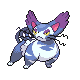

# Important Trainers

### Commander Mars

| Pokémon | Attributes | Item | Moves |
|:-------:|------------|:----:|-------|
|  | **Lv. 52** Crobat **Ability:** Inner Focus **Nature:** ? |  Bright Powder | **1.** Brave Bird **2.** Hypnosis **3.** Double Team **4.** Giga Drain |
|  | **Lv. 52** Yanmega **Ability:** Speed Boost **Nature:** ? |  Wise Glasses | **1.** Bug Buzz **2.** Air Slash **3.** Psychic **4.** Detect |
|  | **Lv. 52** Bronzong **Ability:** Levitate **Nature:** ? |  Leftovers | **1.** Stealth Rock **2.** Gyro Ball **3.** Payback **4.** Explosion |
|  | **Lv. 52** Kangaskhan **Ability:** Scrappy **Nature:** ? |  Muscle Band | **1.** Double-Edge **2.** Hammer Arm **3.** Crunch **4.** Fake Out |
|  | **Lv. 53** Purugly **Ability:** Thick Fat **Nature:** ? |  Sitrus Berry | **1.** Body Slam **2.** Play Rough **3.** Hypnosis **4.** Fake Out |

