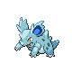

# Lake Verity — Trainer Rosters

### Generic Trainers

| Trainer | P1 | P2 | P3 | P4 | P5 | P6 |
|:-------:|:--:|:--:|:--:|:--:|:--:|:--:|
|  Galactic Grunt |  [Beautifly](../../pokemon/beautifly.md/) Lv. 50 |  [Butterfree](../../pokemon/butterfree.md/) Lv. 50 |
|  Galactic Grunt |  [Dustox](../../pokemon/dustox.md/) Lv. 50 |  [Beedrill](../../pokemon/beedrill.md/) Lv. 50 |
|  Galactic Grunt |  [Nidorino](../../pokemon/nidorino.md/) Lv. 49 |  [Golbat](../../pokemon/golbat.md/) Lv. 49 |  [Wormadam](../../pokemon/wormadam-plant.md/) Lv. 49 |
|  Galactic Grunt |  [Nidorina](../../pokemon/nidorina.md/) Lv. 49 |  [Golbat](../../pokemon/golbat.md/) Lv. 49 |  [Mothim](../../pokemon/mothim.md/) Lv. 49 |

### Important Trainers

1. [Commander Mars](important_trainers.md#commander-mars)
