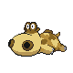
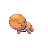

### Morning

| Sprite | Pokémon | Encounter Type | Level | Chance |
|:------:|---------|:--------------:|-------|--------|
|  | Diglett | {: style='max-width: 24px;' } | 28 - 32 | 25% |
|  | Whismur | {: style='max-width: 24px;' } | 28 - 32 | 20% |
|  | Hippopotas | {: style='max-width: 24px;' } | 28 - 32 | 15% |
|  | Trapinch | {: style='max-width: 24px;' } | 28 - 32 | 15% |
|  | Loudred | {: style='max-width: 24px;' } | 28 - 32 | 10% |
|  | Ditto | {: style='max-width: 24px;' } | 28 - 32 | 10% |
|  | Dugtrio | {: style='max-width: 24px;' } | 28 - 32 | 5% |

### Day

| Sprite | Pokémon | Encounter Type | Level | Chance |
|:------:|---------|:--------------:|-------|--------|
|  | Diglett | {: style='max-width: 24px;' } | 28 - 32 | 25% |
|  | Whismur | {: style='max-width: 24px;' } | 28 - 32 | 20% |
|  | Hippopotas | {: style='max-width: 24px;' } | 28 - 32 | 15% |
|  | Trapinch | {: style='max-width: 24px;' } | 28 - 32 | 15% |
|  | Loudred | {: style='max-width: 24px;' } | 28 - 32 | 10% |
|  | Ditto | {: style='max-width: 24px;' } | 28 - 32 | 10% |
|  | Dugtrio | {: style='max-width: 24px;' } | 28 - 32 | 5% |

### Night

| Sprite | Pokémon | Encounter Type | Level | Chance |
|:------:|---------|:--------------:|-------|--------|
|  | Diglett | {: style='max-width: 24px;' } | 28 - 32 | 25% |
|  | Whismur | {: style='max-width: 24px;' } | 28 - 32 | 20% |
|  | Hippopotas | {: style='max-width: 24px;' } | 28 - 32 | 15% |
|  | Trapinch | {: style='max-width: 24px;' } | 28 - 32 | 15% |
|  | Loudred | {: style='max-width: 24px;' } | 28 - 32 | 10% |
|  | Ditto | {: style='max-width: 24px;' } | 28 - 32 | 10% |
|  | Dugtrio | {: style='max-width: 24px;' } | 28 - 32 | 5% |

