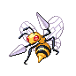
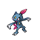
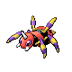
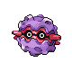

# Trainer Rosters

---

## 3F

### Generic Trainers

| Trainer | P1 | P2 | P3 | P4 | P5 | P6 |
|:-------:|:--:|:--:|:--:|:--:|:--:|:--:|
|  Galactic Grunt |  Nidorina Lv. 54 |  Swalot Lv. 54 |  Persian Lv. 54 |
|  Galactic Grunt |  Nidorino Lv. 54 |  Drapion Lv. 54 |  Kricketune Lv. 54 |

---

## 4F

### Generic Trainers

| Trainer | P1 | P2 | P3 | P4 | P5 | P6 |
|:-------:|:--:|:--:|:--:|:--:|:--:|:--:|
|  Galactic Grunt |  Houndoom Lv. 54 |  Golbat Lv. 54 |  Beedrill Lv. 54 |
|  Galactic Grunt |  Ledian Lv. 55 |  Weezing Lv. 55 |

---

## Route 211 Entrance

### Generic Trainers

| Trainer | P1 | P2 | P3 | P4 | P5 | P6 |
|:-------:|:--:|:--:|:--:|:--:|:--:|:--:|
|  Galactic Grunt |  Golbat Lv. 56 |
|  Galactic Grunt |  Murkrow Lv. 54 |  Mightyena Lv. 54 |  Sneasel Lv. 54 |
|  Galactic Grunt |  Masquerain Lv. 55 |  Muk Lv. 55 |

---

## 6F

### Generic Trainers

| Trainer | P1 | P2 | P3 | P4 | P5 | P6 |
|:-------:|:--:|:--:|:--:|:--:|:--:|:--:|
|  Galactic Grunt |  Golbat Lv. 55 |  Houndoom Lv. 55 |  Yanmega Lv. 55 |
|  Galactic Grunt |  Ariados Lv. 55 |  Persian Lv. 55 |  Forretress Lv. 55 |

---

## 7F

### Generic Trainers

| Trainer | P1 | P2 | P3 | P4 | P5 | P6 |
|:-------:|:--:|:--:|:--:|:--:|:--:|:--:|
|  Galactic Grunt |  Murkrow Lv. 55 |  Golbat Lv. 55 |  Toxicroak Lv. 55 |  Pinsir Lv. 55 |

