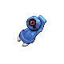
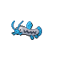

# Mt. Coronet — Wild Pokémon

---

## Route 211 Entrance

### Walking

| Sprite | Pokémon | Encounter Type | Level | Chance |
|:------:|---------|:--------------:|-------|--------|
|  | [Geodude](../../pokemon/geodude.md/) | {: style='max-width: 24px;' } | 16 - 18 | 20% |
|  | [Bronzor](../../pokemon/bronzor.md/) | {: style='max-width: 24px;' } | 16 - 18 | 20% |
|  | [Cleffa](../../pokemon/cleffa.md/) | {: style='max-width: 24px;' } | 16 - 18 | 10% |
|  | [Nosepass](../../pokemon/nosepass.md/) | {: style='max-width: 24px;' } | 16 - 18 | 10% |
|  | [Chingling](../../pokemon/chingling.md/) | {: style='max-width: 24px;' } | 16 - 18 | 10% |
|  | [Zubat](../../pokemon/zubat.md/) | {: style='max-width: 24px;' } | 16 - 18 | 10% |
|  | [Beldum](../../pokemon/beldum.md/) | {: style='max-width: 24px;' } | 16 - 18 | 10% |
|  | [Solrock](../../pokemon/solrock.md/) | {: style='max-width: 24px;' } | 16 - 18 | 5% |
|  | [Lunatone](../../pokemon/lunatone.md/) | {: style='max-width: 24px;' } | 16 - 18 | 5% |
|  | [Geodude](../../pokemon/geodude.md/) | {: style='max-width: 24px;' } | 16 - 18 | 20% |
|  | [Bronzor](../../pokemon/bronzor.md/) | {: style='max-width: 24px;' } | 16 - 18 | 20% |
|  | [Cleffa](../../pokemon/cleffa.md/) | {: style='max-width: 24px;' } | 16 - 18 | 10% |
|  | [Nosepass](../../pokemon/nosepass.md/) | {: style='max-width: 24px;' } | 16 - 18 | 10% |
|  | [Chingling](../../pokemon/chingling.md/) | {: style='max-width: 24px;' } | 16 - 18 | 10% |
|  | [Zubat](../../pokemon/zubat.md/) | {: style='max-width: 24px;' } | 16 - 18 | 10% |
|  | [Beldum](../../pokemon/beldum.md/) | {: style='max-width: 24px;' } | 16 - 18 | 10% |
|  | [Solrock](../../pokemon/solrock.md/) | {: style='max-width: 24px;' } | 16 - 18 | 5% |
|  | [Lunatone](../../pokemon/lunatone.md/) | {: style='max-width: 24px;' } | 16 - 18 | 5% |
|  | [Geodude](../../pokemon/geodude.md/) | {: style='max-width: 24px;' } | 16 - 18 | 20% |
|  | [Bronzor](../../pokemon/bronzor.md/) | {: style='max-width: 24px;' } | 16 - 18 | 20% |
|  | [Cleffa](../../pokemon/cleffa.md/) | {: style='max-width: 24px;' } | 16 - 18 | 10% |
|  | [Nosepass](../../pokemon/nosepass.md/) | {: style='max-width: 24px;' } | 16 - 18 | 10% |
|  | [Chingling](../../pokemon/chingling.md/) | {: style='max-width: 24px;' } | 16 - 18 | 10% |
|  | [Zubat](../../pokemon/zubat.md/) | {: style='max-width: 24px;' } | 16 - 18 | 10% |
|  | [Beldum](../../pokemon/beldum.md/) | {: style='max-width: 24px;' } | 16 - 18 | 10% |
|  | [Solrock](../../pokemon/solrock.md/) | {: style='max-width: 24px;' } | 16 - 18 | 5% |
|  | [Lunatone](../../pokemon/lunatone.md/) | {: style='max-width: 24px;' } | 16 - 18 | 5% |

---

## Tunnel

### Walking

| Sprite | Pokémon | Encounter Type | Level | Chance |
|:------:|---------|:--------------:|-------|--------|
|  | [Geodude](../../pokemon/geodude.md/) | {: style='max-width: 24px;' } | 18 - 19 | 20% |
|  | [Bronzor](../../pokemon/bronzor.md/) | {: style='max-width: 24px;' } | 18 - 19 | 20% |
|  | [Clefairy](../../pokemon/clefairy.md/) | {: style='max-width: 24px;' } | 18 - 19 | 10% |
|  | [Nosepass](../../pokemon/nosepass.md/) | {: style='max-width: 24px;' } | 18 - 19 | 10% |
|  | [Chimecho](../../pokemon/chimecho.md/) | {: style='max-width: 24px;' } | 18 - 19 | 10% |
|  | [Zubat](../../pokemon/zubat.md/) | {: style='max-width: 24px;' } | 18 - 19 | 10% |
|  | [Beldum](../../pokemon/beldum.md/) | {: style='max-width: 24px;' } | 18 - 19 | 10% |
|  | [Solrock](../../pokemon/solrock.md/) | {: style='max-width: 24px;' } | 18 - 19 | 5% |
|  | [Lunatone](../../pokemon/lunatone.md/) | {: style='max-width: 24px;' } | 18 - 19 | 5% |
|  | [Geodude](../../pokemon/geodude.md/) | {: style='max-width: 24px;' } | 18 - 19 | 20% |
|  | [Bronzor](../../pokemon/bronzor.md/) | {: style='max-width: 24px;' } | 18 - 19 | 20% |
|  | [Clefairy](../../pokemon/clefairy.md/) | {: style='max-width: 24px;' } | 18 - 19 | 10% |
|  | [Nosepass](../../pokemon/nosepass.md/) | {: style='max-width: 24px;' } | 18 - 19 | 10% |
|  | [Chimecho](../../pokemon/chimecho.md/) | {: style='max-width: 24px;' } | 18 - 19 | 10% |
|  | [Zubat](../../pokemon/zubat.md/) | {: style='max-width: 24px;' } | 18 - 19 | 10% |
|  | [Beldum](../../pokemon/beldum.md/) | {: style='max-width: 24px;' } | 18 - 19 | 10% |
|  | [Solrock](../../pokemon/solrock.md/) | {: style='max-width: 24px;' } | 18 - 19 | 5% |
|  | [Lunatone](../../pokemon/lunatone.md/) | {: style='max-width: 24px;' } | 18 - 19 | 5% |
|  | [Geodude](../../pokemon/geodude.md/) | {: style='max-width: 24px;' } | 18 - 19 | 20% |
|  | [Bronzor](../../pokemon/bronzor.md/) | {: style='max-width: 24px;' } | 18 - 19 | 20% |
|  | [Clefairy](../../pokemon/clefairy.md/) | {: style='max-width: 24px;' } | 18 - 19 | 10% |
|  | [Nosepass](../../pokemon/nosepass.md/) | {: style='max-width: 24px;' } | 18 - 19 | 10% |
|  | [Chimecho](../../pokemon/chimecho.md/) | {: style='max-width: 24px;' } | 18 - 19 | 10% |
|  | [Zubat](../../pokemon/zubat.md/) | {: style='max-width: 24px;' } | 18 - 19 | 10% |
|  | [Beldum](../../pokemon/beldum.md/) | {: style='max-width: 24px;' } | 18 - 19 | 10% |
|  | [Solrock](../../pokemon/solrock.md/) | {: style='max-width: 24px;' } | 18 - 19 | 5% |
|  | [Lunatone](../../pokemon/lunatone.md/) | {: style='max-width: 24px;' } | 18 - 19 | 5% |

---

## B1F

### Walking

| Sprite | Pokémon | Encounter Type | Level | Chance |
|:------:|---------|:--------------:|-------|--------|
|  | [Geodude](../../pokemon/geodude.md/) | {: style='max-width: 24px;' } | 18 - 20 | 20% |
|  | [Bronzor](../../pokemon/bronzor.md/) | {: style='max-width: 24px;' } | 18 - 20 | 20% |
|  | [Clefairy](../../pokemon/clefairy.md/) | {: style='max-width: 24px;' } | 18 - 20 | 10% |
|  | [Nosepass](../../pokemon/nosepass.md/) | {: style='max-width: 24px;' } | 18 - 20 | 10% |
|  | [Chimecho](../../pokemon/chimecho.md/) | {: style='max-width: 24px;' } | 18 - 20 | 10% |
|  | [Zubat](../../pokemon/zubat.md/) | {: style='max-width: 24px;' } | 18 - 20 | 10% |
|  | [Metang](../../pokemon/metang.md/) | {: style='max-width: 24px;' } | 18 - 20 | 10% |
|  | [Solrock](../../pokemon/solrock.md/) | {: style='max-width: 24px;' } | 18 - 20 | 5% |
|  | [Lunatone](../../pokemon/lunatone.md/) | {: style='max-width: 24px;' } | 18 - 20 | 5% |
|  | [Geodude](../../pokemon/geodude.md/) | {: style='max-width: 24px;' } | 18 - 20 | 20% |
|  | [Bronzor](../../pokemon/bronzor.md/) | {: style='max-width: 24px;' } | 18 - 20 | 20% |
|  | [Clefairy](../../pokemon/clefairy.md/) | {: style='max-width: 24px;' } | 18 - 20 | 10% |
|  | [Nosepass](../../pokemon/nosepass.md/) | {: style='max-width: 24px;' } | 18 - 20 | 10% |
|  | [Chimecho](../../pokemon/chimecho.md/) | {: style='max-width: 24px;' } | 18 - 20 | 10% |
|  | [Zubat](../../pokemon/zubat.md/) | {: style='max-width: 24px;' } | 18 - 20 | 10% |
|  | [Metang](../../pokemon/metang.md/) | {: style='max-width: 24px;' } | 18 - 20 | 10% |
|  | [Solrock](../../pokemon/solrock.md/) | {: style='max-width: 24px;' } | 18 - 20 | 5% |
|  | [Lunatone](../../pokemon/lunatone.md/) | {: style='max-width: 24px;' } | 18 - 20 | 5% |
|  | [Geodude](../../pokemon/geodude.md/) | {: style='max-width: 24px;' } | 18 - 20 | 20% |
|  | [Bronzor](../../pokemon/bronzor.md/) | {: style='max-width: 24px;' } | 18 - 20 | 20% |
|  | [Clefairy](../../pokemon/clefairy.md/) | {: style='max-width: 24px;' } | 18 - 20 | 10% |
|  | [Nosepass](../../pokemon/nosepass.md/) | {: style='max-width: 24px;' } | 18 - 20 | 10% |
|  | [Chimecho](../../pokemon/chimecho.md/) | {: style='max-width: 24px;' } | 18 - 20 | 10% |
|  | [Zubat](../../pokemon/zubat.md/) | {: style='max-width: 24px;' } | 18 - 20 | 10% |
|  | [Metang](../../pokemon/metang.md/) | {: style='max-width: 24px;' } | 18 - 20 | 10% |
|  | [Solrock](../../pokemon/solrock.md/) | {: style='max-width: 24px;' } | 18 - 20 | 5% |
|  | [Lunatone](../../pokemon/lunatone.md/) | {: style='max-width: 24px;' } | 18 - 20 | 5% |

### Surfing

| Sprite | Pokémon | Encounter Type | Level | Chance |
|:------:|---------|:--------------:|-------|--------|
|  | [Spheal](../../pokemon/spheal.md/) | {: style='max-width: 24px;' } | 30 - 45 | 60% |
|  | [Seel](../../pokemon/seel.md/) | {: style='max-width: 24px;' } | 30 - 45 | 30% |
|  | [Sealeo](../../pokemon/sealeo.md/) | {: style='max-width: 24px;' } | 30 - 45 | 10% |

### Fishing

| Sprite | Pokémon | Encounter Type | Level | Chance |
|:------:|---------|:--------------:|-------|--------|
|  | [Feebas](../../pokemon/feebas.md/) | {: style='max-width: 24px;' } | 10 | 100% |
|  | [Feebas](../../pokemon/feebas.md/) | {: style='max-width: 24px;' } | 25 | 100% |
|  | [Feebas](../../pokemon/feebas.md/) | {: style='max-width: 24px;' } | 50 | 100% |

---

## Route 216 Entrance

### Walking

| Sprite | Pokémon | Encounter Type | Level | Chance |
|:------:|---------|:--------------:|-------|--------|
|  | [Geodude](../../pokemon/geodude.md/) | {: style='max-width: 24px;' } | 18 - 19 | 20% |
|  | [Bronzor](../../pokemon/bronzor.md/) | {: style='max-width: 24px;' } | 18 - 19 | 20% |
|  | [Clefairy](../../pokemon/clefairy.md/) | {: style='max-width: 24px;' } | 18 - 19 | 10% |
|  | [Nosepass](../../pokemon/nosepass.md/) | {: style='max-width: 24px;' } | 18 - 19 | 10% |
|  | [Chimecho](../../pokemon/chimecho.md/) | {: style='max-width: 24px;' } | 18 - 19 | 10% |
|  | [Zubat](../../pokemon/zubat.md/) | {: style='max-width: 24px;' } | 18 - 19 | 10% |
|  | [Beldum](../../pokemon/beldum.md/) | {: style='max-width: 24px;' } | 18 - 19 | 10% |
|  | [Solrock](../../pokemon/solrock.md/) | {: style='max-width: 24px;' } | 18 - 19 | 5% |
|  | [Lunatone](../../pokemon/lunatone.md/) | {: style='max-width: 24px;' } | 18 - 19 | 5% |
|  | [Geodude](../../pokemon/geodude.md/) | {: style='max-width: 24px;' } | 18 - 19 | 20% |
|  | [Bronzor](../../pokemon/bronzor.md/) | {: style='max-width: 24px;' } | 18 - 19 | 20% |
|  | [Clefairy](../../pokemon/clefairy.md/) | {: style='max-width: 24px;' } | 18 - 19 | 10% |
|  | [Nosepass](../../pokemon/nosepass.md/) | {: style='max-width: 24px;' } | 18 - 19 | 10% |
|  | [Chimecho](../../pokemon/chimecho.md/) | {: style='max-width: 24px;' } | 18 - 19 | 10% |
|  | [Zubat](../../pokemon/zubat.md/) | {: style='max-width: 24px;' } | 18 - 19 | 10% |
|  | [Beldum](../../pokemon/beldum.md/) | {: style='max-width: 24px;' } | 18 - 19 | 10% |
|  | [Solrock](../../pokemon/solrock.md/) | {: style='max-width: 24px;' } | 18 - 19 | 5% |
|  | [Lunatone](../../pokemon/lunatone.md/) | {: style='max-width: 24px;' } | 18 - 19 | 5% |
|  | [Geodude](../../pokemon/geodude.md/) | {: style='max-width: 24px;' } | 18 - 19 | 20% |
|  | [Bronzor](../../pokemon/bronzor.md/) | {: style='max-width: 24px;' } | 18 - 19 | 20% |
|  | [Clefairy](../../pokemon/clefairy.md/) | {: style='max-width: 24px;' } | 18 - 19 | 10% |
|  | [Nosepass](../../pokemon/nosepass.md/) | {: style='max-width: 24px;' } | 18 - 19 | 10% |
|  | [Chimecho](../../pokemon/chimecho.md/) | {: style='max-width: 24px;' } | 18 - 19 | 10% |
|  | [Zubat](../../pokemon/zubat.md/) | {: style='max-width: 24px;' } | 18 - 19 | 10% |
|  | [Beldum](../../pokemon/beldum.md/) | {: style='max-width: 24px;' } | 18 - 19 | 10% |
|  | [Solrock](../../pokemon/solrock.md/) | {: style='max-width: 24px;' } | 18 - 19 | 5% |
|  | [Lunatone](../../pokemon/lunatone.md/) | {: style='max-width: 24px;' } | 18 - 19 | 5% |

---

## Route 207 Entrance

### Walking

| Sprite | Pokémon | Encounter Type | Level | Chance |
|:------:|---------|:--------------:|-------|--------|
|  | [Geodude](../../pokemon/geodude.md/) | {: style='max-width: 24px;' } | 22 - 23 | 20% |
|  | [Bronzor](../../pokemon/bronzor.md/) | {: style='max-width: 24px;' } | 22 - 23 | 20% |
|  | [Clefairy](../../pokemon/clefairy.md/) | {: style='max-width: 24px;' } | 22 - 23 | 10% |
|  | [Nosepass](../../pokemon/nosepass.md/) | {: style='max-width: 24px;' } | 22 - 23 | 10% |
|  | [Chimecho](../../pokemon/chimecho.md/) | {: style='max-width: 24px;' } | 22 - 23 | 10% |
|  | [Golbat](../../pokemon/golbat.md/) | {: style='max-width: 24px;' } | 22 - 23 | 10% |
|  | [Metang](../../pokemon/metang.md/) | {: style='max-width: 24px;' } | 22 - 23 | 10% |
|  | [Solrock](../../pokemon/solrock.md/) | {: style='max-width: 24px;' } | 22 - 23 | 5% |
|  | [Lunatone](../../pokemon/lunatone.md/) | {: style='max-width: 24px;' } | 22 - 23 | 5% |
|  | [Geodude](../../pokemon/geodude.md/) | {: style='max-width: 24px;' } | 22 - 23 | 20% |
|  | [Bronzor](../../pokemon/bronzor.md/) | {: style='max-width: 24px;' } | 22 - 23 | 20% |
|  | [Clefairy](../../pokemon/clefairy.md/) | {: style='max-width: 24px;' } | 22 - 23 | 10% |
|  | [Nosepass](../../pokemon/nosepass.md/) | {: style='max-width: 24px;' } | 22 - 23 | 10% |
|  | [Chimecho](../../pokemon/chimecho.md/) | {: style='max-width: 24px;' } | 22 - 23 | 10% |
|  | [Golbat](../../pokemon/golbat.md/) | {: style='max-width: 24px;' } | 22 - 23 | 10% |
|  | [Metang](../../pokemon/metang.md/) | {: style='max-width: 24px;' } | 22 - 23 | 10% |
|  | [Solrock](../../pokemon/solrock.md/) | {: style='max-width: 24px;' } | 22 - 23 | 5% |
|  | [Lunatone](../../pokemon/lunatone.md/) | {: style='max-width: 24px;' } | 22 - 23 | 5% |
|  | [Geodude](../../pokemon/geodude.md/) | {: style='max-width: 24px;' } | 22 - 23 | 20% |
|  | [Bronzor](../../pokemon/bronzor.md/) | {: style='max-width: 24px;' } | 22 - 23 | 20% |
|  | [Clefairy](../../pokemon/clefairy.md/) | {: style='max-width: 24px;' } | 22 - 23 | 10% |
|  | [Nosepass](../../pokemon/nosepass.md/) | {: style='max-width: 24px;' } | 22 - 23 | 10% |
|  | [Chimecho](../../pokemon/chimecho.md/) | {: style='max-width: 24px;' } | 22 - 23 | 10% |
|  | [Golbat](../../pokemon/golbat.md/) | {: style='max-width: 24px;' } | 22 - 23 | 10% |
|  | [Metang](../../pokemon/metang.md/) | {: style='max-width: 24px;' } | 22 - 23 | 10% |
|  | [Solrock](../../pokemon/solrock.md/) | {: style='max-width: 24px;' } | 22 - 23 | 5% |
|  | [Lunatone](../../pokemon/lunatone.md/) | {: style='max-width: 24px;' } | 22 - 23 | 5% |

### Surfing

| Sprite | Pokémon | Encounter Type | Level | Chance |
|:------:|---------|:--------------:|-------|--------|
|  | [Zubat](../../pokemon/zubat.md/) | {: style='max-width: 24px;' } | 20 - 40 | 90% |
|  | [Golbat](../../pokemon/golbat.md/) | {: style='max-width: 24px;' } | 20 - 40 | 10% |

### Fishing

| Sprite | Pokémon | Encounter Type | Level | Chance |
|:------:|---------|:--------------:|-------|--------|
|  | [Magikarp](../../pokemon/magikarp.md/) | {: style='max-width: 24px;' } | 10 | 65% |
|  | [Barboach](../../pokemon/barboach.md/) | {: style='max-width: 24px;' } | 10 | 35% |
|  | [Magikarp](../../pokemon/magikarp.md/) | {: style='max-width: 24px;' } | 25 | 65% |
|  | [Barboach](../../pokemon/barboach.md/) | {: style='max-width: 24px;' } | 25 | 35% |
|  | [Gyarados](../../pokemon/gyarados.md/) | {: style='max-width: 24px;' } | 50 | 65% |
|  | [Whiscash](../../pokemon/whiscash.md/) | {: style='max-width: 24px;' } | 50 | 35% |

---

## 2F

### Walking

| Sprite | Pokémon | Encounter Type | Level | Chance |
|:------:|---------|:--------------:|-------|--------|
|  | [Graveler](../../pokemon/graveler.md/) | {: style='max-width: 24px;' } | 49 - 51 | 20% |
|  | [Bronzong](../../pokemon/bronzong.md/) | {: style='max-width: 24px;' } | 49 - 51 | 20% |
|  | [Clefairy](../../pokemon/clefairy.md/) | {: style='max-width: 24px;' } | 49 - 51 | 10% |
|  | [Nosepass](../../pokemon/nosepass.md/) | {: style='max-width: 24px;' } | 49 - 51 | 10% |
|  | [Chimecho](../../pokemon/chimecho.md/) | {: style='max-width: 24px;' } | 49 - 51 | 10% |
|  | [Golbat](../../pokemon/golbat.md/) | {: style='max-width: 24px;' } | 49 - 51 | 10% |
|  | [Metang](../../pokemon/metang.md/) | {: style='max-width: 24px;' } | 49 - 51 | 10% |
|  | [Solrock](../../pokemon/solrock.md/) | {: style='max-width: 24px;' } | 49 - 51 | 5% |
|  | [Lunatone](../../pokemon/lunatone.md/) | {: style='max-width: 24px;' } | 49 - 51 | 5% |
|  | [Graveler](../../pokemon/graveler.md/) | {: style='max-width: 24px;' } | 49 - 51 | 20% |
|  | [Bronzong](../../pokemon/bronzong.md/) | {: style='max-width: 24px;' } | 49 - 51 | 20% |
|  | [Clefairy](../../pokemon/clefairy.md/) | {: style='max-width: 24px;' } | 49 - 51 | 10% |
|  | [Nosepass](../../pokemon/nosepass.md/) | {: style='max-width: 24px;' } | 49 - 51 | 10% |
|  | [Chimecho](../../pokemon/chimecho.md/) | {: style='max-width: 24px;' } | 49 - 51 | 10% |
|  | [Golbat](../../pokemon/golbat.md/) | {: style='max-width: 24px;' } | 49 - 51 | 10% |
|  | [Metang](../../pokemon/metang.md/) | {: style='max-width: 24px;' } | 49 - 51 | 10% |
|  | [Solrock](../../pokemon/solrock.md/) | {: style='max-width: 24px;' } | 49 - 51 | 5% |
|  | [Lunatone](../../pokemon/lunatone.md/) | {: style='max-width: 24px;' } | 49 - 51 | 5% |
|  | [Graveler](../../pokemon/graveler.md/) | {: style='max-width: 24px;' } | 49 - 51 | 20% |
|  | [Bronzong](../../pokemon/bronzong.md/) | {: style='max-width: 24px;' } | 49 - 51 | 20% |
|  | [Clefairy](../../pokemon/clefairy.md/) | {: style='max-width: 24px;' } | 49 - 51 | 10% |
|  | [Nosepass](../../pokemon/nosepass.md/) | {: style='max-width: 24px;' } | 49 - 51 | 10% |
|  | [Chimecho](../../pokemon/chimecho.md/) | {: style='max-width: 24px;' } | 49 - 51 | 10% |
|  | [Golbat](../../pokemon/golbat.md/) | {: style='max-width: 24px;' } | 49 - 51 | 10% |
|  | [Metang](../../pokemon/metang.md/) | {: style='max-width: 24px;' } | 49 - 51 | 10% |
|  | [Solrock](../../pokemon/solrock.md/) | {: style='max-width: 24px;' } | 49 - 51 | 5% |
|  | [Lunatone](../../pokemon/lunatone.md/) | {: style='max-width: 24px;' } | 49 - 51 | 5% |

---

## 3F

### Walking

| Sprite | Pokémon | Encounter Type | Level | Chance |
|:------:|---------|:--------------:|-------|--------|
|  | [Graveler](../../pokemon/graveler.md/) | {: style='max-width: 24px;' } | 49 - 51 | 20% |
|  | [Bronzong](../../pokemon/bronzong.md/) | {: style='max-width: 24px;' } | 49 - 51 | 20% |
|  | [Clefairy](../../pokemon/clefairy.md/) | {: style='max-width: 24px;' } | 49 - 51 | 10% |
|  | [Nosepass](../../pokemon/nosepass.md/) | {: style='max-width: 24px;' } | 49 - 51 | 10% |
|  | [Chimecho](../../pokemon/chimecho.md/) | {: style='max-width: 24px;' } | 49 - 51 | 10% |
|  | [Golbat](../../pokemon/golbat.md/) | {: style='max-width: 24px;' } | 49 - 51 | 10% |
|  | [Metang](../../pokemon/metang.md/) | {: style='max-width: 24px;' } | 49 - 51 | 10% |
|  | [Solrock](../../pokemon/solrock.md/) | {: style='max-width: 24px;' } | 49 - 51 | 5% |
|  | [Lunatone](../../pokemon/lunatone.md/) | {: style='max-width: 24px;' } | 49 - 51 | 5% |
|  | [Graveler](../../pokemon/graveler.md/) | {: style='max-width: 24px;' } | 49 - 51 | 20% |
|  | [Bronzong](../../pokemon/bronzong.md/) | {: style='max-width: 24px;' } | 49 - 51 | 20% |
|  | [Clefairy](../../pokemon/clefairy.md/) | {: style='max-width: 24px;' } | 49 - 51 | 10% |
|  | [Nosepass](../../pokemon/nosepass.md/) | {: style='max-width: 24px;' } | 49 - 51 | 10% |
|  | [Chimecho](../../pokemon/chimecho.md/) | {: style='max-width: 24px;' } | 49 - 51 | 10% |
|  | [Golbat](../../pokemon/golbat.md/) | {: style='max-width: 24px;' } | 49 - 51 | 10% |
|  | [Metang](../../pokemon/metang.md/) | {: style='max-width: 24px;' } | 49 - 51 | 10% |
|  | [Solrock](../../pokemon/solrock.md/) | {: style='max-width: 24px;' } | 49 - 51 | 5% |
|  | [Lunatone](../../pokemon/lunatone.md/) | {: style='max-width: 24px;' } | 49 - 51 | 5% |
|  | [Graveler](../../pokemon/graveler.md/) | {: style='max-width: 24px;' } | 49 - 51 | 20% |
|  | [Bronzong](../../pokemon/bronzong.md/) | {: style='max-width: 24px;' } | 49 - 51 | 20% |
|  | [Clefairy](../../pokemon/clefairy.md/) | {: style='max-width: 24px;' } | 49 - 51 | 10% |
|  | [Nosepass](../../pokemon/nosepass.md/) | {: style='max-width: 24px;' } | 49 - 51 | 10% |
|  | [Chimecho](../../pokemon/chimecho.md/) | {: style='max-width: 24px;' } | 49 - 51 | 10% |
|  | [Golbat](../../pokemon/golbat.md/) | {: style='max-width: 24px;' } | 49 - 51 | 10% |
|  | [Metang](../../pokemon/metang.md/) | {: style='max-width: 24px;' } | 49 - 51 | 10% |
|  | [Solrock](../../pokemon/solrock.md/) | {: style='max-width: 24px;' } | 49 - 51 | 5% |
|  | [Lunatone](../../pokemon/lunatone.md/) | {: style='max-width: 24px;' } | 49 - 51 | 5% |

---

## Cliffside

### Walking

| Sprite | Pokémon | Encounter Type | Level | Chance |
|:------:|---------|:--------------:|-------|--------|
|  | [Abomasnow](../../pokemon/abomasnow.md/) | {: style='max-width: 24px;' } | 50 - 52 | 30% |
|  | [Medicham](../../pokemon/medicham.md/) | {: style='max-width: 24px;' } | 50 - 52 | 20% |
|  | [Loudred](../../pokemon/loudred.md/) | {: style='max-width: 24px;' } | 50 - 52 | 20% |
|  | [Absol](../../pokemon/absol.md/) | {: style='max-width: 24px;' } | 50 - 52 | 10% |
|  | [Donphan](../../pokemon/donphan.md/) | {: style='max-width: 24px;' } | 50 - 52 | 10% |
|  | [Ursaring](../../pokemon/ursaring.md/) | {: style='max-width: 24px;' } | 50 - 52 | 10% |
|  | [Abomasnow](../../pokemon/abomasnow.md/) | {: style='max-width: 24px;' } | 50 - 52 | 30% |
|  | [Medicham](../../pokemon/medicham.md/) | {: style='max-width: 24px;' } | 50 - 52 | 20% |
|  | [Loudred](../../pokemon/loudred.md/) | {: style='max-width: 24px;' } | 50 - 52 | 20% |
|  | [Absol](../../pokemon/absol.md/) | {: style='max-width: 24px;' } | 50 - 52 | 10% |
|  | [Donphan](../../pokemon/donphan.md/) | {: style='max-width: 24px;' } | 50 - 52 | 10% |
|  | [Ursaring](../../pokemon/ursaring.md/) | {: style='max-width: 24px;' } | 50 - 52 | 10% |
|  | [Abomasnow](../../pokemon/abomasnow.md/) | {: style='max-width: 24px;' } | 50 - 52 | 30% |
|  | [Medicham](../../pokemon/medicham.md/) | {: style='max-width: 24px;' } | 50 - 52 | 20% |
|  | [Loudred](../../pokemon/loudred.md/) | {: style='max-width: 24px;' } | 50 - 52 | 20% |
|  | [Absol](../../pokemon/absol.md/) | {: style='max-width: 24px;' } | 50 - 52 | 10% |
|  | [Donphan](../../pokemon/donphan.md/) | {: style='max-width: 24px;' } | 50 - 52 | 10% |
|  | [Ursaring](../../pokemon/ursaring.md/) | {: style='max-width: 24px;' } | 50 - 52 | 10% |
|  | [Clefable](../../pokemon/clefable.md/) | {: style='max-width: 24px;' } | 50 - 52 | 22% |

---

## 4F

### Walking

| Sprite | Pokémon | Encounter Type | Level | Chance |
|:------:|---------|:--------------:|-------|--------|
|  | [Graveler](../../pokemon/graveler.md/) | {: style='max-width: 24px;' } | 50 - 52 | 20% |
|  | [Bronzong](../../pokemon/bronzong.md/) | {: style='max-width: 24px;' } | 50 - 52 | 20% |
|  | [Clefairy](../../pokemon/clefairy.md/) | {: style='max-width: 24px;' } | 50 - 52 | 10% |
|  | [Nosepass](../../pokemon/nosepass.md/) | {: style='max-width: 24px;' } | 50 - 52 | 10% |
|  | [Chimecho](../../pokemon/chimecho.md/) | {: style='max-width: 24px;' } | 50 - 52 | 10% |
|  | [Golbat](../../pokemon/golbat.md/) | {: style='max-width: 24px;' } | 50 - 52 | 10% |
|  | [Metang](../../pokemon/metang.md/) | {: style='max-width: 24px;' } | 50 - 52 | 10% |
|  | [Solrock](../../pokemon/solrock.md/) | {: style='max-width: 24px;' } | 50 - 52 | 5% |
|  | [Lunatone](../../pokemon/lunatone.md/) | {: style='max-width: 24px;' } | 50 - 52 | 5% |
|  | [Graveler](../../pokemon/graveler.md/) | {: style='max-width: 24px;' } | 50 - 52 | 20% |
|  | [Bronzong](../../pokemon/bronzong.md/) | {: style='max-width: 24px;' } | 50 - 52 | 20% |
|  | [Clefairy](../../pokemon/clefairy.md/) | {: style='max-width: 24px;' } | 50 - 52 | 10% |
|  | [Nosepass](../../pokemon/nosepass.md/) | {: style='max-width: 24px;' } | 50 - 52 | 10% |
|  | [Chimecho](../../pokemon/chimecho.md/) | {: style='max-width: 24px;' } | 50 - 52 | 10% |
|  | [Golbat](../../pokemon/golbat.md/) | {: style='max-width: 24px;' } | 50 - 52 | 10% |
|  | [Metang](../../pokemon/metang.md/) | {: style='max-width: 24px;' } | 50 - 52 | 10% |
|  | [Solrock](../../pokemon/solrock.md/) | {: style='max-width: 24px;' } | 50 - 52 | 5% |
|  | [Lunatone](../../pokemon/lunatone.md/) | {: style='max-width: 24px;' } | 50 - 52 | 5% |
|  | [Graveler](../../pokemon/graveler.md/) | {: style='max-width: 24px;' } | 50 - 52 | 20% |
|  | [Bronzong](../../pokemon/bronzong.md/) | {: style='max-width: 24px;' } | 50 - 52 | 20% |
|  | [Clefairy](../../pokemon/clefairy.md/) | {: style='max-width: 24px;' } | 50 - 52 | 10% |
|  | [Nosepass](../../pokemon/nosepass.md/) | {: style='max-width: 24px;' } | 50 - 52 | 10% |
|  | [Chimecho](../../pokemon/chimecho.md/) | {: style='max-width: 24px;' } | 50 - 52 | 10% |
|  | [Golbat](../../pokemon/golbat.md/) | {: style='max-width: 24px;' } | 50 - 52 | 10% |
|  | [Metang](../../pokemon/metang.md/) | {: style='max-width: 24px;' } | 50 - 52 | 10% |
|  | [Solrock](../../pokemon/solrock.md/) | {: style='max-width: 24px;' } | 50 - 52 | 5% |
|  | [Lunatone](../../pokemon/lunatone.md/) | {: style='max-width: 24px;' } | 50 - 52 | 5% |

### Surfing

| Sprite | Pokémon | Encounter Type | Level | Chance |
|:------:|---------|:--------------:|-------|--------|
|  | [Zubat](../../pokemon/zubat.md/) | {: style='max-width: 24px;' } | 35 - 55 | 90% |
|  | [Golbat](../../pokemon/golbat.md/) | {: style='max-width: 24px;' } | 35 - 55 | 10% |

### Fishing

| Sprite | Pokémon | Encounter Type | Level | Chance |
|:------:|---------|:--------------:|-------|--------|
|  | [Magikarp](../../pokemon/magikarp.md/) | {: style='max-width: 24px;' } | 10 | 60% |
|  | [Horsea](../../pokemon/horsea.md/) | {: style='max-width: 24px;' } | 10 | 30% |
|  | [Dratini](../../pokemon/dratini.md/) | {: style='max-width: 24px;' } | 10 | 10% |
|  | [Magikarp](../../pokemon/magikarp.md/) | {: style='max-width: 24px;' } | 25 | 60% |
|  | [Horsea](../../pokemon/horsea.md/) | {: style='max-width: 24px;' } | 25 | 30% |
|  | [Dratini](../../pokemon/dratini.md/) | {: style='max-width: 24px;' } | 25 | 10% |
|  | [Gyarados](../../pokemon/gyarados.md/) | {: style='max-width: 24px;' } | 50 | 60% |
|  | [Seadra](../../pokemon/seadra.md/) | {: style='max-width: 24px;' } | 50 | 30% |
|  | [Dragonair](../../pokemon/dragonair.md/) | {: style='max-width: 24px;' } | 50 | 10% |

---

## Summit

### Walking

| Sprite | Pokémon | Encounter Type | Level | Chance |
|:------:|---------|:--------------:|-------|--------|
|  | [Abomasnow](../../pokemon/abomasnow.md/) | {: style='max-width: 24px;' } | 51 - 53 | 30% |
|  | [Medicham](../../pokemon/medicham.md/) | {: style='max-width: 24px;' } | 51 - 53 | 20% |
|  | [Loudred](../../pokemon/loudred.md/) | {: style='max-width: 24px;' } | 51 - 53 | 20% |
|  | [Absol](../../pokemon/absol.md/) | {: style='max-width: 24px;' } | 51 - 53 | 10% |
|  | [Donphan](../../pokemon/donphan.md/) | {: style='max-width: 24px;' } | 51 - 53 | 10% |
|  | [Ursaring](../../pokemon/ursaring.md/) | {: style='max-width: 24px;' } | 51 - 53 | 10% |
|  | [Abomasnow](../../pokemon/abomasnow.md/) | {: style='max-width: 24px;' } | 51 - 53 | 30% |
|  | [Medicham](../../pokemon/medicham.md/) | {: style='max-width: 24px;' } | 51 - 53 | 20% |
|  | [Loudred](../../pokemon/loudred.md/) | {: style='max-width: 24px;' } | 51 - 53 | 20% |
|  | [Absol](../../pokemon/absol.md/) | {: style='max-width: 24px;' } | 51 - 53 | 10% |
|  | [Donphan](../../pokemon/donphan.md/) | {: style='max-width: 24px;' } | 51 - 53 | 10% |
|  | [Ursaring](../../pokemon/ursaring.md/) | {: style='max-width: 24px;' } | 51 - 53 | 10% |
|  | [Abomasnow](../../pokemon/abomasnow.md/) | {: style='max-width: 24px;' } | 51 - 53 | 30% |
|  | [Medicham](../../pokemon/medicham.md/) | {: style='max-width: 24px;' } | 51 - 53 | 20% |
|  | [Loudred](../../pokemon/loudred.md/) | {: style='max-width: 24px;' } | 51 - 53 | 20% |
|  | [Absol](../../pokemon/absol.md/) | {: style='max-width: 24px;' } | 51 - 53 | 10% |
|  | [Donphan](../../pokemon/donphan.md/) | {: style='max-width: 24px;' } | 51 - 53 | 10% |
|  | [Ursaring](../../pokemon/ursaring.md/) | {: style='max-width: 24px;' } | 51 - 53 | 10% |
|  | [Clefable](../../pokemon/clefable.md/) | {: style='max-width: 24px;' } | 51 - 53 | 22% |

---

## 5F

### Walking

| Sprite | Pokémon | Encounter Type | Level | Chance |
|:------:|---------|:--------------:|-------|--------|
|  | [Graveler](../../pokemon/graveler.md/) | {: style='max-width: 24px;' } | 51 - 53 | 20% |
|  | [Bronzong](../../pokemon/bronzong.md/) | {: style='max-width: 24px;' } | 51 - 53 | 20% |
|  | [Clefairy](../../pokemon/clefairy.md/) | {: style='max-width: 24px;' } | 51 - 53 | 10% |
|  | [Nosepass](../../pokemon/nosepass.md/) | {: style='max-width: 24px;' } | 51 - 53 | 10% |
|  | [Chimecho](../../pokemon/chimecho.md/) | {: style='max-width: 24px;' } | 51 - 53 | 10% |
|  | [Golbat](../../pokemon/golbat.md/) | {: style='max-width: 24px;' } | 51 - 53 | 10% |
|  | [Metang](../../pokemon/metang.md/) | {: style='max-width: 24px;' } | 51 - 53 | 10% |
|  | [Solrock](../../pokemon/solrock.md/) | {: style='max-width: 24px;' } | 51 - 53 | 5% |
|  | [Lunatone](../../pokemon/lunatone.md/) | {: style='max-width: 24px;' } | 51 - 53 | 5% |
|  | [Graveler](../../pokemon/graveler.md/) | {: style='max-width: 24px;' } | 51 - 53 | 20% |
|  | [Bronzong](../../pokemon/bronzong.md/) | {: style='max-width: 24px;' } | 51 - 53 | 20% |
|  | [Clefairy](../../pokemon/clefairy.md/) | {: style='max-width: 24px;' } | 51 - 53 | 10% |
|  | [Nosepass](../../pokemon/nosepass.md/) | {: style='max-width: 24px;' } | 51 - 53 | 10% |
|  | [Chimecho](../../pokemon/chimecho.md/) | {: style='max-width: 24px;' } | 51 - 53 | 10% |
|  | [Golbat](../../pokemon/golbat.md/) | {: style='max-width: 24px;' } | 51 - 53 | 10% |
|  | [Metang](../../pokemon/metang.md/) | {: style='max-width: 24px;' } | 51 - 53 | 10% |
|  | [Solrock](../../pokemon/solrock.md/) | {: style='max-width: 24px;' } | 51 - 53 | 5% |
|  | [Lunatone](../../pokemon/lunatone.md/) | {: style='max-width: 24px;' } | 51 - 53 | 5% |
|  | [Graveler](../../pokemon/graveler.md/) | {: style='max-width: 24px;' } | 51 - 53 | 20% |
|  | [Bronzong](../../pokemon/bronzong.md/) | {: style='max-width: 24px;' } | 51 - 53 | 20% |
|  | [Clefairy](../../pokemon/clefairy.md/) | {: style='max-width: 24px;' } | 51 - 53 | 10% |
|  | [Nosepass](../../pokemon/nosepass.md/) | {: style='max-width: 24px;' } | 51 - 53 | 10% |
|  | [Chimecho](../../pokemon/chimecho.md/) | {: style='max-width: 24px;' } | 51 - 53 | 10% |
|  | [Golbat](../../pokemon/golbat.md/) | {: style='max-width: 24px;' } | 51 - 53 | 10% |
|  | [Metang](../../pokemon/metang.md/) | {: style='max-width: 24px;' } | 51 - 53 | 10% |
|  | [Solrock](../../pokemon/solrock.md/) | {: style='max-width: 24px;' } | 51 - 53 | 5% |
|  | [Lunatone](../../pokemon/lunatone.md/) | {: style='max-width: 24px;' } | 51 - 53 | 5% |

---

## 6F

### Walking

| Sprite | Pokémon | Encounter Type | Level | Chance |
|:------:|---------|:--------------:|-------|--------|
|  | [Graveler](../../pokemon/graveler.md/) | {: style='max-width: 24px;' } | 51 - 53 | 20% |
|  | [Bronzong](../../pokemon/bronzong.md/) | {: style='max-width: 24px;' } | 51 - 53 | 20% |
|  | [Clefairy](../../pokemon/clefairy.md/) | {: style='max-width: 24px;' } | 51 - 53 | 10% |
|  | [Nosepass](../../pokemon/nosepass.md/) | {: style='max-width: 24px;' } | 51 - 53 | 10% |
|  | [Chimecho](../../pokemon/chimecho.md/) | {: style='max-width: 24px;' } | 51 - 53 | 10% |
|  | [Golbat](../../pokemon/golbat.md/) | {: style='max-width: 24px;' } | 51 - 53 | 10% |
|  | [Metang](../../pokemon/metang.md/) | {: style='max-width: 24px;' } | 51 - 53 | 10% |
|  | [Solrock](../../pokemon/solrock.md/) | {: style='max-width: 24px;' } | 51 - 53 | 5% |
|  | [Lunatone](../../pokemon/lunatone.md/) | {: style='max-width: 24px;' } | 51 - 53 | 5% |
|  | [Graveler](../../pokemon/graveler.md/) | {: style='max-width: 24px;' } | 51 - 53 | 20% |
|  | [Bronzong](../../pokemon/bronzong.md/) | {: style='max-width: 24px;' } | 51 - 53 | 20% |
|  | [Clefairy](../../pokemon/clefairy.md/) | {: style='max-width: 24px;' } | 51 - 53 | 10% |
|  | [Nosepass](../../pokemon/nosepass.md/) | {: style='max-width: 24px;' } | 51 - 53 | 10% |
|  | [Chimecho](../../pokemon/chimecho.md/) | {: style='max-width: 24px;' } | 51 - 53 | 10% |
|  | [Golbat](../../pokemon/golbat.md/) | {: style='max-width: 24px;' } | 51 - 53 | 10% |
|  | [Metang](../../pokemon/metang.md/) | {: style='max-width: 24px;' } | 51 - 53 | 10% |
|  | [Solrock](../../pokemon/solrock.md/) | {: style='max-width: 24px;' } | 51 - 53 | 5% |
|  | [Lunatone](../../pokemon/lunatone.md/) | {: style='max-width: 24px;' } | 51 - 53 | 5% |
|  | [Graveler](../../pokemon/graveler.md/) | {: style='max-width: 24px;' } | 51 - 53 | 20% |
|  | [Bronzong](../../pokemon/bronzong.md/) | {: style='max-width: 24px;' } | 51 - 53 | 20% |
|  | [Clefairy](../../pokemon/clefairy.md/) | {: style='max-width: 24px;' } | 51 - 53 | 10% |
|  | [Nosepass](../../pokemon/nosepass.md/) | {: style='max-width: 24px;' } | 51 - 53 | 10% |
|  | [Chimecho](../../pokemon/chimecho.md/) | {: style='max-width: 24px;' } | 51 - 53 | 10% |
|  | [Golbat](../../pokemon/golbat.md/) | {: style='max-width: 24px;' } | 51 - 53 | 10% |
|  | [Metang](../../pokemon/metang.md/) | {: style='max-width: 24px;' } | 51 - 53 | 10% |
|  | [Solrock](../../pokemon/solrock.md/) | {: style='max-width: 24px;' } | 51 - 53 | 5% |
|  | [Lunatone](../../pokemon/lunatone.md/) | {: style='max-width: 24px;' } | 51 - 53 | 5% |

---

## 7F

### Walking

| Sprite | Pokémon | Encounter Type | Level | Chance |
|:------:|---------|:--------------:|-------|--------|
|  | [Graveler](../../pokemon/graveler.md/) | {: style='max-width: 24px;' } | 51 - 53 | 20% |
|  | [Bronzong](../../pokemon/bronzong.md/) | {: style='max-width: 24px;' } | 51 - 53 | 20% |
|  | [Clefairy](../../pokemon/clefairy.md/) | {: style='max-width: 24px;' } | 51 - 53 | 10% |
|  | [Nosepass](../../pokemon/nosepass.md/) | {: style='max-width: 24px;' } | 51 - 53 | 10% |
|  | [Chimecho](../../pokemon/chimecho.md/) | {: style='max-width: 24px;' } | 51 - 53 | 10% |
|  | [Golbat](../../pokemon/golbat.md/) | {: style='max-width: 24px;' } | 51 - 53 | 10% |
|  | [Metang](../../pokemon/metang.md/) | {: style='max-width: 24px;' } | 51 - 53 | 10% |
|  | [Solrock](../../pokemon/solrock.md/) | {: style='max-width: 24px;' } | 51 - 53 | 5% |
|  | [Lunatone](../../pokemon/lunatone.md/) | {: style='max-width: 24px;' } | 51 - 53 | 5% |
|  | [Graveler](../../pokemon/graveler.md/) | {: style='max-width: 24px;' } | 51 - 53 | 20% |
|  | [Bronzong](../../pokemon/bronzong.md/) | {: style='max-width: 24px;' } | 51 - 53 | 20% |
|  | [Clefairy](../../pokemon/clefairy.md/) | {: style='max-width: 24px;' } | 51 - 53 | 10% |
|  | [Nosepass](../../pokemon/nosepass.md/) | {: style='max-width: 24px;' } | 51 - 53 | 10% |
|  | [Chimecho](../../pokemon/chimecho.md/) | {: style='max-width: 24px;' } | 51 - 53 | 10% |
|  | [Golbat](../../pokemon/golbat.md/) | {: style='max-width: 24px;' } | 51 - 53 | 10% |
|  | [Metang](../../pokemon/metang.md/) | {: style='max-width: 24px;' } | 51 - 53 | 10% |
|  | [Solrock](../../pokemon/solrock.md/) | {: style='max-width: 24px;' } | 51 - 53 | 5% |
|  | [Lunatone](../../pokemon/lunatone.md/) | {: style='max-width: 24px;' } | 51 - 53 | 5% |
|  | [Graveler](../../pokemon/graveler.md/) | {: style='max-width: 24px;' } | 51 - 53 | 20% |
|  | [Bronzong](../../pokemon/bronzong.md/) | {: style='max-width: 24px;' } | 51 - 53 | 20% |
|  | [Clefairy](../../pokemon/clefairy.md/) | {: style='max-width: 24px;' } | 51 - 53 | 10% |
|  | [Nosepass](../../pokemon/nosepass.md/) | {: style='max-width: 24px;' } | 51 - 53 | 10% |
|  | [Chimecho](../../pokemon/chimecho.md/) | {: style='max-width: 24px;' } | 51 - 53 | 10% |
|  | [Golbat](../../pokemon/golbat.md/) | {: style='max-width: 24px;' } | 51 - 53 | 10% |
|  | [Metang](../../pokemon/metang.md/) | {: style='max-width: 24px;' } | 51 - 53 | 10% |
|  | [Solrock](../../pokemon/solrock.md/) | {: style='max-width: 24px;' } | 51 - 53 | 5% |
|  | [Lunatone](../../pokemon/lunatone.md/) | {: style='max-width: 24px;' } | 51 - 53 | 5% |

