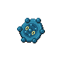

---

## Route 211 Entrance

### Walking

| Sprite | Pokémon | Encounter Type | Level | Chance |
|:------:|---------|:--------------:|-------|--------|
|  | Geodude | {: style='max-width: 24px;' } | 16 - 18 | 20% |
|  | Bronzor | {: style='max-width: 24px;' } | 16 - 18 | 20% |
|  | Cleffa | {: style='max-width: 24px;' } | 16 - 18 | 10% |
|  | Nosepass | {: style='max-width: 24px;' } | 16 - 18 | 10% |
|  | Chingling | {: style='max-width: 24px;' } | 16 - 18 | 10% |
|  | Zubat | {: style='max-width: 24px;' } | 16 - 18 | 10% |
|  | Beldum | {: style='max-width: 24px;' } | 16 - 18 | 10% |
|  | Solrock | {: style='max-width: 24px;' } | 16 - 18 | 5% |
|  | Lunatone | {: style='max-width: 24px;' } | 16 - 18 | 5% |
|  | Geodude | {: style='max-width: 24px;' } | 16 - 18 | 20% |
|  | Bronzor | {: style='max-width: 24px;' } | 16 - 18 | 20% |
|  | Cleffa | {: style='max-width: 24px;' } | 16 - 18 | 10% |
|  | Nosepass | {: style='max-width: 24px;' } | 16 - 18 | 10% |
|  | Chingling | {: style='max-width: 24px;' } | 16 - 18 | 10% |
|  | Zubat | {: style='max-width: 24px;' } | 16 - 18 | 10% |
|  | Beldum | {: style='max-width: 24px;' } | 16 - 18 | 10% |
|  | Solrock | {: style='max-width: 24px;' } | 16 - 18 | 5% |
|  | Lunatone | {: style='max-width: 24px;' } | 16 - 18 | 5% |
|  | Geodude | {: style='max-width: 24px;' } | 16 - 18 | 20% |
|  | Bronzor | {: style='max-width: 24px;' } | 16 - 18 | 20% |
|  | Cleffa | {: style='max-width: 24px;' } | 16 - 18 | 10% |
|  | Nosepass | {: style='max-width: 24px;' } | 16 - 18 | 10% |
|  | Chingling | {: style='max-width: 24px;' } | 16 - 18 | 10% |
|  | Zubat | {: style='max-width: 24px;' } | 16 - 18 | 10% |
|  | Beldum | {: style='max-width: 24px;' } | 16 - 18 | 10% |
|  | Solrock | {: style='max-width: 24px;' } | 16 - 18 | 5% |
|  | Lunatone | {: style='max-width: 24px;' } | 16 - 18 | 5% |

---

## Tunnel

### Walking

| Sprite | Pokémon | Encounter Type | Level | Chance |
|:------:|---------|:--------------:|-------|--------|
|  | Geodude | {: style='max-width: 24px;' } | 18 - 19 | 20% |
|  | Bronzor | {: style='max-width: 24px;' } | 18 - 19 | 20% |
|  | Clefairy | {: style='max-width: 24px;' } | 18 - 19 | 10% |
|  | Nosepass | {: style='max-width: 24px;' } | 18 - 19 | 10% |
|  | Chimecho | {: style='max-width: 24px;' } | 18 - 19 | 10% |
|  | Zubat | {: style='max-width: 24px;' } | 18 - 19 | 10% |
|  | Beldum | {: style='max-width: 24px;' } | 18 - 19 | 10% |
|  | Solrock | {: style='max-width: 24px;' } | 18 - 19 | 5% |
|  | Lunatone | {: style='max-width: 24px;' } | 18 - 19 | 5% |
|  | Geodude | {: style='max-width: 24px;' } | 18 - 19 | 20% |
|  | Bronzor | {: style='max-width: 24px;' } | 18 - 19 | 20% |
|  | Clefairy | {: style='max-width: 24px;' } | 18 - 19 | 10% |
|  | Nosepass | {: style='max-width: 24px;' } | 18 - 19 | 10% |
|  | Chimecho | {: style='max-width: 24px;' } | 18 - 19 | 10% |
|  | Zubat | {: style='max-width: 24px;' } | 18 - 19 | 10% |
|  | Beldum | {: style='max-width: 24px;' } | 18 - 19 | 10% |
|  | Solrock | {: style='max-width: 24px;' } | 18 - 19 | 5% |
|  | Lunatone | {: style='max-width: 24px;' } | 18 - 19 | 5% |
|  | Geodude | {: style='max-width: 24px;' } | 18 - 19 | 20% |
|  | Bronzor | {: style='max-width: 24px;' } | 18 - 19 | 20% |
|  | Clefairy | {: style='max-width: 24px;' } | 18 - 19 | 10% |
|  | Nosepass | {: style='max-width: 24px;' } | 18 - 19 | 10% |
|  | Chimecho | {: style='max-width: 24px;' } | 18 - 19 | 10% |
|  | Zubat | {: style='max-width: 24px;' } | 18 - 19 | 10% |
|  | Beldum | {: style='max-width: 24px;' } | 18 - 19 | 10% |
|  | Solrock | {: style='max-width: 24px;' } | 18 - 19 | 5% |
|  | Lunatone | {: style='max-width: 24px;' } | 18 - 19 | 5% |

---

## B1F

### Walking

| Sprite | Pokémon | Encounter Type | Level | Chance |
|:------:|---------|:--------------:|-------|--------|
|  | Geodude | {: style='max-width: 24px;' } | 18 - 20 | 20% |
|  | Bronzor | {: style='max-width: 24px;' } | 18 - 20 | 20% |
|  | Clefairy | {: style='max-width: 24px;' } | 18 - 20 | 10% |
|  | Nosepass | {: style='max-width: 24px;' } | 18 - 20 | 10% |
|  | Chimecho | {: style='max-width: 24px;' } | 18 - 20 | 10% |
|  | Zubat | {: style='max-width: 24px;' } | 18 - 20 | 10% |
|  | Metang | {: style='max-width: 24px;' } | 18 - 20 | 10% |
|  | Solrock | {: style='max-width: 24px;' } | 18 - 20 | 5% |
|  | Lunatone | {: style='max-width: 24px;' } | 18 - 20 | 5% |
|  | Geodude | {: style='max-width: 24px;' } | 18 - 20 | 20% |
|  | Bronzor | {: style='max-width: 24px;' } | 18 - 20 | 20% |
|  | Clefairy | {: style='max-width: 24px;' } | 18 - 20 | 10% |
|  | Nosepass | {: style='max-width: 24px;' } | 18 - 20 | 10% |
|  | Chimecho | {: style='max-width: 24px;' } | 18 - 20 | 10% |
|  | Zubat | {: style='max-width: 24px;' } | 18 - 20 | 10% |
|  | Metang | {: style='max-width: 24px;' } | 18 - 20 | 10% |
|  | Solrock | {: style='max-width: 24px;' } | 18 - 20 | 5% |
|  | Lunatone | {: style='max-width: 24px;' } | 18 - 20 | 5% |
|  | Geodude | {: style='max-width: 24px;' } | 18 - 20 | 20% |
|  | Bronzor | {: style='max-width: 24px;' } | 18 - 20 | 20% |
|  | Clefairy | {: style='max-width: 24px;' } | 18 - 20 | 10% |
|  | Nosepass | {: style='max-width: 24px;' } | 18 - 20 | 10% |
|  | Chimecho | {: style='max-width: 24px;' } | 18 - 20 | 10% |
|  | Zubat | {: style='max-width: 24px;' } | 18 - 20 | 10% |
|  | Metang | {: style='max-width: 24px;' } | 18 - 20 | 10% |
|  | Solrock | {: style='max-width: 24px;' } | 18 - 20 | 5% |
|  | Lunatone | {: style='max-width: 24px;' } | 18 - 20 | 5% |

### Surfing

| Sprite | Pokémon | Encounter Type | Level | Chance |
|:------:|---------|:--------------:|-------|--------|
|  | Spheal | {: style='max-width: 24px;' } | 30 - 45 | 60% |
|  | Seel | {: style='max-width: 24px;' } | 30 - 45 | 30% |
|  | Sealeo | {: style='max-width: 24px;' } | 30 - 45 | 10% |

### Fishing

| Sprite | Pokémon | Encounter Type | Level | Chance |
|:------:|---------|:--------------:|-------|--------|
|  | Feebas | {: style='max-width: 24px;' } | 10 | 100% |
|  | Feebas | {: style='max-width: 24px;' } | 25 | 100% |
|  | Feebas | {: style='max-width: 24px;' } | 50 | 100% |

---

## Route 216 Entrance

### Walking

| Sprite | Pokémon | Encounter Type | Level | Chance |
|:------:|---------|:--------------:|-------|--------|
|  | Geodude | {: style='max-width: 24px;' } | 18 - 19 | 20% |
|  | Bronzor | {: style='max-width: 24px;' } | 18 - 19 | 20% |
|  | Clefairy | {: style='max-width: 24px;' } | 18 - 19 | 10% |
|  | Nosepass | {: style='max-width: 24px;' } | 18 - 19 | 10% |
|  | Chimecho | {: style='max-width: 24px;' } | 18 - 19 | 10% |
|  | Zubat | {: style='max-width: 24px;' } | 18 - 19 | 10% |
|  | Beldum | {: style='max-width: 24px;' } | 18 - 19 | 10% |
|  | Solrock | {: style='max-width: 24px;' } | 18 - 19 | 5% |
|  | Lunatone | {: style='max-width: 24px;' } | 18 - 19 | 5% |
|  | Geodude | {: style='max-width: 24px;' } | 18 - 19 | 20% |
|  | Bronzor | {: style='max-width: 24px;' } | 18 - 19 | 20% |
|  | Clefairy | {: style='max-width: 24px;' } | 18 - 19 | 10% |
|  | Nosepass | {: style='max-width: 24px;' } | 18 - 19 | 10% |
|  | Chimecho | {: style='max-width: 24px;' } | 18 - 19 | 10% |
|  | Zubat | {: style='max-width: 24px;' } | 18 - 19 | 10% |
|  | Beldum | {: style='max-width: 24px;' } | 18 - 19 | 10% |
|  | Solrock | {: style='max-width: 24px;' } | 18 - 19 | 5% |
|  | Lunatone | {: style='max-width: 24px;' } | 18 - 19 | 5% |
|  | Geodude | {: style='max-width: 24px;' } | 18 - 19 | 20% |
|  | Bronzor | {: style='max-width: 24px;' } | 18 - 19 | 20% |
|  | Clefairy | {: style='max-width: 24px;' } | 18 - 19 | 10% |
|  | Nosepass | {: style='max-width: 24px;' } | 18 - 19 | 10% |
|  | Chimecho | {: style='max-width: 24px;' } | 18 - 19 | 10% |
|  | Zubat | {: style='max-width: 24px;' } | 18 - 19 | 10% |
|  | Beldum | {: style='max-width: 24px;' } | 18 - 19 | 10% |
|  | Solrock | {: style='max-width: 24px;' } | 18 - 19 | 5% |
|  | Lunatone | {: style='max-width: 24px;' } | 18 - 19 | 5% |

---

## Route 207 Entrance

### Walking

| Sprite | Pokémon | Encounter Type | Level | Chance |
|:------:|---------|:--------------:|-------|--------|
|  | Geodude | {: style='max-width: 24px;' } | 22 - 23 | 20% |
|  | Bronzor | {: style='max-width: 24px;' } | 22 - 23 | 20% |
|  | Clefairy | {: style='max-width: 24px;' } | 22 - 23 | 10% |
|  | Nosepass | {: style='max-width: 24px;' } | 22 - 23 | 10% |
|  | Chimecho | {: style='max-width: 24px;' } | 22 - 23 | 10% |
|  | Golbat | {: style='max-width: 24px;' } | 22 - 23 | 10% |
|  | Metang | {: style='max-width: 24px;' } | 22 - 23 | 10% |
|  | Solrock | {: style='max-width: 24px;' } | 22 - 23 | 5% |
|  | Lunatone | {: style='max-width: 24px;' } | 22 - 23 | 5% |
|  | Geodude | {: style='max-width: 24px;' } | 22 - 23 | 20% |
|  | Bronzor | {: style='max-width: 24px;' } | 22 - 23 | 20% |
|  | Clefairy | {: style='max-width: 24px;' } | 22 - 23 | 10% |
|  | Nosepass | {: style='max-width: 24px;' } | 22 - 23 | 10% |
|  | Chimecho | {: style='max-width: 24px;' } | 22 - 23 | 10% |
|  | Golbat | {: style='max-width: 24px;' } | 22 - 23 | 10% |
|  | Metang | {: style='max-width: 24px;' } | 22 - 23 | 10% |
|  | Solrock | {: style='max-width: 24px;' } | 22 - 23 | 5% |
|  | Lunatone | {: style='max-width: 24px;' } | 22 - 23 | 5% |
|  | Geodude | {: style='max-width: 24px;' } | 22 - 23 | 20% |
|  | Bronzor | {: style='max-width: 24px;' } | 22 - 23 | 20% |
|  | Clefairy | {: style='max-width: 24px;' } | 22 - 23 | 10% |
|  | Nosepass | {: style='max-width: 24px;' } | 22 - 23 | 10% |
|  | Chimecho | {: style='max-width: 24px;' } | 22 - 23 | 10% |
|  | Golbat | {: style='max-width: 24px;' } | 22 - 23 | 10% |
|  | Metang | {: style='max-width: 24px;' } | 22 - 23 | 10% |
|  | Solrock | {: style='max-width: 24px;' } | 22 - 23 | 5% |
|  | Lunatone | {: style='max-width: 24px;' } | 22 - 23 | 5% |

### Surfing

| Sprite | Pokémon | Encounter Type | Level | Chance |
|:------:|---------|:--------------:|-------|--------|
|  | Zubat | {: style='max-width: 24px;' } | 20 - 40 | 90% |
|  | Golbat | {: style='max-width: 24px;' } | 20 - 40 | 10% |

### Fishing

| Sprite | Pokémon | Encounter Type | Level | Chance |
|:------:|---------|:--------------:|-------|--------|
|  | Magikarp | {: style='max-width: 24px;' } | 10 | 65% |
|  | Barboach | {: style='max-width: 24px;' } | 10 | 35% |
|  | Magikarp | {: style='max-width: 24px;' } | 25 | 65% |
|  | Barboach | {: style='max-width: 24px;' } | 25 | 35% |
|  | Gyarados | {: style='max-width: 24px;' } | 50 | 65% |
|  | Whiscash | {: style='max-width: 24px;' } | 50 | 35% |

---

## 2F

### Walking

| Sprite | Pokémon | Encounter Type | Level | Chance |
|:------:|---------|:--------------:|-------|--------|
|  | Graveler | {: style='max-width: 24px;' } | 49 - 51 | 20% |
|  | Bronzong | {: style='max-width: 24px;' } | 49 - 51 | 20% |
|  | Clefairy | {: style='max-width: 24px;' } | 49 - 51 | 10% |
|  | Nosepass | {: style='max-width: 24px;' } | 49 - 51 | 10% |
|  | Chimecho | {: style='max-width: 24px;' } | 49 - 51 | 10% |
|  | Golbat | {: style='max-width: 24px;' } | 49 - 51 | 10% |
|  | Metang | {: style='max-width: 24px;' } | 49 - 51 | 10% |
|  | Solrock | {: style='max-width: 24px;' } | 49 - 51 | 5% |
|  | Lunatone | {: style='max-width: 24px;' } | 49 - 51 | 5% |
|  | Graveler | {: style='max-width: 24px;' } | 49 - 51 | 20% |
|  | Bronzong | {: style='max-width: 24px;' } | 49 - 51 | 20% |
|  | Clefairy | {: style='max-width: 24px;' } | 49 - 51 | 10% |
|  | Nosepass | {: style='max-width: 24px;' } | 49 - 51 | 10% |
|  | Chimecho | {: style='max-width: 24px;' } | 49 - 51 | 10% |
|  | Golbat | {: style='max-width: 24px;' } | 49 - 51 | 10% |
|  | Metang | {: style='max-width: 24px;' } | 49 - 51 | 10% |
|  | Solrock | {: style='max-width: 24px;' } | 49 - 51 | 5% |
|  | Lunatone | {: style='max-width: 24px;' } | 49 - 51 | 5% |
|  | Graveler | {: style='max-width: 24px;' } | 49 - 51 | 20% |
|  | Bronzong | {: style='max-width: 24px;' } | 49 - 51 | 20% |
|  | Clefairy | {: style='max-width: 24px;' } | 49 - 51 | 10% |
|  | Nosepass | {: style='max-width: 24px;' } | 49 - 51 | 10% |
|  | Chimecho | {: style='max-width: 24px;' } | 49 - 51 | 10% |
|  | Golbat | {: style='max-width: 24px;' } | 49 - 51 | 10% |
|  | Metang | {: style='max-width: 24px;' } | 49 - 51 | 10% |
|  | Solrock | {: style='max-width: 24px;' } | 49 - 51 | 5% |
|  | Lunatone | {: style='max-width: 24px;' } | 49 - 51 | 5% |

---

## 3F

### Walking

| Sprite | Pokémon | Encounter Type | Level | Chance |
|:------:|---------|:--------------:|-------|--------|
|  | Graveler | {: style='max-width: 24px;' } | 49 - 51 | 20% |
|  | Bronzong | {: style='max-width: 24px;' } | 49 - 51 | 20% |
|  | Clefairy | {: style='max-width: 24px;' } | 49 - 51 | 10% |
|  | Nosepass | {: style='max-width: 24px;' } | 49 - 51 | 10% |
|  | Chimecho | {: style='max-width: 24px;' } | 49 - 51 | 10% |
|  | Golbat | {: style='max-width: 24px;' } | 49 - 51 | 10% |
|  | Metang | {: style='max-width: 24px;' } | 49 - 51 | 10% |
|  | Solrock | {: style='max-width: 24px;' } | 49 - 51 | 5% |
|  | Lunatone | {: style='max-width: 24px;' } | 49 - 51 | 5% |
|  | Graveler | {: style='max-width: 24px;' } | 49 - 51 | 20% |
|  | Bronzong | {: style='max-width: 24px;' } | 49 - 51 | 20% |
|  | Clefairy | {: style='max-width: 24px;' } | 49 - 51 | 10% |
|  | Nosepass | {: style='max-width: 24px;' } | 49 - 51 | 10% |
|  | Chimecho | {: style='max-width: 24px;' } | 49 - 51 | 10% |
|  | Golbat | {: style='max-width: 24px;' } | 49 - 51 | 10% |
|  | Metang | {: style='max-width: 24px;' } | 49 - 51 | 10% |
|  | Solrock | {: style='max-width: 24px;' } | 49 - 51 | 5% |
|  | Lunatone | {: style='max-width: 24px;' } | 49 - 51 | 5% |
|  | Graveler | {: style='max-width: 24px;' } | 49 - 51 | 20% |
|  | Bronzong | {: style='max-width: 24px;' } | 49 - 51 | 20% |
|  | Clefairy | {: style='max-width: 24px;' } | 49 - 51 | 10% |
|  | Nosepass | {: style='max-width: 24px;' } | 49 - 51 | 10% |
|  | Chimecho | {: style='max-width: 24px;' } | 49 - 51 | 10% |
|  | Golbat | {: style='max-width: 24px;' } | 49 - 51 | 10% |
|  | Metang | {: style='max-width: 24px;' } | 49 - 51 | 10% |
|  | Solrock | {: style='max-width: 24px;' } | 49 - 51 | 5% |
|  | Lunatone | {: style='max-width: 24px;' } | 49 - 51 | 5% |

---

## Cliffside

### Walking

| Sprite | Pokémon | Encounter Type | Level | Chance |
|:------:|---------|:--------------:|-------|--------|
|  | Abomasnow | {: style='max-width: 24px;' } | 50 - 52 | 30% |
|  | Medicham | {: style='max-width: 24px;' } | 50 - 52 | 20% |
|  | Loudred | {: style='max-width: 24px;' } | 50 - 52 | 20% |
|  | Absol | {: style='max-width: 24px;' } | 50 - 52 | 10% |
|  | Donphan | {: style='max-width: 24px;' } | 50 - 52 | 10% |
|  | Ursaring | {: style='max-width: 24px;' } | 50 - 52 | 10% |
|  | Abomasnow | {: style='max-width: 24px;' } | 50 - 52 | 30% |
|  | Medicham | {: style='max-width: 24px;' } | 50 - 52 | 20% |
|  | Loudred | {: style='max-width: 24px;' } | 50 - 52 | 20% |
|  | Absol | {: style='max-width: 24px;' } | 50 - 52 | 10% |
|  | Donphan | {: style='max-width: 24px;' } | 50 - 52 | 10% |
|  | Ursaring | {: style='max-width: 24px;' } | 50 - 52 | 10% |
|  | Abomasnow | {: style='max-width: 24px;' } | 50 - 52 | 30% |
|  | Medicham | {: style='max-width: 24px;' } | 50 - 52 | 20% |
|  | Loudred | {: style='max-width: 24px;' } | 50 - 52 | 20% |
|  | Absol | {: style='max-width: 24px;' } | 50 - 52 | 10% |
|  | Donphan | {: style='max-width: 24px;' } | 50 - 52 | 10% |
|  | Ursaring | {: style='max-width: 24px;' } | 50 - 52 | 10% |
|  | Clefable | {: style='max-width: 24px;' } | 50 - 52 | 22% |

---

## 4F

### Walking

| Sprite | Pokémon | Encounter Type | Level | Chance |
|:------:|---------|:--------------:|-------|--------|
|  | Graveler | {: style='max-width: 24px;' } | 50 - 52 | 20% |
|  | Bronzong | {: style='max-width: 24px;' } | 50 - 52 | 20% |
|  | Clefairy | {: style='max-width: 24px;' } | 50 - 52 | 10% |
|  | Nosepass | {: style='max-width: 24px;' } | 50 - 52 | 10% |
|  | Chimecho | {: style='max-width: 24px;' } | 50 - 52 | 10% |
|  | Golbat | {: style='max-width: 24px;' } | 50 - 52 | 10% |
|  | Metang | {: style='max-width: 24px;' } | 50 - 52 | 10% |
|  | Solrock | {: style='max-width: 24px;' } | 50 - 52 | 5% |
|  | Lunatone | {: style='max-width: 24px;' } | 50 - 52 | 5% |
|  | Graveler | {: style='max-width: 24px;' } | 50 - 52 | 20% |
|  | Bronzong | {: style='max-width: 24px;' } | 50 - 52 | 20% |
|  | Clefairy | {: style='max-width: 24px;' } | 50 - 52 | 10% |
|  | Nosepass | {: style='max-width: 24px;' } | 50 - 52 | 10% |
|  | Chimecho | {: style='max-width: 24px;' } | 50 - 52 | 10% |
|  | Golbat | {: style='max-width: 24px;' } | 50 - 52 | 10% |
|  | Metang | {: style='max-width: 24px;' } | 50 - 52 | 10% |
|  | Solrock | {: style='max-width: 24px;' } | 50 - 52 | 5% |
|  | Lunatone | {: style='max-width: 24px;' } | 50 - 52 | 5% |
|  | Graveler | {: style='max-width: 24px;' } | 50 - 52 | 20% |
|  | Bronzong | {: style='max-width: 24px;' } | 50 - 52 | 20% |
|  | Clefairy | {: style='max-width: 24px;' } | 50 - 52 | 10% |
|  | Nosepass | {: style='max-width: 24px;' } | 50 - 52 | 10% |
|  | Chimecho | {: style='max-width: 24px;' } | 50 - 52 | 10% |
|  | Golbat | {: style='max-width: 24px;' } | 50 - 52 | 10% |
|  | Metang | {: style='max-width: 24px;' } | 50 - 52 | 10% |
|  | Solrock | {: style='max-width: 24px;' } | 50 - 52 | 5% |
|  | Lunatone | {: style='max-width: 24px;' } | 50 - 52 | 5% |

### Surfing

| Sprite | Pokémon | Encounter Type | Level | Chance |
|:------:|---------|:--------------:|-------|--------|
|  | Zubat | {: style='max-width: 24px;' } | 35 - 55 | 90% |
|  | Golbat | {: style='max-width: 24px;' } | 35 - 55 | 10% |

### Fishing

| Sprite | Pokémon | Encounter Type | Level | Chance |
|:------:|---------|:--------------:|-------|--------|
|  | Magikarp | {: style='max-width: 24px;' } | 10 | 60% |
|  | Horsea | {: style='max-width: 24px;' } | 10 | 30% |
|  | Dratini | {: style='max-width: 24px;' } | 10 | 10% |
|  | Magikarp | {: style='max-width: 24px;' } | 25 | 60% |
|  | Horsea | {: style='max-width: 24px;' } | 25 | 30% |
|  | Dratini | {: style='max-width: 24px;' } | 25 | 10% |
|  | Gyarados | {: style='max-width: 24px;' } | 50 | 60% |
|  | Seadra | {: style='max-width: 24px;' } | 50 | 30% |
|  | Dragonair | {: style='max-width: 24px;' } | 50 | 10% |

---

## Summit

### Walking

| Sprite | Pokémon | Encounter Type | Level | Chance |
|:------:|---------|:--------------:|-------|--------|
|  | Abomasnow | {: style='max-width: 24px;' } | 51 - 53 | 30% |
|  | Medicham | {: style='max-width: 24px;' } | 51 - 53 | 20% |
|  | Loudred | {: style='max-width: 24px;' } | 51 - 53 | 20% |
|  | Absol | {: style='max-width: 24px;' } | 51 - 53 | 10% |
|  | Donphan | {: style='max-width: 24px;' } | 51 - 53 | 10% |
|  | Ursaring | {: style='max-width: 24px;' } | 51 - 53 | 10% |
|  | Abomasnow | {: style='max-width: 24px;' } | 51 - 53 | 30% |
|  | Medicham | {: style='max-width: 24px;' } | 51 - 53 | 20% |
|  | Loudred | {: style='max-width: 24px;' } | 51 - 53 | 20% |
|  | Absol | {: style='max-width: 24px;' } | 51 - 53 | 10% |
|  | Donphan | {: style='max-width: 24px;' } | 51 - 53 | 10% |
|  | Ursaring | {: style='max-width: 24px;' } | 51 - 53 | 10% |
|  | Abomasnow | {: style='max-width: 24px;' } | 51 - 53 | 30% |
|  | Medicham | {: style='max-width: 24px;' } | 51 - 53 | 20% |
|  | Loudred | {: style='max-width: 24px;' } | 51 - 53 | 20% |
|  | Absol | {: style='max-width: 24px;' } | 51 - 53 | 10% |
|  | Donphan | {: style='max-width: 24px;' } | 51 - 53 | 10% |
|  | Ursaring | {: style='max-width: 24px;' } | 51 - 53 | 10% |
|  | Clefable | {: style='max-width: 24px;' } | 51 - 53 | 22% |

---

## 5F

### Walking

| Sprite | Pokémon | Encounter Type | Level | Chance |
|:------:|---------|:--------------:|-------|--------|
|  | Graveler | {: style='max-width: 24px;' } | 51 - 53 | 20% |
|  | Bronzong | {: style='max-width: 24px;' } | 51 - 53 | 20% |
|  | Clefairy | {: style='max-width: 24px;' } | 51 - 53 | 10% |
|  | Nosepass | {: style='max-width: 24px;' } | 51 - 53 | 10% |
|  | Chimecho | {: style='max-width: 24px;' } | 51 - 53 | 10% |
|  | Golbat | {: style='max-width: 24px;' } | 51 - 53 | 10% |
|  | Metang | {: style='max-width: 24px;' } | 51 - 53 | 10% |
|  | Solrock | {: style='max-width: 24px;' } | 51 - 53 | 5% |
|  | Lunatone | {: style='max-width: 24px;' } | 51 - 53 | 5% |
|  | Graveler | {: style='max-width: 24px;' } | 51 - 53 | 20% |
|  | Bronzong | {: style='max-width: 24px;' } | 51 - 53 | 20% |
|  | Clefairy | {: style='max-width: 24px;' } | 51 - 53 | 10% |
|  | Nosepass | {: style='max-width: 24px;' } | 51 - 53 | 10% |
|  | Chimecho | {: style='max-width: 24px;' } | 51 - 53 | 10% |
|  | Golbat | {: style='max-width: 24px;' } | 51 - 53 | 10% |
|  | Metang | {: style='max-width: 24px;' } | 51 - 53 | 10% |
|  | Solrock | {: style='max-width: 24px;' } | 51 - 53 | 5% |
|  | Lunatone | {: style='max-width: 24px;' } | 51 - 53 | 5% |
|  | Graveler | {: style='max-width: 24px;' } | 51 - 53 | 20% |
|  | Bronzong | {: style='max-width: 24px;' } | 51 - 53 | 20% |
|  | Clefairy | {: style='max-width: 24px;' } | 51 - 53 | 10% |
|  | Nosepass | {: style='max-width: 24px;' } | 51 - 53 | 10% |
|  | Chimecho | {: style='max-width: 24px;' } | 51 - 53 | 10% |
|  | Golbat | {: style='max-width: 24px;' } | 51 - 53 | 10% |
|  | Metang | {: style='max-width: 24px;' } | 51 - 53 | 10% |
|  | Solrock | {: style='max-width: 24px;' } | 51 - 53 | 5% |
|  | Lunatone | {: style='max-width: 24px;' } | 51 - 53 | 5% |

---

## 6F

### Walking

| Sprite | Pokémon | Encounter Type | Level | Chance |
|:------:|---------|:--------------:|-------|--------|
|  | Graveler | {: style='max-width: 24px;' } | 51 - 53 | 20% |
|  | Bronzong | {: style='max-width: 24px;' } | 51 - 53 | 20% |
|  | Clefairy | {: style='max-width: 24px;' } | 51 - 53 | 10% |
|  | Nosepass | {: style='max-width: 24px;' } | 51 - 53 | 10% |
|  | Chimecho | {: style='max-width: 24px;' } | 51 - 53 | 10% |
|  | Golbat | {: style='max-width: 24px;' } | 51 - 53 | 10% |
|  | Metang | {: style='max-width: 24px;' } | 51 - 53 | 10% |
|  | Solrock | {: style='max-width: 24px;' } | 51 - 53 | 5% |
|  | Lunatone | {: style='max-width: 24px;' } | 51 - 53 | 5% |
|  | Graveler | {: style='max-width: 24px;' } | 51 - 53 | 20% |
|  | Bronzong | {: style='max-width: 24px;' } | 51 - 53 | 20% |
|  | Clefairy | {: style='max-width: 24px;' } | 51 - 53 | 10% |
|  | Nosepass | {: style='max-width: 24px;' } | 51 - 53 | 10% |
|  | Chimecho | {: style='max-width: 24px;' } | 51 - 53 | 10% |
|  | Golbat | {: style='max-width: 24px;' } | 51 - 53 | 10% |
|  | Metang | {: style='max-width: 24px;' } | 51 - 53 | 10% |
|  | Solrock | {: style='max-width: 24px;' } | 51 - 53 | 5% |
|  | Lunatone | {: style='max-width: 24px;' } | 51 - 53 | 5% |
|  | Graveler | {: style='max-width: 24px;' } | 51 - 53 | 20% |
|  | Bronzong | {: style='max-width: 24px;' } | 51 - 53 | 20% |
|  | Clefairy | {: style='max-width: 24px;' } | 51 - 53 | 10% |
|  | Nosepass | {: style='max-width: 24px;' } | 51 - 53 | 10% |
|  | Chimecho | {: style='max-width: 24px;' } | 51 - 53 | 10% |
|  | Golbat | {: style='max-width: 24px;' } | 51 - 53 | 10% |
|  | Metang | {: style='max-width: 24px;' } | 51 - 53 | 10% |
|  | Solrock | {: style='max-width: 24px;' } | 51 - 53 | 5% |
|  | Lunatone | {: style='max-width: 24px;' } | 51 - 53 | 5% |

---

## 7F

### Walking

| Sprite | Pokémon | Encounter Type | Level | Chance |
|:------:|---------|:--------------:|-------|--------|
|  | Graveler | {: style='max-width: 24px;' } | 51 - 53 | 20% |
|  | Bronzong | {: style='max-width: 24px;' } | 51 - 53 | 20% |
|  | Clefairy | {: style='max-width: 24px;' } | 51 - 53 | 10% |
|  | Nosepass | {: style='max-width: 24px;' } | 51 - 53 | 10% |
|  | Chimecho | {: style='max-width: 24px;' } | 51 - 53 | 10% |
|  | Golbat | {: style='max-width: 24px;' } | 51 - 53 | 10% |
|  | Metang | {: style='max-width: 24px;' } | 51 - 53 | 10% |
|  | Solrock | {: style='max-width: 24px;' } | 51 - 53 | 5% |
|  | Lunatone | {: style='max-width: 24px;' } | 51 - 53 | 5% |
|  | Graveler | {: style='max-width: 24px;' } | 51 - 53 | 20% |
|  | Bronzong | {: style='max-width: 24px;' } | 51 - 53 | 20% |
|  | Clefairy | {: style='max-width: 24px;' } | 51 - 53 | 10% |
|  | Nosepass | {: style='max-width: 24px;' } | 51 - 53 | 10% |
|  | Chimecho | {: style='max-width: 24px;' } | 51 - 53 | 10% |
|  | Golbat | {: style='max-width: 24px;' } | 51 - 53 | 10% |
|  | Metang | {: style='max-width: 24px;' } | 51 - 53 | 10% |
|  | Solrock | {: style='max-width: 24px;' } | 51 - 53 | 5% |
|  | Lunatone | {: style='max-width: 24px;' } | 51 - 53 | 5% |
|  | Graveler | {: style='max-width: 24px;' } | 51 - 53 | 20% |
|  | Bronzong | {: style='max-width: 24px;' } | 51 - 53 | 20% |
|  | Clefairy | {: style='max-width: 24px;' } | 51 - 53 | 10% |
|  | Nosepass | {: style='max-width: 24px;' } | 51 - 53 | 10% |
|  | Chimecho | {: style='max-width: 24px;' } | 51 - 53 | 10% |
|  | Golbat | {: style='max-width: 24px;' } | 51 - 53 | 10% |
|  | Metang | {: style='max-width: 24px;' } | 51 - 53 | 10% |
|  | Solrock | {: style='max-width: 24px;' } | 51 - 53 | 5% |
|  | Lunatone | {: style='max-width: 24px;' } | 51 - 53 | 5% |

