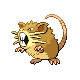

### Walking

| Sprite | Pokémon | Encounter Type | Level | Chance |
|:------:|---------|:--------------:|-------|--------|
|  | Gastly | {: style='max-width: 24px;' } | 15 - 18 | 40% |
|  | Rattata | {: style='max-width: 24px;' } | 15 - 18 | 30% |
|  | Duskull | {: style='max-width: 24px;' } | 15 - 18 | 10% |
|  | Shuppet | {: style='max-width: 24px;' } | 15 - 18 | 10% |
|  | Raticate | {: style='max-width: 24px;' } | 15 - 18 | 5% |
|  | Haunter | {: style='max-width: 24px;' } | 15 - 18 | 5% |
|  | Gastly | {: style='max-width: 24px;' } | 15 - 18 | 40% |
|  | Rattata | {: style='max-width: 24px;' } | 15 - 18 | 30% |
|  | Duskull | {: style='max-width: 24px;' } | 15 - 18 | 10% |
|  | Shuppet | {: style='max-width: 24px;' } | 15 - 18 | 10% |
|  | Raticate | {: style='max-width: 24px;' } | 15 - 18 | 5% |
|  | Haunter | {: style='max-width: 24px;' } | 15 - 18 | 5% |
|  | Gastly | {: style='max-width: 24px;' } | 15 - 18 | 40% |
|  | Rattata | {: style='max-width: 24px;' } | 15 - 18 | 30% |
|  | Duskull | {: style='max-width: 24px;' } | 15 - 18 | 10% |
|  | Shuppet | {: style='max-width: 24px;' } | 15 - 18 | 10% |
|  | Raticate | {: style='max-width: 24px;' } | 15 - 18 | 5% |
|  | Haunter | {: style='max-width: 24px;' } | 15 - 18 | 5% |

