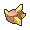

# Important Trainers

---

## City

### PKMN Trainer Steven

| Pokémon | Attributes | Item | Moves |
|:-------:|------------|:----:|-------|
|  | **Lv. 88** [Skarmory](../../pokemon/skarmory.md/) **Ability:** Keen Eye **Nature:** ? |  Occa Berry | 1. Brave Bird 2. Iron Head 3. Drill Run 4. Stealth Rock |
|  | **Lv. 88** [Aggron](../../pokemon/aggron.md/) **Ability:** Rock Head **Nature:** ? |  Focus Sash | 1. Head Smash 2. Aqua Tail 3. Iron Tail 4. Thunder Wave |
|  | **Lv. 88** [Aerodactyl](../../pokemon/aerodactyl.md/) **Ability:** Rock Head **Nature:** ? |  Muscle Band | 1. Brave Bird 2. Stone Edge 3. Crunch 4. Fire Fang |
|  | **Lv. 88** [Cradily](../../pokemon/cradily.md/) **Ability:** Suction Cups **Nature:** ? |  Leftovers | 1. Power Whip 2. Rock Slide 3. Toxic 4. Recover |
|  | **Lv. 88** [Armaldo](../../pokemon/armaldo.md/) **Ability:** Battle Armor **Nature:** ? |  Passho Berry | 1. Stone Edge 2. X-Scissor 3. Swords Dance 4. Aqua Jet |
|  | **Lv. 89** [Metagross](../../pokemon/metagross.md/) **Ability:** Iron Fist **Nature:** ? |  Life Orb | 1. Meteor Mash 2. Zen Headbutt 3. Earthquake 4. Ice Punch |

---

## Gym

### Leader Roark

| Pokémon | Attributes | Item | Moves |
|:-------:|------------|:----:|-------|
|  | **Lv. 15** [Nosepass](../../pokemon/nosepass.md/) **Ability:** Sturdy **Nature:** Modest |  Smooth Rock | 1. Stealth Rock 2. Sandstorm 3. Thunder Wave 4. Shock Wave |
|  | **Lv. 15** [Bonsly](../../pokemon/bonsly.md/) **Ability:** Rock Head **Nature:** Impish |  Rindo Berry | 1. Stealth Rock 2. Brick Break 3. Rollout 4. Defense Curl |
|  | **Lv. 15** [Geodude](../../pokemon/geodude.md/) **Ability:** Rock Head **Nature:** Adamant |  Expert Belt | 1. Bulldoze 2. Rock Tomb 3. Fire Punch 4. Thunder Punch |
|  | **Lv. 15** [Onix](../../pokemon/onix.md/) **Ability:** Rock Head **Nature:** Jolly |  Muscle Band | 1. Stealth Rock 2. Rock Tomb 3. Bulldoze 4. Sandstorm |
|  | **Lv. 15** [Larvitar](../../pokemon/larvitar.md/) **Ability:** Guts **Nature:** Jolly |  Flame Orb | 1. Rock Tomb 2. Bulldoze 3. Bite 4. Protect |
|  | **Lv. 16** [Cranidos](../../pokemon/cranidos.md/) **Ability:** Rock Head (!) **Nature:** Hasty |  Sitrus Berry | 1. Zen Headbutt 2. Rock Tomb 3. Thunder Punch 4. Scary Face |

