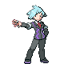

# Important Trainers

---

## City

### PKMN Trainer Steven

| Pokémon | Attributes | Item | Moves |
|:-------:|------------|:----:|-------|
|  | **Lv. 88** Skarmory **Ability:** Keen Eye **Nature:** ? |  Occa Berry | **1.** Brave Bird **2.** Iron Head **3.** Drill Run **4.** Stealth Rock |
|  | **Lv. 88** Aggron **Ability:** Rock Head **Nature:** ? |  Focus Sash | **1.** Head Smash **2.** Aqua Tail **3.** Iron Tail **4.** Thunder Wave |
|  | **Lv. 88** Aerodactyl **Ability:** Rock Head **Nature:** ? |  Muscle Band | **1.** Brave Bird **2.** Stone Edge **3.** Crunch **4.** Fire Fang |
|  | **Lv. 88** Cradily **Ability:** Suction Cups **Nature:** ? |  Leftovers | **1.** Power Whip **2.** Rock Slide **3.** Toxic **4.** Recover |
|  | **Lv. 88** Armaldo **Ability:** Battle Armor **Nature:** ? |  Passho Berry | **1.** Stone Edge **2.** X-Scissor **3.** Swords Dance **4.** Aqua Jet |
|  | **Lv. 89** Metagross **Ability:** Iron Fist **Nature:** ? |  Life Orb | **1.** Meteor Mash **2.** Zen Headbutt **3.** Earthquake **4.** Ice Punch |

---

## Gym

### Leader Roark

| Pokémon | Attributes | Item | Moves |
|:-------:|------------|:----:|-------|
|  | **Lv. 15** Nosepass **Ability:** Sturdy **Nature:** Modest |  Smooth Rock | **1.** Stealth Rock **2.** Sandstorm **3.** Thunder Wave **4.** Shock Wave |
|  | **Lv. 15** Bonsly **Ability:** Rock Head **Nature:** Impish |  Rindo Berry | **1.** Stealth Rock **2.** Brick Break **3.** Rollout **4.** Defense Curl |
|  | **Lv. 15** Geodude **Ability:** Rock Head **Nature:** Adamant |  Expert Belt | **1.** Bulldoze **2.** Rock Tomb **3.** Fire Punch **4.** Thunder Punch |
|  | **Lv. 15** Onix **Ability:** Rock Head **Nature:** Jolly |  Muscle Band | **1.** Stealth Rock **2.** Rock Tomb **3.** Bulldoze **4.** Sandstorm |
|  | **Lv. 15** Larvitar **Ability:** Guts **Nature:** Jolly |  Flame Orb | **1.** Rock Tomb **2.** Bulldoze **3.** Bite **4.** Protect |
|  | **Lv. 16** Cranidos **Ability:** Rock Head (!) **Nature:** Hasty |  Sitrus Berry | **1.** Zen Headbutt **2.** Rock Tomb **3.** Thunder Punch **4.** Scary Face |

