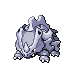

# Trainer Rosters

---

## City

### Generic Trainers

| Trainer | P1 | P2 | P3 | P4 | P5 | P6 |
|:-------:|:--:|:--:|:--:|:--:|:--:|:--:|
|  Reporter Helen |  [Treecko](../../pokemon/treecko.md/) Lv. 10 |  [Torchic](../../pokemon/torchic.md/) Lv. 10 |  [Mudkip](../../pokemon/mudkip.md/) Lv. 10 |

### Important Trainers

1. [PKMN Trainer Steven](important_trainers.md#pkmn-trainer-steven)

---

## Gym

### Generic Trainers

| Trainer | P1 | P2 | P3 | P4 | P5 | P6 |
|:-------:|:--:|:--:|:--:|:--:|:--:|:--:|
|  Youngster Jonathon |  [Rhyhorn](../../pokemon/rhyhorn.md/) Lv. 13 |  [Omanyte](../../pokemon/omanyte.md/) Lv. 13 |  [Kabuto](../../pokemon/kabuto.md/) Lv. 13 |
|  Youngster Darius |  [Aron](../../pokemon/aron.md/) Lv. 13 |  [Anorith](../../pokemon/anorith.md/) Lv. 13 |  [Lileep](../../pokemon/lileep.md/) Lv. 13 |

### Important Trainers

1. [Leader Roark](important_trainers.md#leader-roark)
