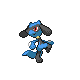

# Oreburgh Mine — Trainer Rosters

### Generic Trainers

| Trainer | P1 | P2 | P3 | P4 | P5 | P6 |
|:-------:|:--:|:--:|:--:|:--:|:--:|:--:|
|  Worker Mason |  [Aron](../../pokemon/aron.md/) Lv. 12 |  [Phanpy](../../pokemon/phanpy.md/) Lv. 12 |  [Riolu](../../pokemon/riolu.md/) Lv. 12 |
|  Worker Colin |  [Geodude](../../pokemon/geodude.md/) Lv. 12 |  [Whismur](../../pokemon/whismur.md/) Lv. 12 |  [Machop](../../pokemon/machop.md/) Lv. 12 |

