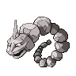

---

## 1F

### Walking

| Sprite | Pokémon | Encounter Type | Level | Chance |
|:------:|---------|:--------------:|-------|--------|
|  | [Geodude](../../pokemon/geodude.md/) | {: style='max-width: 24px;' } | 9 - 10 | 25% |
|  | [Zubat](../../pokemon/zubat.md/) | {: style='max-width: 24px;' } | 9 - 10 | 25% |
|  | [Whismur](../../pokemon/whismur.md/) | {: style='max-width: 24px;' } | 9 - 10 | 20% |
|  | [Aron](../../pokemon/aron.md/) | {: style='max-width: 24px;' } | 9 - 10 | 10% |
|  | [Onix](../../pokemon/onix.md/) | {: style='max-width: 24px;' } | 9 - 10 | 10% |
|  | [Trapinch](../../pokemon/trapinch.md/) | {: style='max-width: 24px;' } | 9 - 10 | 10% |
|  | [Geodude](../../pokemon/geodude.md/) | {: style='max-width: 24px;' } | 9 - 10 | 25% |
|  | [Zubat](../../pokemon/zubat.md/) | {: style='max-width: 24px;' } | 9 - 10 | 25% |
|  | [Whismur](../../pokemon/whismur.md/) | {: style='max-width: 24px;' } | 9 - 10 | 20% |
|  | [Aron](../../pokemon/aron.md/) | {: style='max-width: 24px;' } | 9 - 10 | 10% |
|  | [Onix](../../pokemon/onix.md/) | {: style='max-width: 24px;' } | 9 - 10 | 10% |
|  | [Trapinch](../../pokemon/trapinch.md/) | {: style='max-width: 24px;' } | 9 - 10 | 10% |
|  | [Geodude](../../pokemon/geodude.md/) | {: style='max-width: 24px;' } | 9 - 10 | 25% |
|  | [Zubat](../../pokemon/zubat.md/) | {: style='max-width: 24px;' } | 9 - 10 | 25% |
|  | [Whismur](../../pokemon/whismur.md/) | {: style='max-width: 24px;' } | 9 - 10 | 20% |
|  | [Aron](../../pokemon/aron.md/) | {: style='max-width: 24px;' } | 9 - 10 | 10% |
|  | [Onix](../../pokemon/onix.md/) | {: style='max-width: 24px;' } | 9 - 10 | 10% |
|  | [Trapinch](../../pokemon/trapinch.md/) | {: style='max-width: 24px;' } | 9 - 10 | 10% |

---

## B1F

### Walking

| Sprite | Pokémon | Encounter Type | Level | Chance |
|:------:|---------|:--------------:|-------|--------|
|  | [Geodude](../../pokemon/geodude.md/) | {: style='max-width: 24px;' } | 10 - 11 | 25% |
|  | [Zubat](../../pokemon/zubat.md/) | {: style='max-width: 24px;' } | 10 - 11 | 25% |
|  | [Whismur](../../pokemon/whismur.md/) | {: style='max-width: 24px;' } | 10 - 11 | 20% |
|  | [Aron](../../pokemon/aron.md/) | {: style='max-width: 24px;' } | 10 - 11 | 10% |
|  | [Onix](../../pokemon/onix.md/) | {: style='max-width: 24px;' } | 10 - 11 | 10% |
|  | [Trapinch](../../pokemon/trapinch.md/) | {: style='max-width: 24px;' } | 10 - 11 | 10% |
|  | [Geodude](../../pokemon/geodude.md/) | {: style='max-width: 24px;' } | 10 - 11 | 25% |
|  | [Zubat](../../pokemon/zubat.md/) | {: style='max-width: 24px;' } | 10 - 11 | 25% |
|  | [Whismur](../../pokemon/whismur.md/) | {: style='max-width: 24px;' } | 10 - 11 | 20% |
|  | [Aron](../../pokemon/aron.md/) | {: style='max-width: 24px;' } | 10 - 11 | 10% |
|  | [Onix](../../pokemon/onix.md/) | {: style='max-width: 24px;' } | 10 - 11 | 10% |
|  | [Trapinch](../../pokemon/trapinch.md/) | {: style='max-width: 24px;' } | 10 - 11 | 10% |
|  | [Geodude](../../pokemon/geodude.md/) | {: style='max-width: 24px;' } | 10 - 11 | 25% |
|  | [Zubat](../../pokemon/zubat.md/) | {: style='max-width: 24px;' } | 10 - 11 | 25% |
|  | [Whismur](../../pokemon/whismur.md/) | {: style='max-width: 24px;' } | 10 - 11 | 20% |
|  | [Aron](../../pokemon/aron.md/) | {: style='max-width: 24px;' } | 10 - 11 | 10% |
|  | [Onix](../../pokemon/onix.md/) | {: style='max-width: 24px;' } | 10 - 11 | 10% |
|  | [Trapinch](../../pokemon/trapinch.md/) | {: style='max-width: 24px;' } | 10 - 11 | 10% |

