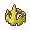

# Important Trainers

### Castle Valet Darach

| Pokémon | Attributes | Item | Moves |
|:-------:|------------|:----:|-------|
|  | **Lv. 48** [Gallade](../../pokemon/gallade.md/) **Ability:** Steadfast **Nature:** ?   |  Scope Lens | 1. Psycho Cut 2. Night Slash 3. Close Combat 4. Leaf Blade |
|  | **Lv. 48** [Empoleon](../../pokemon/empoleon.md/) **Ability:** Torrent **Nature:** ?   |  Sitrus Berry | 1. Hydro Pump 2. Flash Cannon 3. Ice Beam 4. Aqua Jet |
|  | **Lv. 48** [Alakazam](../../pokemon/alakazam.md/) **Ability:** Magic Guard **Nature:** ?  |  Expert Belt | 1. Psychic 2. Dazzling Gleam 3. Focus Blast 4. Energy Ball |
|  | **Lv. 48** [Metagross](../../pokemon/metagross.md/) **Ability:** Iron Fist (!) **Nature:** ?   |  Life Orb | 1. Meteor Mash 2. Zen Headbutt 3. Earthquake 4. Hammer Arm |
|  | **Lv. 48** [Staraptor](../../pokemon/staraptor.md/) **Ability:** Reckless **Nature:** ?   |  King's Rock | 1. Return 2. Brave Bird 3. Close Combat 4. Roost |
|  | **Lv. 48** [Entei](../../pokemon/entei.md/) **Ability:** Pressure **Nature:** ?  |  Shuca Berry | 1. Sacred Fire 2. Stone Edge 3. Extreme Speed 4. Iron Head |

