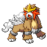
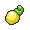

# Important Trainers

### Castle Valet Darach

| Pokémon | Attributes | Item | Moves |
|:-------:|------------|:----:|-------|
|  | **Lv. 48** Gallade **Ability:** Steadfast ? |  Scope Lens | **1.** Psycho Cut **2.** Night Slash **3.** Close Combat **4.** Leaf Blade |
|  | **Lv. 48** Empoleon **Ability:** Torrent ? |  Sitrus Berry | **1.** Hydro Pump **2.** Flash Cannon **3.** Ice Beam **4.** Aqua Jet |
|  | **Lv. 48** Alakazam **Ability:** Magic Guard ? |  Expert Belt | **1.** Psychic **2.** Dazzling Gleam **3.** Focus Blast **4.** Energy Ball |
|  | **Lv. 48** Metagross **Ability:** Iron Fist (!) ? |  Life Orb | **1.** Meteor Mash **2.** Zen Headbutt **3.** Earthquake **4.** Hammer Arm |
|  | **Lv. 48** Staraptor **Ability:** Reckless ? |  King's Rock | **1.** Return **2.** Brave Bird **3.** Close Combat **4.** Roost |
|  | **Lv. 48** Entei **Ability:** Pressure ? |  Shuca Berry | **1.** Sacred Fire **2.** Stone Edge **3.** Extreme Speed **4.** Iron Head |

