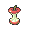

# Important Trainers

---

## City

### PKMN Trainer Barry

=== "Turtwig"

	| Pokémon | Attributes | Item | Moves |
	|:-------:|------------|:----:|-------|
	|  | **Lv. 41** Azumarill **Ability:** Huge Power **Nature:** ? |  Life Orb | **1.** Aqua Tail **2.** Play Rough **3.** Body Slam **4.** Aqua Jet |
	|  | **Lv. 42** Torterra **Ability:** Overgrow **Nature:** ? |  Sitrus Berry | **1.** Seed Bomb **2.** Earthquake **3.** Crunch **4.** Iron Head |
	|  | **Lv. 41** Staraptor **Ability:** Reckless **Nature:** ? |  Muscle Band | **1.** Double-Edge **2.** Close Combat **3.** Aerial Ace **4.** Roost |
	|  | **Lv. 41** Heracross **Ability:** Guts **Nature:** ? |  Coba Berry | **1.** Megahorn **2.** Brick Break **3.** Bullet Seed **4.** Night Slash |
	|  | **Lv. 41** Snorlax **Ability:** Thick Fat **Nature:** ? |  Leftovers | **1.** Body Slam **2.** Crunch **3.** Rest **4.** Sleep Talk |
	
=== "Chimchar"

	| Pokémon | Attributes | Item | Moves |
	|:-------:|------------|:----:|-------|
	|  | **Lv. 41** Arcanine **Ability:** Intimidate **Nature:** ? |  Expert Belt | **1.** Heat Wave **2.** Thunder Fang **3.** Outrage **4.** Crunch |
	|  | **Lv. 42** Infernape **Ability:** Iron Fist **Nature:** ? |  Sitrus Berry | **1.** Flamethrower **2.** Close Combat **3.** Fake Out **4.** Thunder Punch |
	|  | **Lv. 41** Staraptor **Ability:** Reckless **Nature:** ? |  Muscle Band | **1.** Double-Edge **2.** Close Combat **3.** Aerial Ace **4.** Roost |
	|  | **Lv. 41** Heracross **Ability:** Guts **Nature:** ? |  Coba Berry | **1.** Megahorn **2.** Brick Break **3.** Bullet Seed **4.** Night Slash |
	|  | **Lv. 41** Snorlax **Ability:** Thick Fat **Nature:** ? |  Leftovers | **1.** Body Slam **2.** Crunch **3.** Rest **4.** Sleep Talk |
	
=== "Piplup"

	| Pokémon | Attributes | Item | Moves |
	|:-------:|------------|:----:|-------|
	|  | **Lv. 41** Breloom **Ability:** Technician **Nature:** ? |  Focus Sash | **1.** Bullet Seed **2.** Force Palm **3.** Spore **4.** Rock Tomb |
	|  | **Lv. 42** Empoleon **Ability:** Torrent **Nature:** ? |  Sitrus Berry | **1.** Scald **2.** Flash Cannon **3.** Agility **4.** Swagger |
	|  | **Lv. 41** Staraptor **Ability:** Reckless **Nature:** ? |  Muscle Band | **1.** Double-Edge **2.** Close Combat **3.** Aerial Ace **4.** Roost |
	|  | **Lv. 41** Heracross **Ability:** Guts **Nature:** ? |  Coba Berry | **1.** Megahorn **2.** Brick Break **3.** Bullet Seed **4.** Night Slash |
	|  | **Lv. 41** Snorlax **Ability:** Thick Fat **Nature:** ? |  Leftovers | **1.** Body Slam **2.** Crunch **3.** Rest **4.** Sleep Talk |
	

---

## Gym

### Leader Wake

| Pokémon | Attributes | Item | Moves |
|:-------:|------------|:----:|-------|
|  | **Lv. 43** Quagsire **Ability:** Water Absorb **Nature:** Adamant |  Rindo Berry | **1.** Aqua Tail **2.** Earthquake **3.** Recover **4.** Ice Punch |
|  | **Lv. 43** Gyarados **Ability:** Intimidate **Nature:** Jolly |  Wacan Berry | **1.** Aqua Tail **2.** Ice Fang **3.** Crunch **4.** Dragon Dance |
|  | **Lv. 43** Poliwrath **Ability:** Water Absorb **Nature:** Careful |  Sitrus Berry | **1.** Waterfall **2.** Drain Punch **3.** Ice Punch **4.** Hypnosis |
|  | **Lv. 43** Ludicolo **Ability:** Swift Swim **Nature:** Modest |  Life Orb | **1.** Hydro Pump **2.** Ice Beam **3.** Energy Ball **4.** Fake Out |
|  | **Lv. 43** Sharpedo **Ability:** Speed Boost **Nature:** Naive |  Focus Sash | **1.** Waterfall **2.** Crunch **3.** Ice Fang **4.** Zen Headbutt |
|  | **Lv. 44** Floatzel **Ability:** Swift Swim **Nature:** Naive |  Life Orb | **1.** Aqua Tail **2.** Crunch **3.** Ice Punch **4.** Aqua Jet |

