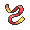

# Pastoria City — Important Trainers

---

## City

### PKMN Trainer Barry

=== "Turtwig"

	| Pokémon | Attributes | Item | Moves |
	|:-------:|------------|:----:|-------|
	|  | **Lv. 41** [Staraptor](../../pokemon/staraptor.md/) **Ability:** Reckless **Nature:** ?   |  Muscle Band | 1. Double-Edge 2. Close Combat 3. Aerial Ace 4. Roost |
	|  | **Lv. 41** [Heracross](../../pokemon/heracross.md/) **Ability:** Guts **Nature:** ?   |  Coba Berry | 1. Megahorn 2. Brick Break 3. Bullet Seed 4. Night Slash |
	|  | **Lv. 41** [Snorlax](../../pokemon/snorlax.md/) **Ability:** Thick Fat **Nature:** ?  |  Leftovers | 1. Body Slam 2. Crunch 3. Rest 4. Sleep Talk |
	|  | **Lv. 41** [Azumarill](../../pokemon/azumarill.md/) **Ability:** Huge Power **Nature:** ?   |  Life Orb | 1. Aqua Tail 2. Play Rough 3. Body Slam 4. Aqua Jet |
	|  | **Lv. 42** [Torterra](../../pokemon/torterra.md/) **Ability:** Overgrow **Nature:** ?   |  Sitrus Berry | 1. Seed Bomb 2. Earthquake 3. Crunch 4. Iron Head |
	
=== "Chimchar"

	| Pokémon | Attributes | Item | Moves |
	|:-------:|------------|:----:|-------|
	|  | **Lv. 41** [Staraptor](../../pokemon/staraptor.md/) **Ability:** Reckless **Nature:** ?   |  Muscle Band | 1. Double-Edge 2. Close Combat 3. Aerial Ace 4. Roost |
	|  | **Lv. 41** [Heracross](../../pokemon/heracross.md/) **Ability:** Guts **Nature:** ?   |  Coba Berry | 1. Megahorn 2. Brick Break 3. Bullet Seed 4. Night Slash |
	|  | **Lv. 41** [Snorlax](../../pokemon/snorlax.md/) **Ability:** Thick Fat **Nature:** ?  |  Leftovers | 1. Body Slam 2. Crunch 3. Rest 4. Sleep Talk |
	|  | **Lv. 41** [Arcanine](../../pokemon/arcanine.md/) **Ability:** Intimidate **Nature:** ?  |  Expert Belt | 1. Heat Wave 2. Thunder Fang 3. Outrage 4. Crunch |
	|  | **Lv. 42** [Infernape](../../pokemon/infernape.md/) **Ability:** Iron Fist **Nature:** ?   |  Sitrus Berry | 1. Flamethrower 2. Close Combat 3. Fake Out 4. Thunder Punch |
	
=== "Piplup"

	| Pokémon | Attributes | Item | Moves |
	|:-------:|------------|:----:|-------|
	|  | **Lv. 41** [Staraptor](../../pokemon/staraptor.md/) **Ability:** Reckless **Nature:** ?   |  Muscle Band | 1. Double-Edge 2. Close Combat 3. Aerial Ace 4. Roost |
	|  | **Lv. 41** [Heracross](../../pokemon/heracross.md/) **Ability:** Guts **Nature:** ?   |  Coba Berry | 1. Megahorn 2. Brick Break 3. Bullet Seed 4. Night Slash |
	|  | **Lv. 41** [Snorlax](../../pokemon/snorlax.md/) **Ability:** Thick Fat **Nature:** ?  |  Leftovers | 1. Body Slam 2. Crunch 3. Rest 4. Sleep Talk |
	|  | **Lv. 41** [Breloom](../../pokemon/breloom.md/) **Ability:** Technician **Nature:** ?   |  Focus Sash | 1. Bullet Seed 2. Force Palm 3. Spore 4. Rock Tomb |
	|  | **Lv. 42** [Empoleon](../../pokemon/empoleon.md/) **Ability:** Torrent **Nature:** ?   |  Sitrus Berry | 1. Scald 2. Flash Cannon 3. Agility 4. Swagger |
	

---

## Gym

### Leader Wake

| Pokémon | Attributes | Item | Moves |
|:-------:|------------|:----:|-------|
|  | **Lv. 43** [Quagsire](../../pokemon/quagsire.md/) **Ability:** Water Absorb **Nature:** Adamant   |  Rindo Berry | 1. Aqua Tail 2. Earthquake 3. Recover 4. Ice Punch |
|  | **Lv. 43** [Gyarados](../../pokemon/gyarados.md/) **Ability:** Intimidate **Nature:** Jolly   |  Wacan Berry | 1. Aqua Tail 2. Ice Fang 3. Crunch 4. Dragon Dance |
|  | **Lv. 43** [Poliwrath](../../pokemon/poliwrath.md/) **Ability:** Water Absorb **Nature:** Careful   |  Sitrus Berry | 1. Waterfall 2. Drain Punch 3. Ice Punch 4. Hypnosis |
|  | **Lv. 43** [Ludicolo](../../pokemon/ludicolo.md/) **Ability:** Swift Swim **Nature:** Modest   |  Life Orb | 1. Hydro Pump 2. Ice Beam 3. Energy Ball 4. Fake Out |
|  | **Lv. 43** [Sharpedo](../../pokemon/sharpedo.md/) **Ability:** Speed Boost **Nature:** Naive   |  Focus Sash | 1. Waterfall 2. Crunch 3. Ice Fang 4. Zen Headbutt |
|  | **Lv. 44** [Floatzel](../../pokemon/floatzel.md/) **Ability:** Swift Swim **Nature:** Naive  |  Life Orb | 1. Aqua Tail 2. Crunch 3. Ice Punch 4. Aqua Jet |

