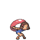
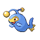
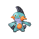

# Trainer Rosters

---

## City

### Important Trainers

1. [PKMN Trainer Barry](important_trainers.md#pkmn-trainer-barry)

---

## Gym

### Generic Trainers

| Trainer | P1 | P2 | P3 | P4 | P5 | P6 |
|:-------:|:--:|:--:|:--:|:--:|:--:|:--:|
|  Tuber Jacky |  [Bibarel](../../pokemon/bibarel.md/) Lv. 39 |  [Wartortle](../../pokemon/wartortle.md/) Lv. 39 |  [Sealeo](../../pokemon/sealeo.md/) Lv. 39 |
|  Fisherman Walter |  [Whiscash](../../pokemon/whiscash.md/) Lv. 39 |  [Lanturn](../../pokemon/lanturn.md/) Lv. 39 |  [Seaking](../../pokemon/seaking.md/) Lv. 39 |
|  Sailor Damian |  [Pelipper](../../pokemon/pelipper.md/) Lv. 39 |  [Croconaw](../../pokemon/croconaw.md/) Lv. 39 |  [Golduck](../../pokemon/golduck.md/) Lv. 39 |
|  Tuber Caitlyn |  [Azumarill](../../pokemon/azumarill.md/) Lv. 39 |  [Marshtomp](../../pokemon/marshtomp.md/) Lv. 39 |  [Dewgong](../../pokemon/dewgong.md/) Lv. 39 |
|  Fisherman Erick |  [Lumineon](../../pokemon/lumineon.md/) Lv. 39 |  [Tentacruel](../../pokemon/tentacruel.md/) Lv. 39 |  [Kingler](../../pokemon/kingler.md/) Lv. 39 |
|  Sailor Samson |  [Slowbro](../../pokemon/slowbro.md/) Lv. 39 |  [Gastrodon](../../pokemon/gastrodon.md/) Lv. 39 |  [Mantine](../../pokemon/mantine.md/) Lv. 39 |

### Important Trainers

1. [Leader Wake](important_trainers.md#leader-wake)
