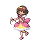
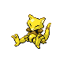

# Trainer Rosters

### Generic Trainers

| Trainer | P1 | P2 | P3 | P4 | P5 | P6 |
|:-------:|:--:|:--:|:--:|:--:|:--:|:--:|
|  Reporter Kinsey |  Drifloon Lv. 10 |  Shinx Lv. 10 |
| ") Reporter Kinsey (3) |  Drifloon Lv. 30 |  Luxio Lv. 30 |
| ") Reporter Kinsey (5) |  Drifblim Lv. 40 |  Luxray Lv. 40 |
| ") Reporter Kinsey (8) |  Drifblim Lv. 60 |  Luxray Lv. 60 |
| ") Reporter Kinsey (C) |  Drifblim Lv. 70 |  Luxray Lv. 70 |
| ") Reporter Kinsey (S) |  Drifblim Lv. 80 |  Luxray Lv. 80 |
|  Cameraman Tevin |  Mime Jr. Lv. 10 |  Machop Lv. 10 |
| ") Cameraman Tevin (3) |  Mime Jr. Lv. 30 |  Machoke Lv. 30 |
| ") Cameraman Tevin (5) |  Mr. Mime Lv. 40 |  Machamp Lv. 40 |
| ") Cameraman Tevin (8) |  Mr. Mime Lv. 60 |  Machamp Lv. 60 |
| ") Cameraman Tevin (C) |  Mr. Mime Lv. 70 |  Machamp Lv. 70 |
| ") Cameraman Tevin (S) |  Mr. Mime Lv. 80 |  Machamp Lv. 80 |
|  Interviewers Roxy & Oli |  Magnemite Lv. 10 |  Ralts Lv. 10 |
| ") Interviewers Roxy & Oli (3) |  Magneton Lv. 30 |  Kirlia Lv. 30 |
| ") Interviewers Roxy & Oli (5) |  Magnezone Lv. 40 |  Gardevoir Lv. 40 |
| ") Interviewers Roxy & Oli (8) |  Magnezone Lv. 60 |  Gardevoir Lv. 60 |
| ") Interviewers Roxy & Oli (C) |  Magnezone Lv. 70 |  Gardevoir Lv. 70 |
| ") Interviewers Roxy & Oli (S) |  Magnezone Lv. 80 |  Gardevoir Lv. 80 |
|  Idol Grace |  Igglybuff Lv. 10 |  Cleffa Lv. 10 |
| ") Idol Grace (3) |  Jigglypuff Lv. 30 |  Clefairy Lv. 30 |
| ") Idol Grace (5) |  Wigglytuff Lv. 40 |  Clefable Lv. 40 |
| ") Idol Grace (8) |  Wigglytuff Lv. 60 |  Clefable Lv. 60 |
| ") Idol Grace (C) |  Wigglytuff Lv. 70 |  Clefable Lv. 70 |
| ") Idol Grace (S) |  Wigglytuff Lv. 80 |  Clefable Lv. 80 |
|  Guitarist Arturo |  Kricketot Lv. 10 |  Voltorb Lv. 10 |
| ") Guitarist Arturo (3) |  Kricketune Lv. 30 |  Electrode Lv. 30 |
| ") Guitarist Arturo (5) |  Kricketune Lv. 40 |  Electrode Lv. 40 |
| ") Guitarist Arturo (8) |  Kricketune Lv. 60 |  Electrode Lv. 60 |
| ") Guitarist Arturo (C) |  Kricketune Lv. 70 |  Electrode Lv. 70 |
| ") Guitarist Arturo (S) |  Kricketune Lv. 80 |  Electrode Lv. 80 |
|  Poke Kid Ariel |  Pichu Lv. 10 |  Pichu Lv. 10 |  Pichu Lv. 10 |
| ") Poke Kid Ariel (3) |  Pichu Lv. 30 |  Pikachu Lv. 30 |  Pikachu Lv. 30 |
| ") Poke Kid Ariel (5) |  Pichu Lv. 40 |  Pikachu Lv. 40 |  Raichu Lv. 40 |
| ") Poke Kid Ariel (8) |  Pichu Lv. 60 |  Pikachu Lv. 60 |  Raichu Lv. 60 |
| ") Poke Kid Ariel (C) |  Pichu Lv. 70 |  Pikachu Lv. 70 |  Raichu Lv. 70 |
| ") Poke Kid Ariel (S) |  Pichu Lv. 80 |  Pikachu Lv. 80 |  Raichu Lv. 80 |
|  Clown Lee |  Aipom Lv. 10 |  Abra Lv. 10 |
| ") Clown Lee (3) |  Aipom Lv. 30 |  Kadabra Lv. 30 |
| ") Clown Lee (5) |  Ambipom Lv. 40 |  Alakazam Lv. 40 |
| ") Clown Lee (8) |  Ambipom Lv. 60 |  Alakazam Lv. 60 |
| ") Clown Lee (C) |  Ambipom Lv. 70 |  Alakazam Lv. 70 |
| ") Clown Lee (S) |  Ambipom Lv. 80 |  Alakazam Lv. 80 |

