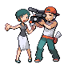
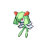
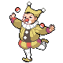

# Pokémon Center — Trainer Rosters

### Generic Trainers

| Trainer | P1 | P2 | P3 | P4 | P5 | P6 |
|:-------:|:--:|:--:|:--:|:--:|:--:|:--:|
|  Reporter Kinsey |  [Drifloon](../../pokemon/drifloon.md/) Lv. 10 |  [Shinx](../../pokemon/shinx.md/) Lv. 10 |
| ") Reporter Kinsey (3) |  [Drifloon](../../pokemon/drifloon.md/) Lv. 30 |  [Luxio](../../pokemon/luxio.md/) Lv. 30 |
| ") Reporter Kinsey (5) |  [Drifblim](../../pokemon/drifblim.md/) Lv. 40 |  [Luxray](../../pokemon/luxray.md/) Lv. 40 |
| ") Reporter Kinsey (8) |  [Drifblim](../../pokemon/drifblim.md/) Lv. 60 |  [Luxray](../../pokemon/luxray.md/) Lv. 60 |
| ") Reporter Kinsey (C) |  [Drifblim](../../pokemon/drifblim.md/) Lv. 70 |  [Luxray](../../pokemon/luxray.md/) Lv. 70 |
| ") Reporter Kinsey (S) |  [Drifblim](../../pokemon/drifblim.md/) Lv. 80 |  [Luxray](../../pokemon/luxray.md/) Lv. 80 |
|  Cameraman Tevin |  [Mime Jr.](../../pokemon/mime-jr.md/) Lv. 10 |  [Machop](../../pokemon/machop.md/) Lv. 10 |
| ") Cameraman Tevin (3) |  [Mime Jr.](../../pokemon/mime-jr.md/) Lv. 30 |  [Machoke](../../pokemon/machoke.md/) Lv. 30 |
| ") Cameraman Tevin (5) |  [Mr. Mime](../../pokemon/mr-mime.md/) Lv. 40 |  [Machamp](../../pokemon/machamp.md/) Lv. 40 |
| ") Cameraman Tevin (8) |  [Mr. Mime](../../pokemon/mr-mime.md/) Lv. 60 |  [Machamp](../../pokemon/machamp.md/) Lv. 60 |
| ") Cameraman Tevin (C) |  [Mr. Mime](../../pokemon/mr-mime.md/) Lv. 70 |  [Machamp](../../pokemon/machamp.md/) Lv. 70 |
| ") Cameraman Tevin (S) |  [Mr. Mime](../../pokemon/mr-mime.md/) Lv. 80 |  [Machamp](../../pokemon/machamp.md/) Lv. 80 |
|  Interviewers Roxy & Oli |  [Magnemite](../../pokemon/magnemite.md/) Lv. 10 |  [Ralts](../../pokemon/ralts.md/) Lv. 10 |
| ") Interviewers Roxy & Oli (3) |  [Magneton](../../pokemon/magneton.md/) Lv. 30 |  [Kirlia](../../pokemon/kirlia.md/) Lv. 30 |
| ") Interviewers Roxy & Oli (5) |  [Magnezone](../../pokemon/magnezone.md/) Lv. 40 |  [Gardevoir](../../pokemon/gardevoir.md/) Lv. 40 |
| ") Interviewers Roxy & Oli (8) |  [Magnezone](../../pokemon/magnezone.md/) Lv. 60 |  [Gardevoir](../../pokemon/gardevoir.md/) Lv. 60 |
| ") Interviewers Roxy & Oli (C) |  [Magnezone](../../pokemon/magnezone.md/) Lv. 70 |  [Gardevoir](../../pokemon/gardevoir.md/) Lv. 70 |
| ") Interviewers Roxy & Oli (S) |  [Magnezone](../../pokemon/magnezone.md/) Lv. 80 |  [Gardevoir](../../pokemon/gardevoir.md/) Lv. 80 |
|  Idol Grace |  [Igglybuff](../../pokemon/igglybuff.md/) Lv. 10 |  [Cleffa](../../pokemon/cleffa.md/) Lv. 10 |
| ") Idol Grace (3) |  [Jigglypuff](../../pokemon/jigglypuff.md/) Lv. 30 |  [Clefairy](../../pokemon/clefairy.md/) Lv. 30 |
| ") Idol Grace (5) |  [Wigglytuff](../../pokemon/wigglytuff.md/) Lv. 40 |  [Clefable](../../pokemon/clefable.md/) Lv. 40 |
| ") Idol Grace (8) |  [Wigglytuff](../../pokemon/wigglytuff.md/) Lv. 60 |  [Clefable](../../pokemon/clefable.md/) Lv. 60 |
| ") Idol Grace (C) |  [Wigglytuff](../../pokemon/wigglytuff.md/) Lv. 70 |  [Clefable](../../pokemon/clefable.md/) Lv. 70 |
| ") Idol Grace (S) |  [Wigglytuff](../../pokemon/wigglytuff.md/) Lv. 80 |  [Clefable](../../pokemon/clefable.md/) Lv. 80 |
|  Guitarist Arturo |  [Kricketot](../../pokemon/kricketot.md/) Lv. 10 |  [Voltorb](../../pokemon/voltorb.md/) Lv. 10 |
| ") Guitarist Arturo (3) |  [Kricketune](../../pokemon/kricketune.md/) Lv. 30 |  [Electrode](../../pokemon/electrode.md/) Lv. 30 |
| ") Guitarist Arturo (5) |  [Kricketune](../../pokemon/kricketune.md/) Lv. 40 |  [Electrode](../../pokemon/electrode.md/) Lv. 40 |
| ") Guitarist Arturo (8) |  [Kricketune](../../pokemon/kricketune.md/) Lv. 60 |  [Electrode](../../pokemon/electrode.md/) Lv. 60 |
| ") Guitarist Arturo (C) |  [Kricketune](../../pokemon/kricketune.md/) Lv. 70 |  [Electrode](../../pokemon/electrode.md/) Lv. 70 |
| ") Guitarist Arturo (S) |  [Kricketune](../../pokemon/kricketune.md/) Lv. 80 |  [Electrode](../../pokemon/electrode.md/) Lv. 80 |
|  Poke Kid Ariel |  [Pichu](../../pokemon/pichu.md/) Lv. 10 |  [Pichu](../../pokemon/pichu.md/) Lv. 10 |  [Pichu](../../pokemon/pichu.md/) Lv. 10 |
| ") Poke Kid Ariel (3) |  [Pichu](../../pokemon/pichu.md/) Lv. 30 |  [Pikachu](../../pokemon/pikachu.md/) Lv. 30 |  [Pikachu](../../pokemon/pikachu.md/) Lv. 30 |
| ") Poke Kid Ariel (5) |  [Pichu](../../pokemon/pichu.md/) Lv. 40 |  [Pikachu](../../pokemon/pikachu.md/) Lv. 40 |  [Raichu](../../pokemon/raichu.md/) Lv. 40 |
| ") Poke Kid Ariel (8) |  [Pichu](../../pokemon/pichu.md/) Lv. 60 |  [Pikachu](../../pokemon/pikachu.md/) Lv. 60 |  [Raichu](../../pokemon/raichu.md/) Lv. 60 |
| ") Poke Kid Ariel (C) |  [Pichu](../../pokemon/pichu.md/) Lv. 70 |  [Pikachu](../../pokemon/pikachu.md/) Lv. 70 |  [Raichu](../../pokemon/raichu.md/) Lv. 70 |
| ") Poke Kid Ariel (S) |  [Pichu](../../pokemon/pichu.md/) Lv. 80 |  [Pikachu](../../pokemon/pikachu.md/) Lv. 80 |  [Raichu](../../pokemon/raichu.md/) Lv. 80 |
|  Clown Lee |  [Aipom](../../pokemon/aipom.md/) Lv. 10 |  [Abra](../../pokemon/abra.md/) Lv. 10 |
| ") Clown Lee (3) |  [Aipom](../../pokemon/aipom.md/) Lv. 30 |  [Kadabra](../../pokemon/kadabra.md/) Lv. 30 |
| ") Clown Lee (5) |  [Ambipom](../../pokemon/ambipom.md/) Lv. 40 |  [Alakazam](../../pokemon/alakazam.md/) Lv. 40 |
| ") Clown Lee (8) |  [Ambipom](../../pokemon/ambipom.md/) Lv. 60 |  [Alakazam](../../pokemon/alakazam.md/) Lv. 60 |
| ") Clown Lee (C) |  [Ambipom](../../pokemon/ambipom.md/) Lv. 70 |  [Alakazam](../../pokemon/alakazam.md/) Lv. 70 |
| ") Clown Lee (S) |  [Ambipom](../../pokemon/ambipom.md/) Lv. 80 |  [Alakazam](../../pokemon/alakazam.md/) Lv. 80 |

