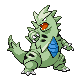
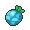

# Important Trainers

### PKMN Trainer Barry

=== "Turtwig"

	| Pokémon | Attributes | Item | Moves |
	|:-------:|------------|:----:|-------|
	|  | **Lv. 70** Azumarill **Ability:** Huge Power **Nature:** ? |  Life Orb | 1. Aqua Tail 2. Play Rough 3. Ice Punch 4. Aqua Jet |
	|  | **Lv. 71** Torterra **Ability:** Overgrow **Nature:** ? |  Sitrus Berry | 1. Wood Hammer 2. Earthquake 3. Stone Edge 4. Crunch |
	|  | **Lv. 70** Staraptor **Ability:** Intimidate **Nature:** ? |  Choice Scarf | 1. Double-Edge 2. Brave Bird 3. Close Combat 4. U-turn |
	|  | **Lv. 70** Heracross **Ability:** Guts **Nature:** ? |  Toxic Orb | 1. Megahorn 2. Close Combat 3. Stone Edge 4. Protect |
	|  | **Lv. 70** Snorlax **Ability:** Thick Fat **Nature:** ? |  Leftovers | 1. Body Slam 2. Earthquake 3. Curse 4. Slack Off |
	
=== "Chimchar"

	| Pokémon | Attributes | Item | Moves |
	|:-------:|------------|:----:|-------|
	|  | **Lv. 70** Arcanine **Ability:** Intimidate **Nature:** ? |  Life Orb | 1. Flare Blitz 2. Close Combat 3. Wild Charge 4. Crunch |
	|  | **Lv. 71** Infernape **Ability:** Iron Fist **Nature:** ? |  Sitrus Berry | 1. Flare Blitz 2. Close Combat 3. Stone Edge 4. Grass Knot |
	|  | **Lv. 70** Staraptor **Ability:** Intimidate **Nature:** ? |  Choice Scarf | 1. Double-Edge 2. Brave Bird 3. Close Combat 4. U-turn |
	|  | **Lv. 70** Heracross **Ability:** Guts **Nature:** ? |  Toxic Orb | 1. Megahorn 2. Close Combat 3. Stone Edge 4. Protect |
	|  | **Lv. 70** Snorlax **Ability:** Thick Fat **Nature:** ? |  Leftovers | 1. Body Slam 2. Earthquake 3. Curse 4. Slack Off |
	
=== "Piplup"

	| Pokémon | Attributes | Item | Moves |
	|:-------:|------------|:----:|-------|
	|  | **Lv. 70** Breloom **Ability:** Technician **Nature:** ? |  Life Orb | 1. Bullet Seed 2. Force Palm 3. Stone Edge 4. Spore |
	|  | **Lv. 71** Empoleon **Ability:** Torrent **Nature:** ? |  Sitrus Berry | 1. Hydro Pump 2. Flash Cannon 3. Grass Knot 4. Blizzard |
	|  | **Lv. 70** Staraptor **Ability:** Intimidate **Nature:** ? |  Choice Scarf | 1. Double-Edge 2. Brave Bird 3. Close Combat 4. U-turn |
	|  | **Lv. 70** Heracross **Ability:** Guts **Nature:** ? |  Toxic Orb | 1. Megahorn 2. Close Combat 3. Stone Edge 4. Protect |
	|  | **Lv. 70** Snorlax **Ability:** Thick Fat **Nature:** ? |  Leftovers | 1. Body Slam 2. Earthquake 3. Curse 4. Slack Off |
	
### (R1) Elite Four Aaron

 Elite Four Aaron")

=== "1"

	| Pokémon | Attributes | Item | Moves |
	|:-------:|------------|:----:|-------|
	|  | **Lv. 71** Yanmega **Ability:** Speed Boost **Nature:** Timid |  Wise Glasses | 1. Bug Buzz 2. Hurricane 3. Giga Drain 4. Protect |
	|  | **Lv. 71** Scizor **Ability:** Technician **Nature:** Adamant |  Life Orb | 1. Bug Bite 2. Iron Head 3. Bullet Punch 4. U-turn |
	|  | **Lv. 71** Heracross **Ability:** Guts **Nature:** Adamant |  Choice Scarf | 1. Megahorn 2. Close Combat 3. Stone Edge 4. Night Slash |
	|  | **Lv. 71** Vespiquen **Ability:** Intimidate (!) **Nature:** Brave |  Leftovers | 1. Attack Order 2. Defend Order 3. Heal Order 4. Hurricane |
	|  | **Lv. 71** Armaldo **Ability:** Battle Armor **Nature:** Naughty |  Choice Band | 1. X-Scissor 2. Stone Edge 3. Earthquake 4. Aqua Tail |
	|  | **Lv. 72** Drapion **Ability:** Sniper **Nature:** Jolly |  Scope Lens | 1. Cross Poison 2. Night Slash 3. X-Scissor 4. Earthquake |
	
=== "2"

	| Pokémon | Attributes | Item | Moves |
	|:-------:|------------|:----:|-------|
	|  | **Lv. 71** Venomoth **Ability:** Tinted Lens **Nature:** Timid |  Wide Lens | 1. Bug Buzz 2. Sludge Bomb 3. Double Team 4. Psychic |
	|  | **Lv. 71** Scyther **Ability:** Technician **Nature:** Naive |  Life Orb | 1. Bug Bite 2. Aerial Ace 3. Quick Attack 4. U-turn |
	|  | **Lv. 71** Pinsir **Ability:** Hyper Cutter **Nature:** Adamant |  Expert Belt | 1. Megahorn 2. Close Combat 3. Stone Edge 4. Earthquake |
	|  | **Lv. 71** Forretress **Ability:** Sturdy **Nature:** Adamant |  Leftovers | 1. Gyro Ball 2. Bug Bite 3. Drill Run 4. Toxic Spikes |
	|  | **Lv. 71** Armaldo **Ability:** Battle Armor **Nature:** Adamant |  Choice Band | 1. X-Scissor 2. Stone Edge 3. Earthquake 4. Aqua Tail |
	|  | **Lv. 72** Drapion **Ability:** Sniper **Nature:** Naive |  Scope Lens | 1. Cross Poison 2. Night Slash 3. Aqua Tail 4. Earthquake |
	
=== "3"

	| Pokémon | Attributes | Item | Moves |
	|:-------:|------------|:----:|-------|
	|  | **Lv. 71** Masquerain **Ability:** Intimidate **Nature:** Hasty |  Wise Glasses | 1. Hydro Pump 2. Bug Buzz 3. Hurricane 4. Blizzard |
	|  | **Lv. 71** Beautifly **Ability:** Swarm **Nature:** Mild |  Focus Sash | 1. Bug Buzz 2. Hurricane 3. Energy Ball 4. Shadow Ball |
	|  | **Lv. 71** Heracross **Ability:** Guts **Nature:** Adamant |  Toxic Orb | 1. Megahorn 2. Close Combat 3. Stone Edge 4. Protect |
	|  | **Lv. 71** Scizor **Ability:** Technician **Nature:** Adamant |  Life Orb | 1. Bug Bite 2. Iron Head 3. Bullet Punch 4. U-turn |
	|  | **Lv. 71** Dustox **Ability:** Shield Dust **Nature:** Bold |  Light Clay | 1. Bug Buzz 2. Sludge Bomb 3. Light Screen 4. Moonlight |
	|  | **Lv. 72** Drapion **Ability:** Sniper **Nature:** Naive |  Scope Lens | 1. Cross Poison 2. Night Slash 3. X-Scissor 4. Earthquake |
	
=== "4"

	| Pokémon | Attributes | Item | Moves |
	|:-------:|------------|:----:|-------|
	|  | **Lv. 71** Scyther **Ability:** Technician **Nature:** Naive |  Life Orb | 1. Bug Bite 2. Aerial Ace 3. Quick Attack 4. U-turn |
	|  | **Lv. 71** Yanmega **Ability:** Speed Boost **Nature:** Timid |  Wise Glasses | 1. Bug Buzz 2. Hurricane 3. Psychic 4. Detect |
	|  | **Lv. 71** Pinsir **Ability:** Hyper Cutter **Nature:** Adamant |  Expert Belt | 1. Megahorn 2. Close Combat 3. Stone Edge 4. Earthquake |
	|  | **Lv. 71** Scizor **Ability:** Technician **Nature:** Adamant |  Life Orb | 1. Bug Bite 2. Iron Head 3. Bullet Punch 4. U-turn |
	|  | **Lv. 71** Flygon **Ability:** Compound Eyes (!) **Nature:** Timid |  White Herb | 1. Bug Buzz 2. Draco Meteor 3. Fire Blast 4. Earth Power |
	|  | **Lv. 72** Drapion **Ability:** Sniper **Nature:** Naive |  Scope Lens | 1. Cross Poison 2. Night Slash 3. Aqua Tail 4. Earthquake |
	
### (R1) Elite Four Bertha

 Elite Four Bertha")

=== "1"

	| Pokémon | Attributes | Item | Moves |
	|:-------:|------------|:----:|-------|
	|  | **Lv. 72** Hippowdon **Ability:** Sand Stream **Nature:** Adamant |  Leftovers | 1. Earthquake 2. Crunch 3. Stealth Rock 4. Slack Off |
	|  | **Lv. 72** Whiscash **Ability:** Oblivious **Nature:** Careful |  Life Orb | 1. Aqua Tail 2. Earthquake 3. Bounce 4. Dragon Dance |
	|  | **Lv. 72** Gliscor **Ability:** Poison Heal **Nature:** Naive |  Toxic Orb | 1. Earthquake 2. Wing Attack 3. Protect 4. Roost |
	|  | **Lv. 72** Golem **Ability:** Rock Head **Nature:** Naughty |  Focus Sash | 1. Earthquake 2. Stone Edge 3. Thunder Punch 4. Explosion |
	|  | **Lv. 72** Donphan **Ability:** Sand Veil **Nature:** Impish |  Rindo Berry | 1. Earthquake 2. Play Rough 3. Head Smash 4. Superpower |
	|  | **Lv. 73** Rhyperior **Ability:** Solid Rock **Nature:** Brave |  Choice Band | 1. Earthquake 2. Stone Edge 3. Megahorn 4. Ice Punch |
	
=== "2"

	| Pokémon | Attributes | Item | Moves |
	|:-------:|------------|:----:|-------|
	|  | **Lv. 72** Hippowdon **Ability:** Sand Stream **Nature:** Naughty |  Sitrus Berry | 1. Earthquake 2. Crunch 3. Stealth Rock 4. Slack Off |
	|  | **Lv. 72** Sudowoodo **Ability:** Rock Head **Nature:** Relaxed |  Passho Berry | 1. Head Smash 2. Wood Hammer 3. Sucker Punch 4. Hammer Arm |
	|  | **Lv. 72** Gliscor **Ability:** Poison Heal **Nature:** Impish |  Toxic Orb | 1. Earthquake 2. X-Scissor 3. Protect 4. Roost |
	|  | **Lv. 72** Torterra **Ability:** Overgrow **Nature:** Adamant |  Leftovers | 1. Earthquake 2. Wood Hammer 3. Stone Edge 4. Leech Seed |
	|  | **Lv. 72** Camerupt **Ability:** Solid Rock **Nature:** Quiet |  Focus Sash | 1. Overheat 2. Earth Power 3. Yawn 4. Explosion |
	|  | **Lv. 73** Rhyperior **Ability:** Solid Rock **Nature:** Naughty |  Choice Band | 1. Earthquake 2. Stone Edge 3. Megahorn 4. Thunder Punch |
	
=== "3"

	| Pokémon | Attributes | Item | Moves |
	|:-------:|------------|:----:|-------|
	|  | **Lv. 72** Tyranitar **Ability:** Sand Stream **Nature:** Naughty |  Choice Scarf | 1. Stone Edge 2. Crunch 3. Earthquake 4. Thunder Punch |
	|  | **Lv. 72** Swampert **Ability:** Torrent **Nature:** Adamant |  Lum Berry | 1. Earthquake 2. Aqua Tail 3. Rest 4. Sleep Talk |
	|  | **Lv. 72** Dugtrio **Ability:** Arena Trap **Nature:** Naughty |  Choice Band | 1. Earthquake 2. Stone Edge 3. Night Slash 4. Aerial Ace |
	|  | **Lv. 72** Mamoswine **Ability:** Thick Fat **Nature:** Jolly |  Passho Berry | 1. Earthquake 2. Icicle Crash 3. Stone Edge 4. Ice Shard |
	|  | **Lv. 72** Claydol **Ability:** Levitate **Nature:** Sassy |  Light Clay | 1. Earthquake 2. Psychic 3. Reflect 4. Light Screen |
	|  | **Lv. 73** Rhyperior **Ability:** Solid Rock **Nature:** Naughty |  Choice Band | 1. Earthquake 2. Stone Edge 3. Megahorn 4. Fire Punch |
	
=== "4"

	| Pokémon | Attributes | Item | Moves |
	|:-------:|------------|:----:|-------|
	|  | **Lv. 72** Tyranitar **Ability:** Sand Stream **Nature:** Jolly |  Choice Scarf | 1. Stone Edge 2. Crunch 3. Earthquake 4. Fire Punch |
	|  | **Lv. 72** Quagsire **Ability:** Water Absorb **Nature:** Careful |  Sitrus Berry | 1. Earthquake 2. Aqua Tail 3. Yawn 4. Recover |
	|  | **Lv. 72** Mamoswine **Ability:** Thick Fat **Nature:** Jolly |  Passho Berry | 1. Earthquake 2. Icicle Crash 3. Stone Edge 4. Ice Shard |
	|  | **Lv. 72** Dugtrio **Ability:** Arena Trap **Nature:** Naughty |  Choice Band | 1. Earthquake 2. Stone Edge 3. Night Slash 4. Aerial Ace |
	|  | **Lv. 72** Torterra **Ability:** Overgrow **Nature:** Brave |  Leftovers | 1. Earthquake 2. Wood Hammer 3. Stone Edge 4. Leech Seed |
	|  | **Lv. 73** Rhyperior **Ability:** Solid Rock **Nature:** Naughty |  Choice Band | 1. Earthquake 2. Stone Edge 3. Megahorn 4. Ice Punch |
	
### (R1) Elite Four Flint

 Elite Four Flint")

=== "1"

	| Pokémon | Attributes | Item | Moves |
	|:-------:|------------|:----:|-------|
	|  | **Lv. 73** Ninetales **Ability:** Drought **Nature:** Timid |  White Herb | 1. Overheat 2. Solar Beam 3. Moonblast 4. Confuse Ray |
	|  | **Lv. 73** Houndoom **Ability:** Intimidate (!) **Nature:** Hasty |  Choice Scarf | 1. Fire Blast 2. Dark Pulse 3. Solar Beam 4. Sludge Bomb |
	|  | **Lv. 73** Flareon **Ability:** Flash Fire **Nature:** Lonely |  Choice Band | 1. Flare Blitz 2. Play Rough 3. Wild Charge 4. Close Combat |
	|  | **Lv. 73** Rapidash **Ability:** Flame Body **Nature:** Hasty |  Power Herb | 1. Flare Blitz 2. Wild Charge 3. Megahorn 4. Drill Run |
	|  | **Lv. 73** Infernape **Ability:** Iron Fist **Nature:** Hasty |  Expert Belt | 1. Flare Blitz 2. Close Combat 3. Thunder Punch 4. Grass Knot |
	|  | **Lv. 74** Magmortar **Ability:** Flame Body **Nature:** Timid |  Life Orb | 1. Fire Blast 2. Thunderbolt 3. Aura Sphere 4. Solar Beam |
	
=== "2"

	| Pokémon | Attributes | Item | Moves |
	|:-------:|------------|:----:|-------|
	|  | **Lv. 73** Rapidash **Ability:** Flame Body **Nature:** Naive |  Heat Rock | 1. Flare Blitz 2. Wild Charge 3. Megahorn 4. Sunny Day |
	|  | **Lv. 73** Lopunny **Ability:** Scrappy (!) **Nature:** Hasty |  Focus Sash | 1. High Jump Kick 2. Mega Kick 3. Blaze Kick 4. Sunny Day |
	|  | **Lv. 73** Drifblim **Ability:** Unburden **Nature:** Modest |  Wacan Berry | 1. Shadow Ball 2. Hurricane 3. Flamethrower 4. Will-O-Wisp |
	|  | **Lv. 73** Steelix **Ability:** Rock Head **Nature:** Sassy |  Muscle Band | 1. Iron Tail 2. Earthquake 3. Fire Fang 4. Crunch |
	|  | **Lv. 73** Infernape **Ability:** Iron Fist **Nature:** Adamant |  Expert Belt | 1. Flare Blitz 2. Close Combat 3. Thunder Punch 4. Gunk Shot |
	|  | **Lv. 74** Magmortar **Ability:** Flame Body **Nature:** Modest |  Life Orb | 1. Fire Blast 2. Thunderbolt 3. Aura Sphere 4. Solar Beam |
	
=== "3"

	| Pokémon | Attributes | Item | Moves |
	|:-------:|------------|:----:|-------|
	|  | **Lv. 73** Ninetales **Ability:** Drought **Nature:** Modest |  White Herb | 1. Overheat 2. Solar Beam 3. Moonblast 4. Hypnosis |
	|  | **Lv. 73** Arcanine **Ability:** Intimidate **Nature:** Hasty |  Expert Belt | 1. Flare Blitz 2. Wild Charge 3. Crunch 4. Extreme Speed |
	|  | **Lv. 73** Magcargo **Ability:** Solid Rock (!) **Nature:** Quiet |  Focus Sash | 1. Fire Blast 2. Earth Power 3. Power Gem 4. Solar Beam |
	|  | **Lv. 73** Lopunny **Ability:** Scrappy (!) **Nature:** Hasty |  Muscle Band | 1. High Jump Kick 2. Mega Kick 3. Blaze Kick 4. Fake Out |
	|  | **Lv. 73** Charizard **Ability:** Drought (!) **Nature:** Modest |  Choice Specs | 1. Fire Blast 2. Dragon Pulse 3. Hurricane 4. Solar Beam |
	|  | **Lv. 74** Magmortar **Ability:** Flame Body **Nature:** Modest |  Life Orb | 1. Fire Blast 2. Thunderbolt 3. Aura Sphere 4. Solar Beam |
	
=== "4"

	| Pokémon | Attributes | Item | Moves |
	|:-------:|------------|:----:|-------|
	|  | **Lv. 73** Torkoal **Ability:** Drought **Nature:** Calm |  Focus Sash | 1. Fire Blast 2. Earth Power 3. Stealth Rock 4. Solar Beam |
	|  | **Lv. 73** Houndoom **Ability:** Intimidate (!) **Nature:** Hasty |  Choice Specs | 1. Fire Blast 2. Dark Pulse 3. Solar Beam 4. Sludge Bomb |
	|  | **Lv. 73** Arcanine **Ability:** Intimidate **Nature:** Hasty |  Expert Belt | 1. Flare Blitz 2. Wild Charge 3. Crunch 4. Extreme Speed |
	|  | **Lv. 73** Drifblim **Ability:** Unburden **Nature:** Rash |  Wacan Berry | 1. Shadow Ball 2. Hurricane 3. Flamethrower 4. Will-O-Wisp |
	|  | **Lv. 73** Typhlosion **Ability:** Flash Fire **Nature:** Timid |  Choice Scarf | 1. Eruption 2. Extrasensory 3. Earth Power 4. Solar Beam |
	|  | **Lv. 74** Magmortar **Ability:** Flame Body **Nature:** Rash |  Life Orb | 1. Fire Blast 2. Thunderbolt 3. Aura Sphere 4. Solar Beam |
	
### (R1) Elite Four Lucian

 Elite Four Lucian")

=== "1"

	| Pokémon | Attributes | Item | Moves |
	|:-------:|------------|:----:|-------|
	|  | **Lv. 74** Mr. Mime **Ability:** Filter **Nature:** Naive |  Light Clay | 1. Psychic 2. Dazzling Gleam 3. Reflect 4. Light Screen |
	|  | **Lv. 74** Espeon **Ability:** Synchronize **Nature:** Naive |  Wise Glasses | 1. Psychic 2. Dazzling Gleam 3. Aura Sphere 4. Power Gem |
	|  | **Lv. 74** Bronzong **Ability:** Levitate **Nature:** Impish |  Leftovers | 1. Zen Headbutt 2. Gyro Ball 3. Reflect 4. Light Screen |
	|  | **Lv. 74** Alakazam **Ability:** Magic Guard **Nature:** Timid |  Life Orb | 1. Psychic 2. Shadow Ball 3. Energy Ball 4. Aura Sphere |
	|  | **Lv. 74** Metagross **Ability:** Iron Fist (!) **Nature:** Naughty |  Muscle Band | 1. Zen Headbutt 2. Meteor Mash 3. Earthquake 4. Explosion |
	|  | **Lv. 75** Gallade **Ability:** Steadfast **Nature:** Lonely |  Scope Lens | 1. Psycho Cut 2. Close Combat 3. Leaf Blade 4. Night Slash |
	
=== "2"

	| Pokémon | Attributes | Item | Moves |
	|:-------:|------------|:----:|-------|
	|  | **Lv. 74** Espeon **Ability:** Synchronize **Nature:** Hasty |  Light Clay | 1. Psychic 2. Aura Sphere 3. Reflect 4. Light Screen |
	|  | **Lv. 74** Girafarig **Ability:** Inner Focus **Nature:** Hasty |  Colbur Berry | 1. Psychic 2. Thunderbolt 3. Shadow Ball 4. Earthquake |
	|  | **Lv. 74** Medicham **Ability:** Pure Power **Nature:** Naive |  Choice Scarf | 1. Zen Headbutt 2. High Jump Kick 3. Thunder Punch 4. Ice Punch |
	|  | **Lv. 74** Starmie **Ability:** Illuminate **Nature:** Modest |  Life Orb | 1. Psychic 2. Hydro Pump 3. Ice Beam 4. Thunderbolt |
	|  | **Lv. 74** Exeggutor **Ability:** Chlorophyll **Nature:** Quiet |  Occa Berry | 1. Psychic 2. Giga Drain 3. Sleep Powder 4. Leech Seed |
	|  | **Lv. 75** Gallade **Ability:** Steadfast **Nature:** Jolly |  Scope Lens | 1. Psycho Cut 2. Close Combat 3. Leaf Blade 4. Night Slash |
	
=== "3"

	| Pokémon | Attributes | Item | Moves |
	|:-------:|------------|:----:|-------|
	|  | **Lv. 74** Hypno **Ability:** Insomnia **Nature:** Relaxed |  Light Clay | 1. Psychic 2. Hypnosis 3. Reflect 4. Light Screen |
	|  | **Lv. 74** Slowbro **Ability:** Oblivious **Nature:** Bold |  Leftovers | 1. Psychic 2. Scald 3. Flamethrower 4. Slack Off |
	|  | **Lv. 74** Gardevoir **Ability:** Synchronize **Nature:** Timid |  Wise Glasses | 1. Psychic 2. Moonblast 3. Thunderbolt 4. Aura Sphere |
	|  | **Lv. 74** Jynx **Ability:** Dry Skin **Nature:** Naive |  White Herb | 1. Psycho Boost 2. Blizzard 3. Petal Dance 4. Fake Out |
	|  | **Lv. 74** Bronzong **Ability:** Levitate **Nature:** Relaxed |  Occa Berry | 1. Psychic 2. Flash Cannon 3. Earthquake 4. Hypnosis |
	|  | **Lv. 75** Gallade **Ability:** Steadfast **Nature:** Jolly |  Scope Lens | 1. Psycho Cut 2. Close Combat 3. Leaf Blade 4. Night Slash |
	
=== "4"

	| Pokémon | Attributes | Item | Moves |
	|:-------:|------------|:----:|-------|
	|  | **Lv. 74** Alakazam **Ability:** Magic Guard **Nature:** Timid |  Focus Sash | 1. Psychic 2. Aura Sphere 3. Thunder Wave 4. Counter |
	|  | **Lv. 74** Gardevoir **Ability:** Synchronize **Nature:** Timid |  Wise Glasses | 1. Psychic 2. Moonblast 3. Thunderbolt 4. Aura Sphere |
	|  | **Lv. 74** Exeggutor **Ability:** Chlorophyll **Nature:** Rash |  Occa Berry | 1. Psychic 2. Giga Drain 3. Sleep Powder 4. Leech Seed |
	|  | **Lv. 74** Starmie **Ability:** Illuminate **Nature:** Modest |  Life Orb | 1. Psychic 2. Hydro Pump 3. Ice Beam 4. Thunderbolt |
	|  | **Lv. 74** Metagross **Ability:** Iron Fist (!) **Nature:** Naughty |  Muscle Band | 1. Zen Headbutt 2. Meteor Mash 3. Earthquake 4. Explosion |
	|  | **Lv. 75** Gallade **Ability:** Steadfast **Nature:** Jolly |  Scope Lens | 1. Psycho Cut 2. Close Combat 3. Leaf Blade 4. Night Slash |
	
### (R1) Champion Cynthia

 Champion Cynthia")

=== "1"

	| Pokémon | Attributes | Item | Moves |
	|:-------:|------------|:----:|-------|
	|  | **Lv. 77** Spiritomb **Ability:** Pressure **Nature:** Sassy |  Lum Berry | 1. Dark Pulse 2. Will-O-Wisp 3. Confuse Ray 4. Rest |
	|  | **Lv. 77** Roserade **Ability:** Technician **Nature:** Timid |  White Herb | 1. Leaf Storm 2. Sludge Bomb 3. Dazzling Gleam 4. Sleep Powder |
	|  | **Lv. 77** Togekiss **Ability:** Serene Grace **Nature:** Bold |  Sitrus Berry | 1. Air Slash 2. Thunder Wave 3. Roost 4. Moonblast |
	|  | **Lv. 77** Lucario **Ability:** Adaptability (!) **Nature:** Jolly |  Life Orb | 1. High Jump Kick 2. Meteor Mash 3. Extreme Speed 4. Ice Punch |
	|  | **Lv. 77** Milotic **Ability:** Marvel Scale **Nature:** Calm |  Leftovers | 1. Surf 2. Ice Beam 3. Recover 4. Hypnosis |
	|  | **Lv. 78** Garchomp **Ability:** Rough Skin **Nature:** Jolly |  Yache Berry | 1. Earthquake 2. Outrage 3. Stone Edge 4. Swords Dance |
	
=== "2"

	| Pokémon | Attributes | Item | Moves |
	|:-------:|------------|:----:|-------|
	|  | **Lv. 77** Milotic **Ability:** Marvel Scale **Nature:** Bold |  Leftovers | 1. Scald 2. Ice Beam 3. Light Screen 4. Recover |
	|  | **Lv. 77** Spiritomb **Ability:** Pressure **Nature:** Relaxed |  Wise Glasses | 1. Dark Pulse 2. Shadow Ball 3. Psychic 4. Hypnosis |
	|  | **Lv. 77** Ampharos **Ability:** Static **Nature:** Quiet |  Shuca Berry | 1. Thunderbolt 2. Dragon Pulse 3. Focus Blast 4. Flash Cannon |
	|  | **Lv. 77** Staraptor **Ability:** Reckless **Nature:** Naughty |  Choice Scarf | 1. Brave Bird 2. Double-Edge 3. Close Combat 4. U-turn |
	|  | **Lv. 77** Lucario **Ability:** Adaptability (!) **Nature:** Timid |  Life Orb | 1. Aura Sphere 2. Flash Cannon 3. Dark Pulse 4. Vacuum Wave |
	|  | **Lv. 78** Garchomp **Ability:** Rough Skin **Nature:** Hasty |  Yache Berry | 1. Earthquake 2. Outrage 3. Stone Edge 4. Swords Dance |
	
=== "3"

	| Pokémon | Attributes | Item | Moves |
	|:-------:|------------|:----:|-------|
	|  | **Lv. 77** Togekiss **Ability:** Serene Grace **Nature:** Quiet |  Light Clay | 1. Moonblast 2. Light Screen 3. Reflect 4. Tailwind |
	|  | **Lv. 77** Milotic **Ability:** Marvel Scale **Nature:** Calm |  Leftovers | 1. Scald 2. Ice Beam 3. Recover 4. Protect |
	|  | **Lv. 77** Spiritomb **Ability:** Pressure **Nature:** Relaxed |  Sitrus Berry | 1. Dark Pulse 2. Calm Mind 3. Rest 4. Sleep Talk |
	|  | **Lv. 77** Lucario **Ability:** Adaptability (!) **Nature:** Hasty |  Life Orb | 1. High Jump Kick 2. Meteor Mash 3. Bullet Punch 4. Stone Edge |
	|  | **Lv. 77** Glaceon **Ability:** Snow Cloak **Nature:** Modest |  Choice Specs | 1. Blizzard 2. Earth Power 3. Extrasensory 4. Shadow Ball |
	|  | **Lv. 78** Garchomp **Ability:** Rough Skin **Nature:** Hasty |  Yache Berry | 1. Earthquake 2. Outrage 3. Stone Edge 4. Swords Dance |
	
=== "4"

	| Pokémon | Attributes | Item | Moves |
	|:-------:|------------|:----:|-------|
	|  | **Lv. 77** Clefable **Ability:** Cute Charm **Nature:** Calm |  Light Clay | 1. Moonblast 2. Soft-Boiled 3. Reflect 4. Light Screen |
	|  | **Lv. 77** Roserade **Ability:** Technician **Nature:** Modest |  Choice Scarf | 1. Energy Ball 2. Sludge Bomb 3. Shadow Ball 4. Dazzling Gleam |
	|  | **Lv. 77** Mismagius **Ability:** Levitate **Nature:** Timid |  Wise Glasses | 1. Shadow Ball 2. Moonblast 3. Thunderbolt 4. Thunder Wave |
	|  | **Lv. 77** Lopunny **Ability:** Scrappy (!) **Nature:** Hasty |  Life Orb | 1. High Jump Kick 2. Mega Kick 3. Ice Punch 4. Fake Out |
	|  | **Lv. 77** Milotic **Ability:** Marvel Scale **Nature:** Calm |  Leftovers | 1. Hydro Pump 2. Ice Beam 3. Rest 4. Sleep Talk |
	|  | **Lv. 78** Garchomp **Ability:** Rough Skin **Nature:** Hasty |  Yache Berry | 1. Earthquake 2. Outrage 3. Stone Edge 4. Swords Dance |
	
### (R2) Elite Four Aaron

 Elite Four Aaron")

| Pokémon | Attributes | Item | Moves |
|:-------:|------------|:----:|-------|
|  | **Lv. 83** Yanmega **Ability:** Speed Boost **Nature:** ? |  Wise Glasses | 1. Bug Buzz 2. Air Slash 3. Giga Drain 4. Protect |
|  | **Lv. 83** Scizor **Ability:** Technician **Nature:** ? |  Muscle Band | 1. Bug Bite 2. Aerial Ace 3. Superpower 4. Bullet Punch |
|  | **Lv. 83** Heracross **Ability:** Guts **Nature:** ? |  Toxic Orb | 1. Megahorn 2. Close Combat 3. Stone Edge 4. Protect |
|  | **Lv. 83** Scyther **Ability:** Technician **Nature:** ? |  Life Orb | 1. Bug Bite 2. Aerial Ace 3. Brick Break 4. Quick Attack |
|  | **Lv. 83** Armaldo **Ability:** Battle Armor **Nature:** ? |  Passho Berry | 1. X-Scissor 2. Stone Edge 3. Earthquake 4. Aqua Jet |
|  | **Lv. 84** Drapion **Ability:** Sniper **Nature:** ? |  Scope Lens | 1. Cross Poison 2. Night Slash 3. X-Scissor 4. Earthquake |

### (R2) Elite Four Bertha

 Elite Four Bertha")

| Pokémon | Attributes | Item | Moves |
|:-------:|------------|:----:|-------|
|  | **Lv. 84** Hippowdon **Ability:** Sand Stream **Nature:** ? |  Leftovers | 1. Earthquake 2. Stone Edge 3. Stealth Rock 4. Slack Off |
|  | **Lv. 84** Swampert **Ability:** Torrent **Nature:** ? |  Rindo Berry | 1. Earthquake 2. Aqua Tail 3. Avalanche 4. Mirror Coat |
|  | **Lv. 84** Gliscor **Ability:** Poison Heal **Nature:** ? |  Toxic Orb | 1. Earthquake 2. Protect 3. Double Team 4. Guillotine |
|  | **Lv. 84** Tyranitar **Ability:** Sand Stream **Nature:** ? |  Expert Belt | 1. Stone Edge 2. Crunch 3. Fire Punch 4. Thunder Punch |
|  | **Lv. 84** Dugtrio **Ability:** Arena Trap **Nature:** ? |  Choice Band | 1. Earthquake 2. Stone Edge 3. Night Slash 4. Aerial Ace |
|  | **Lv. 85** Rhyperior **Ability:** Rock Head **Nature:** ? |  Focus Sash | 1. Earthquake 2. Rock Wrecker 3. Megahorn 4. Hammer Arm |

### (R2) Elite Four Flint

 Elite Four Flint")

| Pokémon | Attributes | Item | Moves |
|:-------:|------------|:----:|-------|
|  | **Lv. 85** Ninetales **Ability:** Drought **Nature:** ? |  Wide Lens | 1. Fire Blast 2. Solar Beam 3. Moonblast 4. Hypnosis |
|  | **Lv. 85** Houndoom **Ability:** Intimidate (!) **Nature:** ? |  White Herb | 1. Overheat 2. Solar Beam 3. Dark Pulse 4. Sludge Bomb |
|  | **Lv. 85** Magmortar **Ability:** Flame Body **Nature:** ? |  Expert Belt | 1. Fire Blast 2. Thunderbolt 3. Focus Blast 4. Psychic |
|  | **Lv. 85** Infernape **Ability:** Iron Fist **Nature:** ? |  Life Orb | 1. Flare Blitz 2. Close Combat 3. Thunder Punch 4. Mach Punch |
|  | **Lv. 85** Rapidash **Ability:** Flame Body **Nature:** ? |  Power Herb | 1. Flare Blitz 2. Drill Run 3. Megahorn 4. Bounce |
|  | **Lv. 86** Moltres **Ability:** Pressure **Nature:** ? |  Choice Scarf | 1. Fire Blast 2. Hurricane 3. Solar Beam 4. U-turn |

### (R2) Elite Four Lucian

 Elite Four Lucian")

| Pokémon | Attributes | Item | Moves |
|:-------:|------------|:----:|-------|
|  | **Lv. 86** Mr. Mime **Ability:** Filter **Nature:** ? |  Light Clay | 1. Psychic 2. Dazzling Gleam 3. Reflect 4. Light Screen |
|  | **Lv. 86** Espeon **Ability:** Synchronize **Nature:** ? |  Salac Berry | 1. Psychic 2. Aura Sphere 3. Calm Mind 4. Baton Pass |
|  | **Lv. 86** Gallade **Ability:** Steadfast **Nature:** ? |  Muscle Band | 1. Zen Headbutt 2. Close Combat 3. Ice Punch 4. Swords Dance |
|  | **Lv. 86** Metagross **Ability:** Iron Fist (!) **Nature:** ? |  Occa Berry | 1. Meteor Mash 2. Earthquake 3. Ice Punch 4. Explosion |
|  | **Lv. 86** Alakazam **Ability:** Magic Guard **Nature:** ? |  Life Orb | 1. Psychic 2. Aura Sphere 3. Shadow Ball 4. Grass Knot |
|  | **Lv. 87** Latios **Ability:** Levitate **Nature:** ? |  Choice Specs | 1. Psychic 2. Draco Meteor 3. Ice Beam 4. Thunderbolt |

### (R2) Champion Cynthia

 Champion Cynthia")

| Pokémon | Attributes | Item | Moves |
|:-------:|------------|:----:|-------|
|  | **Lv. 88** Spiritomb **Ability:** Pressure **Nature:** ? |  Lum Berry | 1. Dark Pulse 2. Rest 3. Sleep Talk 4. Calm Mind |
|  | **Lv. 88** Togekiss **Ability:** Serene Grace **Nature:** ? |  Leftovers | 1. Air Slash 2. Thunder Wave 3. Roost 4. Aura Sphere |
|  | **Lv. 88** Lucario **Ability:** Adaptability **Nature:** ? |  Life Orb | 1. Meteor Mash 2. High Jump Kick 3. Crunch 4. Bullet Punch |
|  | **Lv. 88** Garchomp **Ability:** Rough Skin **Nature:** ? |  Choice Scarf | 1. Outrage 2. Earthquake 3. Stone Edge 4. Extreme Speed |
|  | **Lv. 88** Milotic **Ability:** Marvel Scale **Nature:** ? |  Flame Orb | 1. Scald 2. Ice Beam 3. Attract 4. Recover |
|  | **Lv. 89** Rayquaza **Ability:** Air Lock **Nature:** ? |  Focus Sash | 1. Outrage 2. Earthquake 3. Overheat 4. Dragon Dance |

