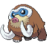
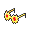

# Important Trainers

### PKMN Trainer Barry

=== "Turtwig"

	| Pokémon | Attributes | Item | Moves |
	|:-------:|------------|:----:|-------|
	|  | **Lv. 70** Azumarill **Ability:** Huge Power ? |  Life Orb | **1.** Aqua Tail **2.** Play Rough **3.** Ice Punch **4.** Aqua Jet |
	|  | **Lv. 71** Torterra **Ability:** Overgrow ? |  Sitrus Berry | **1.** Wood Hammer **2.** Earthquake **3.** Stone Edge **4.** Crunch |
	|  | **Lv. 70** Staraptor **Ability:** Intimidate ? |  Choice Scarf | **1.** Double-Edge **2.** Brave Bird **3.** Close Combat **4.** U-turn |
	|  | **Lv. 70** Heracross **Ability:** Guts ? |  Toxic Orb | **1.** Megahorn **2.** Close Combat **3.** Stone Edge **4.** Protect |
	|  | **Lv. 70** Snorlax **Ability:** Thick Fat ? |  Leftovers | **1.** Body Slam **2.** Earthquake **3.** Curse **4.** Slack Off |
	
=== "Chimchar"

	| Pokémon | Attributes | Item | Moves |
	|:-------:|------------|:----:|-------|
	|  | **Lv. 70** Arcanine **Ability:** Intimidate ? |  Life Orb | **1.** Flare Blitz **2.** Close Combat **3.** Wild Charge **4.** Crunch |
	|  | **Lv. 71** Infernape **Ability:** Iron Fist ? |  Sitrus Berry | **1.** Flare Blitz **2.** Close Combat **3.** Stone Edge **4.** Grass Knot |
	|  | **Lv. 70** Staraptor **Ability:** Intimidate ? |  Choice Scarf | **1.** Double-Edge **2.** Brave Bird **3.** Close Combat **4.** U-turn |
	|  | **Lv. 70** Heracross **Ability:** Guts ? |  Toxic Orb | **1.** Megahorn **2.** Close Combat **3.** Stone Edge **4.** Protect |
	|  | **Lv. 70** Snorlax **Ability:** Thick Fat ? |  Leftovers | **1.** Body Slam **2.** Earthquake **3.** Curse **4.** Slack Off |
	
=== "Piplup"

	| Pokémon | Attributes | Item | Moves |
	|:-------:|------------|:----:|-------|
	|  | **Lv. 70** Breloom **Ability:** Technician ? |  Life Orb | **1.** Bullet Seed **2.** Force Palm **3.** Stone Edge **4.** Spore |
	|  | **Lv. 71** Empoleon **Ability:** Torrent ? |  Sitrus Berry | **1.** Hydro Pump **2.** Flash Cannon **3.** Grass Knot **4.** Blizzard |
	|  | **Lv. 70** Staraptor **Ability:** Intimidate ? |  Choice Scarf | **1.** Double-Edge **2.** Brave Bird **3.** Close Combat **4.** U-turn |
	|  | **Lv. 70** Heracross **Ability:** Guts ? |  Toxic Orb | **1.** Megahorn **2.** Close Combat **3.** Stone Edge **4.** Protect |
	|  | **Lv. 70** Snorlax **Ability:** Thick Fat ? |  Leftovers | **1.** Body Slam **2.** Earthquake **3.** Curse **4.** Slack Off |
	
### (R1) Elite Four Aaron

=== "1"

	| Pokémon | Attributes | Item | Moves |
	|:-------:|------------|:----:|-------|
	|  | **Lv. 71** Yanmega **Ability:** Speed Boost **Nature:** Timid |  Wise Glasses | **1.** Bug Buzz **2.** Hurricane **3.** Giga Drain **4.** Protect |
	|  | **Lv. 71** Scizor **Ability:** Technician **Nature:** Adamant |  Life Orb | **1.** Bug Bite **2.** Iron Head **3.** Bullet Punch **4.** U-turn |
	|  | **Lv. 71** Heracross **Ability:** Guts **Nature:** Adamant |  Choice Scarf | **1.** Megahorn **2.** Close Combat **3.** Stone Edge **4.** Night Slash |
	|  | **Lv. 71** Vespiquen **Ability:** Intimidate (!) **Nature:** Brave |  Leftovers | **1.** Attack Order **2.** Defend Order **3.** Heal Order **4.** Hurricane |
	|  | **Lv. 71** Armaldo **Ability:** Battle Armor **Nature:** Naughty |  Choice Band | **1.** X-Scissor **2.** Stone Edge **3.** Earthquake **4.** Aqua Tail |
	|  | **Lv. 72** Drapion **Ability:** Sniper **Nature:** Jolly |  Scope Lens | **1.** Cross Poison **2.** Night Slash **3.** X-Scissor **4.** Earthquake |
	
=== "2"

	| Pokémon | Attributes | Item | Moves |
	|:-------:|------------|:----:|-------|
	|  | **Lv. 71** Venomoth **Ability:** Tinted Lens **Nature:** Timid |  Wide Lens | **1.** Bug Buzz **2.** Sludge Bomb **3.** Double Team **4.** Psychic |
	|  | **Lv. 71** Scyther **Ability:** Technician **Nature:** Naive |  Life Orb | **1.** Bug Bite **2.** Aerial Ace **3.** Quick Attack **4.** U-turn |
	|  | **Lv. 71** Pinsir **Ability:** Hyper Cutter **Nature:** Adamant |  Expert Belt | **1.** Megahorn **2.** Close Combat **3.** Stone Edge **4.** Earthquake |
	|  | **Lv. 71** Forretress **Ability:** Sturdy **Nature:** Adamant |  Leftovers | **1.** Gyro Ball **2.** Bug Bite **3.** Drill Run **4.** Toxic Spikes |
	|  | **Lv. 71** Armaldo **Ability:** Battle Armor **Nature:** Adamant |  Choice Band | **1.** X-Scissor **2.** Stone Edge **3.** Earthquake **4.** Aqua Tail |
	|  | **Lv. 72** Drapion **Ability:** Sniper **Nature:** Naive |  Scope Lens | **1.** Cross Poison **2.** Night Slash **3.** Aqua Tail **4.** Earthquake |
	
=== "3"

	| Pokémon | Attributes | Item | Moves |
	|:-------:|------------|:----:|-------|
	|  | **Lv. 71** Masquerain **Ability:** Intimidate **Nature:** Hasty |  Wise Glasses | **1.** Hydro Pump **2.** Bug Buzz **3.** Hurricane **4.** Blizzard |
	|  | **Lv. 71** Beautifly **Ability:** Swarm **Nature:** Mild |  Focus Sash | **1.** Bug Buzz **2.** Hurricane **3.** Energy Ball **4.** Shadow Ball |
	|  | **Lv. 71** Heracross **Ability:** Guts **Nature:** Adamant |  Toxic Orb | **1.** Megahorn **2.** Close Combat **3.** Stone Edge **4.** Protect |
	|  | **Lv. 71** Scizor **Ability:** Technician **Nature:** Adamant |  Life Orb | **1.** Bug Bite **2.** Iron Head **3.** Bullet Punch **4.** U-turn |
	|  | **Lv. 71** Dustox **Ability:** Shield Dust **Nature:** Bold |  Light Clay | **1.** Bug Buzz **2.** Sludge Bomb **3.** Light Screen **4.** Moonlight |
	|  | **Lv. 72** Drapion **Ability:** Sniper **Nature:** Naive |  Scope Lens | **1.** Cross Poison **2.** Night Slash **3.** X-Scissor **4.** Earthquake |
	
=== "4"

	| Pokémon | Attributes | Item | Moves |
	|:-------:|------------|:----:|-------|
	|  | **Lv. 71** Scyther **Ability:** Technician **Nature:** Naive |  Life Orb | **1.** Bug Bite **2.** Aerial Ace **3.** Quick Attack **4.** U-turn |
	|  | **Lv. 71** Yanmega **Ability:** Speed Boost **Nature:** Timid |  Wise Glasses | **1.** Bug Buzz **2.** Hurricane **3.** Psychic **4.** Detect |
	|  | **Lv. 71** Pinsir **Ability:** Hyper Cutter **Nature:** Adamant |  Expert Belt | **1.** Megahorn **2.** Close Combat **3.** Stone Edge **4.** Earthquake |
	|  | **Lv. 71** Scizor **Ability:** Technician **Nature:** Adamant |  Life Orb | **1.** Bug Bite **2.** Iron Head **3.** Bullet Punch **4.** U-turn |
	|  | **Lv. 71** Flygon **Ability:** Compound Eyes (!) **Nature:** Timid |  White Herb | **1.** Bug Buzz **2.** Draco Meteor **3.** Fire Blast **4.** Earth Power |
	|  | **Lv. 72** Drapion **Ability:** Sniper **Nature:** Naive |  Scope Lens | **1.** Cross Poison **2.** Night Slash **3.** Aqua Tail **4.** Earthquake |
	
### (R1) Elite Four Bertha

=== "1"

	| Pokémon | Attributes | Item | Moves |
	|:-------:|------------|:----:|-------|
	|  | **Lv. 72** Hippowdon **Ability:** Sand Stream **Nature:** Adamant |  Leftovers | **1.** Earthquake **2.** Crunch **3.** Stealth Rock **4.** Slack Off |
	|  | **Lv. 72** Whiscash **Ability:** Oblivious **Nature:** Careful |  Life Orb | **1.** Aqua Tail **2.** Earthquake **3.** Bounce **4.** Dragon Dance |
	|  | **Lv. 72** Gliscor **Ability:** Poison Heal **Nature:** Naive |  Toxic Orb | **1.** Earthquake **2.** Wing Attack **3.** Protect **4.** Roost |
	|  | **Lv. 72** Golem **Ability:** Rock Head **Nature:** Naughty |  Focus Sash | **1.** Earthquake **2.** Stone Edge **3.** Thunder Punch **4.** Explosion |
	|  | **Lv. 72** Donphan **Ability:** Sand Veil **Nature:** Impish |  Rindo Berry | **1.** Earthquake **2.** Play Rough **3.** Head Smash **4.** Superpower |
	|  | **Lv. 73** Rhyperior **Ability:** Solid Rock **Nature:** Brave |  Choice Band | **1.** Earthquake **2.** Stone Edge **3.** Megahorn **4.** Ice Punch |
	
=== "2"

	| Pokémon | Attributes | Item | Moves |
	|:-------:|------------|:----:|-------|
	|  | **Lv. 72** Hippowdon **Ability:** Sand Stream **Nature:** Naughty |  Sitrus Berry | **1.** Earthquake **2.** Crunch **3.** Stealth Rock **4.** Slack Off |
	|  | **Lv. 72** Sudowoodo **Ability:** Rock Head **Nature:** Relaxed |  Passho Berry | **1.** Head Smash **2.** Wood Hammer **3.** Sucker Punch **4.** Hammer Arm |
	|  | **Lv. 72** Gliscor **Ability:** Poison Heal **Nature:** Impish |  Toxic Orb | **1.** Earthquake **2.** X-Scissor **3.** Protect **4.** Roost |
	|  | **Lv. 72** Torterra **Ability:** Overgrow **Nature:** Adamant |  Leftovers | **1.** Earthquake **2.** Wood Hammer **3.** Stone Edge **4.** Leech Seed |
	|  | **Lv. 72** Camerupt **Ability:** Solid Rock **Nature:** Quiet |  Focus Sash | **1.** Overheat **2.** Earth Power **3.** Yawn **4.** Explosion |
	|  | **Lv. 73** Rhyperior **Ability:** Solid Rock **Nature:** Naughty |  Choice Band | **1.** Earthquake **2.** Stone Edge **3.** Megahorn **4.** Thunder Punch |
	
=== "3"

	| Pokémon | Attributes | Item | Moves |
	|:-------:|------------|:----:|-------|
	|  | **Lv. 72** Tyranitar **Ability:** Sand Stream **Nature:** Naughty |  Choice Scarf | **1.** Stone Edge **2.** Crunch **3.** Earthquake **4.** Thunder Punch |
	|  | **Lv. 72** Swampert **Ability:** Torrent **Nature:** Adamant |  Lum Berry | **1.** Earthquake **2.** Aqua Tail **3.** Rest **4.** Sleep Talk |
	|  | **Lv. 72** Dugtrio **Ability:** Arena Trap **Nature:** Naughty |  Choice Band | **1.** Earthquake **2.** Stone Edge **3.** Night Slash **4.** Aerial Ace |
	|  | **Lv. 72** Mamoswine **Ability:** Thick Fat **Nature:** Jolly |  Passho Berry | **1.** Earthquake **2.** Icicle Crash **3.** Stone Edge **4.** Ice Shard |
	|  | **Lv. 72** Claydol **Ability:** Levitate **Nature:** Sassy |  Light Clay | **1.** Earthquake **2.** Psychic **3.** Reflect **4.** Light Screen |
	|  | **Lv. 73** Rhyperior **Ability:** Solid Rock **Nature:** Naughty |  Choice Band | **1.** Earthquake **2.** Stone Edge **3.** Megahorn **4.** Fire Punch |
	
=== "4"

	| Pokémon | Attributes | Item | Moves |
	|:-------:|------------|:----:|-------|
	|  | **Lv. 72** Tyranitar **Ability:** Sand Stream **Nature:** Jolly |  Choice Scarf | **1.** Stone Edge **2.** Crunch **3.** Earthquake **4.** Fire Punch |
	|  | **Lv. 72** Quagsire **Ability:** Water Absorb **Nature:** Careful |  Sitrus Berry | **1.** Earthquake **2.** Aqua Tail **3.** Yawn **4.** Recover |
	|  | **Lv. 72** Mamoswine **Ability:** Thick Fat **Nature:** Jolly |  Passho Berry | **1.** Earthquake **2.** Icicle Crash **3.** Stone Edge **4.** Ice Shard |
	|  | **Lv. 72** Dugtrio **Ability:** Arena Trap **Nature:** Naughty |  Choice Band | **1.** Earthquake **2.** Stone Edge **3.** Night Slash **4.** Aerial Ace |
	|  | **Lv. 72** Torterra **Ability:** Overgrow **Nature:** Brave |  Leftovers | **1.** Earthquake **2.** Wood Hammer **3.** Stone Edge **4.** Leech Seed |
	|  | **Lv. 73** Rhyperior **Ability:** Solid Rock **Nature:** Naughty |  Choice Band | **1.** Earthquake **2.** Stone Edge **3.** Megahorn **4.** Ice Punch |
	
### (R1) Elite Four Flint

=== "1"

	| Pokémon | Attributes | Item | Moves |
	|:-------:|------------|:----:|-------|
	|  | **Lv. 73** Ninetales **Ability:** Drought **Nature:** Timid |  White Herb | **1.** Overheat **2.** Solar Beam **3.** Moonblast **4.** Confuse Ray |
	|  | **Lv. 73** Houndoom **Ability:** Intimidate (!) **Nature:** Hasty |  Choice Scarf | **1.** Fire Blast **2.** Dark Pulse **3.** Solar Beam **4.** Sludge Bomb |
	|  | **Lv. 73** Flareon **Ability:** Flash Fire **Nature:** Lonely |  Choice Band | **1.** Flare Blitz **2.** Play Rough **3.** Wild Charge **4.** Close Combat |
	|  | **Lv. 73** Rapidash **Ability:** Flame Body **Nature:** Hasty |  Power Herb | **1.** Flare Blitz **2.** Wild Charge **3.** Megahorn **4.** Drill Run |
	|  | **Lv. 73** Infernape **Ability:** Iron Fist **Nature:** Hasty |  Expert Belt | **1.** Flare Blitz **2.** Close Combat **3.** Thunder Punch **4.** Grass Knot |
	|  | **Lv. 74** Magmortar **Ability:** Flame Body **Nature:** Timid |  Life Orb | **1.** Fire Blast **2.** Thunderbolt **3.** Aura Sphere **4.** Solar Beam |
	
=== "2"

	| Pokémon | Attributes | Item | Moves |
	|:-------:|------------|:----:|-------|
	|  | **Lv. 73** Rapidash **Ability:** Flame Body **Nature:** Naive |  Heat Rock | **1.** Flare Blitz **2.** Wild Charge **3.** Megahorn **4.** Sunny Day |
	|  | **Lv. 73** Lopunny **Ability:** Scrappy (!) **Nature:** Hasty |  Focus Sash | **1.** High Jump Kick **2.** Mega Kick **3.** Blaze Kick **4.** Sunny Day |
	|  | **Lv. 73** Drifblim **Ability:** Unburden **Nature:** Modest |  Wacan Berry | **1.** Shadow Ball **2.** Hurricane **3.** Flamethrower **4.** Will-O-Wisp |
	|  | **Lv. 73** Steelix **Ability:** Rock Head **Nature:** Sassy |  Muscle Band | **1.** Iron Tail **2.** Earthquake **3.** Fire Fang **4.** Crunch |
	|  | **Lv. 73** Infernape **Ability:** Iron Fist **Nature:** Adamant |  Expert Belt | **1.** Flare Blitz **2.** Close Combat **3.** Thunder Punch **4.** Gunk Shot |
	|  | **Lv. 74** Magmortar **Ability:** Flame Body **Nature:** Modest |  Life Orb | **1.** Fire Blast **2.** Thunderbolt **3.** Aura Sphere **4.** Solar Beam |
	
=== "3"

	| Pokémon | Attributes | Item | Moves |
	|:-------:|------------|:----:|-------|
	|  | **Lv. 73** Ninetales **Ability:** Drought **Nature:** Modest |  White Herb | **1.** Overheat **2.** Solar Beam **3.** Moonblast **4.** Hypnosis |
	|  | **Lv. 73** Arcanine **Ability:** Intimidate **Nature:** Hasty |  Expert Belt | **1.** Flare Blitz **2.** Wild Charge **3.** Crunch **4.** Extreme Speed |
	|  | **Lv. 73** Magcargo **Ability:** Solid Rock (!) **Nature:** Quiet |  Focus Sash | **1.** Fire Blast **2.** Earth Power **3.** Power Gem **4.** Solar Beam |
	|  | **Lv. 73** Lopunny **Ability:** Scrappy (!) **Nature:** Hasty |  Muscle Band | **1.** High Jump Kick **2.** Mega Kick **3.** Blaze Kick **4.** Fake Out |
	|  | **Lv. 73** Charizard **Ability:** Drought (!) **Nature:** Modest |  Choice Specs | **1.** Fire Blast **2.** Dragon Pulse **3.** Hurricane **4.** Solar Beam |
	|  | **Lv. 74** Magmortar **Ability:** Flame Body **Nature:** Modest |  Life Orb | **1.** Fire Blast **2.** Thunderbolt **3.** Aura Sphere **4.** Solar Beam |
	
=== "4"

	| Pokémon | Attributes | Item | Moves |
	|:-------:|------------|:----:|-------|
	|  | **Lv. 73** Torkoal **Ability:** Drought **Nature:** Calm |  Focus Sash | **1.** Fire Blast **2.** Earth Power **3.** Stealth Rock **4.** Solar Beam |
	|  | **Lv. 73** Houndoom **Ability:** Intimidate (!) **Nature:** Hasty |  Choice Specs | **1.** Fire Blast **2.** Dark Pulse **3.** Solar Beam **4.** Sludge Bomb |
	|  | **Lv. 73** Arcanine **Ability:** Intimidate **Nature:** Hasty |  Expert Belt | **1.** Flare Blitz **2.** Wild Charge **3.** Crunch **4.** Extreme Speed |
	|  | **Lv. 73** Drifblim **Ability:** Unburden **Nature:** Rash |  Wacan Berry | **1.** Shadow Ball **2.** Hurricane **3.** Flamethrower **4.** Will-O-Wisp |
	|  | **Lv. 73** Typhlosion **Ability:** Flash Fire **Nature:** Timid |  Choice Scarf | **1.** Eruption **2.** Extrasensory **3.** Earth Power **4.** Solar Beam |
	|  | **Lv. 74** Magmortar **Ability:** Flame Body **Nature:** Rash |  Life Orb | **1.** Fire Blast **2.** Thunderbolt **3.** Aura Sphere **4.** Solar Beam |
	
### (R1) Elite Four Lucian

=== "1"

	| Pokémon | Attributes | Item | Moves |
	|:-------:|------------|:----:|-------|
	|  | **Lv. 74** Mr. Mime **Ability:** Filter **Nature:** Naive |  Light Clay | **1.** Psychic **2.** Dazzling Gleam **3.** Reflect **4.** Light Screen |
	|  | **Lv. 74** Espeon **Ability:** Synchronize **Nature:** Naive |  Wise Glasses | **1.** Psychic **2.** Dazzling Gleam **3.** Aura Sphere **4.** Power Gem |
	|  | **Lv. 74** Bronzong **Ability:** Levitate **Nature:** Impish |  Leftovers | **1.** Zen Headbutt **2.** Gyro Ball **3.** Reflect **4.** Light Screen |
	|  | **Lv. 74** Alakazam **Ability:** Magic Guard **Nature:** Timid |  Life Orb | **1.** Psychic **2.** Shadow Ball **3.** Energy Ball **4.** Aura Sphere |
	|  | **Lv. 74** Metagross **Ability:** Iron Fist (!) **Nature:** Naughty |  Muscle Band | **1.** Zen Headbutt **2.** Meteor Mash **3.** Earthquake **4.** Explosion |
	|  | **Lv. 75** Gallade **Ability:** Steadfast **Nature:** Lonely |  Scope Lens | **1.** Psycho Cut **2.** Close Combat **3.** Leaf Blade **4.** Night Slash |
	
=== "2"

	| Pokémon | Attributes | Item | Moves |
	|:-------:|------------|:----:|-------|
	|  | **Lv. 74** Espeon **Ability:** Synchronize **Nature:** Hasty |  Light Clay | **1.** Psychic **2.** Aura Sphere **3.** Reflect **4.** Light Screen |
	|  | **Lv. 74** Girafarig **Ability:** Inner Focus **Nature:** Hasty |  Colbur Berry | **1.** Psychic **2.** Thunderbolt **3.** Shadow Ball **4.** Earthquake |
	|  | **Lv. 74** Medicham **Ability:** Pure Power **Nature:** Naive |  Choice Scarf | **1.** Zen Headbutt **2.** High Jump Kick **3.** Thunder Punch **4.** Ice Punch |
	|  | **Lv. 74** Starmie **Ability:** Illuminate **Nature:** Modest |  Life Orb | **1.** Psychic **2.** Hydro Pump **3.** Ice Beam **4.** Thunderbolt |
	|  | **Lv. 74** Exeggutor **Ability:** Chlorophyll **Nature:** Quiet |  Occa Berry | **1.** Psychic **2.** Giga Drain **3.** Sleep Powder **4.** Leech Seed |
	|  | **Lv. 75** Gallade **Ability:** Steadfast **Nature:** Jolly |  Scope Lens | **1.** Psycho Cut **2.** Close Combat **3.** Leaf Blade **4.** Night Slash |
	
=== "3"

	| Pokémon | Attributes | Item | Moves |
	|:-------:|------------|:----:|-------|
	|  | **Lv. 74** Hypno **Ability:** Insomnia **Nature:** Relaxed |  Light Clay | **1.** Psychic **2.** Hypnosis **3.** Reflect **4.** Light Screen |
	|  | **Lv. 74** Slowbro **Ability:** Oblivious **Nature:** Bold |  Leftovers | **1.** Psychic **2.** Scald **3.** Flamethrower **4.** Slack Off |
	|  | **Lv. 74** Gardevoir **Ability:** Synchronize **Nature:** Timid |  Wise Glasses | **1.** Psychic **2.** Moonblast **3.** Thunderbolt **4.** Aura Sphere |
	|  | **Lv. 74** Jynx **Ability:** Dry Skin **Nature:** Naive |  White Herb | **1.** Psycho Boost **2.** Blizzard **3.** Petal Dance **4.** Fake Out |
	|  | **Lv. 74** Bronzong **Ability:** Levitate **Nature:** Relaxed |  Occa Berry | **1.** Psychic **2.** Flash Cannon **3.** Earthquake **4.** Hypnosis |
	|  | **Lv. 75** Gallade **Ability:** Steadfast **Nature:** Jolly |  Scope Lens | **1.** Psycho Cut **2.** Close Combat **3.** Leaf Blade **4.** Night Slash |
	
=== "4"

	| Pokémon | Attributes | Item | Moves |
	|:-------:|------------|:----:|-------|
	|  | **Lv. 74** Alakazam **Ability:** Magic Guard **Nature:** Timid |  Focus Sash | **1.** Psychic **2.** Aura Sphere **3.** Thunder Wave **4.** Counter |
	|  | **Lv. 74** Gardevoir **Ability:** Synchronize **Nature:** Timid |  Wise Glasses | **1.** Psychic **2.** Moonblast **3.** Thunderbolt **4.** Aura Sphere |
	|  | **Lv. 74** Exeggutor **Ability:** Chlorophyll **Nature:** Rash |  Occa Berry | **1.** Psychic **2.** Giga Drain **3.** Sleep Powder **4.** Leech Seed |
	|  | **Lv. 74** Starmie **Ability:** Illuminate **Nature:** Modest |  Life Orb | **1.** Psychic **2.** Hydro Pump **3.** Ice Beam **4.** Thunderbolt |
	|  | **Lv. 74** Metagross **Ability:** Iron Fist (!) **Nature:** Naughty |  Muscle Band | **1.** Zen Headbutt **2.** Meteor Mash **3.** Earthquake **4.** Explosion |
	|  | **Lv. 75** Gallade **Ability:** Steadfast **Nature:** Jolly |  Scope Lens | **1.** Psycho Cut **2.** Close Combat **3.** Leaf Blade **4.** Night Slash |
	
### (R1) Champion Cynthia

=== "1"

	| Pokémon | Attributes | Item | Moves |
	|:-------:|------------|:----:|-------|
	|  | **Lv. 77** Spiritomb **Ability:** Pressure **Nature:** Sassy |  Lum Berry | **1.** Dark Pulse **2.** Will-O-Wisp **3.** Confuse Ray **4.** Rest |
	|  | **Lv. 77** Roserade **Ability:** Technician **Nature:** Timid |  White Herb | **1.** Leaf Storm **2.** Sludge Bomb **3.** Dazzling Gleam **4.** Sleep Powder |
	|  | **Lv. 77** Togekiss **Ability:** Serene Grace **Nature:** Bold |  Sitrus Berry | **1.** Air Slash **2.** Thunder Wave **3.** Roost **4.** Moonblast |
	|  | **Lv. 77** Lucario **Ability:** Adaptability (!) **Nature:** Jolly |  Life Orb | **1.** High Jump Kick **2.** Meteor Mash **3.** Extreme Speed **4.** Ice Punch |
	|  | **Lv. 77** Milotic **Ability:** Marvel Scale **Nature:** Calm |  Leftovers | **1.** Surf **2.** Ice Beam **3.** Recover **4.** Hypnosis |
	|  | **Lv. 78** Garchomp **Ability:** Rough Skin **Nature:** Jolly |  Yache Berry | **1.** Earthquake **2.** Outrage **3.** Stone Edge **4.** Swords Dance |
	
=== "2"

	| Pokémon | Attributes | Item | Moves |
	|:-------:|------------|:----:|-------|
	|  | **Lv. 77** Milotic **Ability:** Marvel Scale **Nature:** Bold |  Leftovers | **1.** Scald **2.** Ice Beam **3.** Light Screen **4.** Recover |
	|  | **Lv. 77** Spiritomb **Ability:** Pressure **Nature:** Relaxed |  Wise Glasses | **1.** Dark Pulse **2.** Shadow Ball **3.** Psychic **4.** Hypnosis |
	|  | **Lv. 77** Ampharos **Ability:** Static **Nature:** Quiet |  Shuca Berry | **1.** Thunderbolt **2.** Dragon Pulse **3.** Focus Blast **4.** Flash Cannon |
	|  | **Lv. 77** Staraptor **Ability:** Reckless **Nature:** Naughty |  Choice Scarf | **1.** Brave Bird **2.** Double-Edge **3.** Close Combat **4.** U-turn |
	|  | **Lv. 77** Lucario **Ability:** Adaptability (!) **Nature:** Timid |  Life Orb | **1.** Aura Sphere **2.** Flash Cannon **3.** Dark Pulse **4.** Vacuum Wave |
	|  | **Lv. 78** Garchomp **Ability:** Rough Skin **Nature:** Hasty |  Yache Berry | **1.** Earthquake **2.** Outrage **3.** Stone Edge **4.** Swords Dance |
	
=== "3"

	| Pokémon | Attributes | Item | Moves |
	|:-------:|------------|:----:|-------|
	|  | **Lv. 77** Togekiss **Ability:** Serene Grace **Nature:** Quiet |  Light Clay | **1.** Moonblast **2.** Light Screen **3.** Reflect **4.** Tailwind |
	|  | **Lv. 77** Milotic **Ability:** Marvel Scale **Nature:** Calm |  Leftovers | **1.** Scald **2.** Ice Beam **3.** Recover **4.** Protect |
	|  | **Lv. 77** Spiritomb **Ability:** Pressure **Nature:** Relaxed |  Sitrus Berry | **1.** Dark Pulse **2.** Calm Mind **3.** Rest **4.** Sleep Talk |
	|  | **Lv. 77** Lucario **Ability:** Adaptability (!) **Nature:** Hasty |  Life Orb | **1.** High Jump Kick **2.** Meteor Mash **3.** Bullet Punch **4.** Stone Edge |
	|  | **Lv. 77** Glaceon **Ability:** Snow Cloak **Nature:** Modest |  Choice Specs | **1.** Blizzard **2.** Earth Power **3.** Extrasensory **4.** Shadow Ball |
	|  | **Lv. 78** Garchomp **Ability:** Rough Skin **Nature:** Hasty |  Yache Berry | **1.** Earthquake **2.** Outrage **3.** Stone Edge **4.** Swords Dance |
	
=== "4"

	| Pokémon | Attributes | Item | Moves |
	|:-------:|------------|:----:|-------|
	|  | **Lv. 77** Clefable **Ability:** Cute Charm **Nature:** Calm |  Light Clay | **1.** Moonblast **2.** Soft-Boiled **3.** Reflect **4.** Light Screen |
	|  | **Lv. 77** Roserade **Ability:** Technician **Nature:** Modest |  Choice Scarf | **1.** Energy Ball **2.** Sludge Bomb **3.** Shadow Ball **4.** Dazzling Gleam |
	|  | **Lv. 77** Mismagius **Ability:** Levitate **Nature:** Timid |  Wise Glasses | **1.** Shadow Ball **2.** Moonblast **3.** Thunderbolt **4.** Thunder Wave |
	|  | **Lv. 77** Lopunny **Ability:** Scrappy (!) **Nature:** Hasty |  Life Orb | **1.** High Jump Kick **2.** Mega Kick **3.** Ice Punch **4.** Fake Out |
	|  | **Lv. 77** Milotic **Ability:** Marvel Scale **Nature:** Calm |  Leftovers | **1.** Hydro Pump **2.** Ice Beam **3.** Rest **4.** Sleep Talk |
	|  | **Lv. 78** Garchomp **Ability:** Rough Skin **Nature:** Hasty |  Yache Berry | **1.** Earthquake **2.** Outrage **3.** Stone Edge **4.** Swords Dance |
	
### (R2) Elite Four Aaron

| Pokémon | Attributes | Item | Moves |
|:-------:|------------|:----:|-------|
|  | **Lv. 83** Yanmega **Ability:** Speed Boost ? |  Wise Glasses | **1.** Bug Buzz **2.** Air Slash **3.** Giga Drain **4.** Protect |
|  | **Lv. 83** Scizor **Ability:** Technician ? |  Muscle Band | **1.** Bug Bite **2.** Aerial Ace **3.** Superpower **4.** Bullet Punch |
|  | **Lv. 83** Heracross **Ability:** Guts ? |  Toxic Orb | **1.** Megahorn **2.** Close Combat **3.** Stone Edge **4.** Protect |
|  | **Lv. 83** Scyther **Ability:** Technician ? |  Life Orb | **1.** Bug Bite **2.** Aerial Ace **3.** Brick Break **4.** Quick Attack |
|  | **Lv. 83** Armaldo **Ability:** Battle Armor ? |  Passho Berry | **1.** X-Scissor **2.** Stone Edge **3.** Earthquake **4.** Aqua Jet |
|  | **Lv. 84** Drapion **Ability:** Sniper ? |  Scope Lens | **1.** Cross Poison **2.** Night Slash **3.** X-Scissor **4.** Earthquake |

### (R2) Elite Four Bertha

| Pokémon | Attributes | Item | Moves |
|:-------:|------------|:----:|-------|
|  | **Lv. 84** Hippowdon **Ability:** Sand Stream ? |  Leftovers | **1.** Earthquake **2.** Stone Edge **3.** Stealth Rock **4.** Slack Off |
|  | **Lv. 84** Swampert **Ability:** Torrent ? |  Rindo Berry | **1.** Earthquake **2.** Aqua Tail **3.** Avalanche **4.** Mirror Coat |
|  | **Lv. 84** Gliscor **Ability:** Poison Heal ? |  Toxic Orb | **1.** Earthquake **2.** Protect **3.** Double Team **4.** Guillotine |
|  | **Lv. 84** Tyranitar **Ability:** Sand Stream ? |  Expert Belt | **1.** Stone Edge **2.** Crunch **3.** Fire Punch **4.** Thunder Punch |
|  | **Lv. 84** Dugtrio **Ability:** Arena Trap ? |  Choice Band | **1.** Earthquake **2.** Stone Edge **3.** Night Slash **4.** Aerial Ace |
|  | **Lv. 85** Rhyperior **Ability:** Rock Head ? |  Focus Sash | **1.** Earthquake **2.** Rock Wrecker **3.** Megahorn **4.** Hammer Arm |

### (R2) Elite Four Flint

| Pokémon | Attributes | Item | Moves |
|:-------:|------------|:----:|-------|
|  | **Lv. 85** Ninetales **Ability:** Drought ? |  Wide Lens | **1.** Fire Blast **2.** Solar Beam **3.** Moonblast **4.** Hypnosis |
|  | **Lv. 85** Houndoom **Ability:** Intimidate (!) ? |  White Herb | **1.** Overheat **2.** Solar Beam **3.** Dark Pulse **4.** Sludge Bomb |
|  | **Lv. 85** Magmortar **Ability:** Flame Body ? |  Expert Belt | **1.** Fire Blast **2.** Thunderbolt **3.** Focus Blast **4.** Psychic |
|  | **Lv. 85** Infernape **Ability:** Iron Fist ? |  Life Orb | **1.** Flare Blitz **2.** Close Combat **3.** Thunder Punch **4.** Mach Punch |
|  | **Lv. 85** Rapidash **Ability:** Flame Body ? |  Power Herb | **1.** Flare Blitz **2.** Drill Run **3.** Megahorn **4.** Bounce |
|  | **Lv. 86** Moltres **Ability:** Pressure ? |  Choice Scarf | **1.** Fire Blast **2.** Hurricane **3.** Solar Beam **4.** U-turn |

### (R2) Elite Four Lucian

| Pokémon | Attributes | Item | Moves |
|:-------:|------------|:----:|-------|
|  | **Lv. 86** Mr. Mime **Ability:** Filter ? |  Light Clay | **1.** Psychic **2.** Dazzling Gleam **3.** Reflect **4.** Light Screen |
|  | **Lv. 86** Espeon **Ability:** Synchronize ? |  Salac Berry | **1.** Psychic **2.** Aura Sphere **3.** Calm Mind **4.** Baton Pass |
|  | **Lv. 86** Gallade **Ability:** Steadfast ? |  Muscle Band | **1.** Zen Headbutt **2.** Close Combat **3.** Ice Punch **4.** Swords Dance |
|  | **Lv. 86** Metagross **Ability:** Iron Fist (!) ? |  Occa Berry | **1.** Meteor Mash **2.** Earthquake **3.** Ice Punch **4.** Explosion |
|  | **Lv. 86** Alakazam **Ability:** Magic Guard ? |  Life Orb | **1.** Psychic **2.** Aura Sphere **3.** Shadow Ball **4.** Grass Knot |
|  | **Lv. 87** Latios **Ability:** Levitate ? |  Choice Specs | **1.** Psychic **2.** Draco Meteor **3.** Ice Beam **4.** Thunderbolt |

### (R2) Champion Cynthia

| Pokémon | Attributes | Item | Moves |
|:-------:|------------|:----:|-------|
|  | **Lv. 88** Spiritomb **Ability:** Pressure ? |  Lum Berry | **1.** Dark Pulse **2.** Rest **3.** Sleep Talk **4.** Calm Mind |
|  | **Lv. 88** Togekiss **Ability:** Serene Grace ? |  Leftovers | **1.** Air Slash **2.** Thunder Wave **3.** Roost **4.** Aura Sphere |
|  | **Lv. 88** Lucario **Ability:** Adaptability ? |  Life Orb | **1.** Meteor Mash **2.** High Jump Kick **3.** Crunch **4.** Bullet Punch |
|  | **Lv. 88** Garchomp **Ability:** Rough Skin ? |  Choice Scarf | **1.** Outrage **2.** Earthquake **3.** Stone Edge **4.** Extreme Speed |
|  | **Lv. 88** Milotic **Ability:** Marvel Scale ? |  Flame Orb | **1.** Scald **2.** Ice Beam **3.** Attract **4.** Recover |
|  | **Lv. 89** Rayquaza **Ability:** Air Lock ? |  Focus Sash | **1.** Outrage **2.** Earthquake **3.** Overheat **4.** Dragon Dance |

