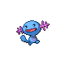

### Walking

| Sprite | Pokémon | Encounter Type | Level | Chance |
|:------:|---------|:--------------:|-------|--------|
|  | Zubat | {: style='max-width: 24px;' } | 6 - 8 | 30% |
|  | Geodude | {: style='max-width: 24px;' } | 6 - 8 | 20% |
|  | Wooper | {: style='max-width: 24px;' } | 6 - 8 | 20% |
|  | Psyduck | {: style='max-width: 24px;' } | 6 - 8 | 10% |
|  | Sandshrew | {: style='max-width: 24px;' } | 6 - 8 | 10% |
|  | Makuhita | {: style='max-width: 24px;' } | 6 - 8 | 10% |
|  | Zubat | {: style='max-width: 24px;' } | 6 - 8 | 30% |
|  | Geodude | {: style='max-width: 24px;' } | 6 - 8 | 20% |
|  | Wooper | {: style='max-width: 24px;' } | 6 - 8 | 20% |
|  | Psyduck | {: style='max-width: 24px;' } | 6 - 8 | 10% |
|  | Sandshrew | {: style='max-width: 24px;' } | 6 - 8 | 10% |
|  | Makuhita | {: style='max-width: 24px;' } | 6 - 8 | 10% |
|  | Zubat | {: style='max-width: 24px;' } | 6 - 8 | 30% |
|  | Geodude | {: style='max-width: 24px;' } | 6 - 8 | 20% |
|  | Wooper | {: style='max-width: 24px;' } | 6 - 8 | 20% |
|  | Psyduck | {: style='max-width: 24px;' } | 6 - 8 | 10% |
|  | Sandshrew | {: style='max-width: 24px;' } | 6 - 8 | 10% |
|  | Makuhita | {: style='max-width: 24px;' } | 6 - 8 | 10% |

### Surfing

| Sprite | Pokémon | Encounter Type | Level | Chance |
|:------:|---------|:--------------:|-------|--------|
|  | Wooper | {: style='max-width: 24px;' } | 20 - 40 | 90% |
|  | Quagsire | {: style='max-width: 24px;' } | 20 - 40 | 10% |

### Fishing

| Sprite | Pokémon | Encounter Type | Level | Chance |
|:------:|---------|:--------------:|-------|--------|
|  | Magikarp | {: style='max-width: 24px;' } | 10 | 65% |
|  | Barboach | {: style='max-width: 24px;' } | 10 | 35% |
|  | Magikarp | {: style='max-width: 24px;' } | 25 | 65% |
|  | Barboach | {: style='max-width: 24px;' } | 25 | 35% |
|  | Gyarados | {: style='max-width: 24px;' } | 50 | 65% |
|  | Whiscash | {: style='max-width: 24px;' } | 50 | 35% |

