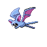

# Ravaged Path — Wild Pokémon

### Walking

| Sprite | Pokémon | Encounter Type | Level | Chance |
|:------:|---------|:--------------:|-------|--------|
|  | [Zubat](../../pokemon/zubat.md/) | {: style='max-width: 24px;' } | 6 - 8 | 30% |
|  | [Geodude](../../pokemon/geodude.md/) | {: style='max-width: 24px;' } | 6 - 8 | 20% |
|  | [Wooper](../../pokemon/wooper.md/) | {: style='max-width: 24px;' } | 6 - 8 | 20% |
|  | [Psyduck](../../pokemon/psyduck.md/) | {: style='max-width: 24px;' } | 6 - 8 | 10% |
|  | [Sandshrew](../../pokemon/sandshrew.md/) | {: style='max-width: 24px;' } | 6 - 8 | 10% |
|  | [Makuhita](../../pokemon/makuhita.md/) | {: style='max-width: 24px;' } | 6 - 8 | 10% |
|  | [Zubat](../../pokemon/zubat.md/) | {: style='max-width: 24px;' } | 6 - 8 | 30% |
|  | [Geodude](../../pokemon/geodude.md/) | {: style='max-width: 24px;' } | 6 - 8 | 20% |
|  | [Wooper](../../pokemon/wooper.md/) | {: style='max-width: 24px;' } | 6 - 8 | 20% |
|  | [Psyduck](../../pokemon/psyduck.md/) | {: style='max-width: 24px;' } | 6 - 8 | 10% |
|  | [Sandshrew](../../pokemon/sandshrew.md/) | {: style='max-width: 24px;' } | 6 - 8 | 10% |
|  | [Makuhita](../../pokemon/makuhita.md/) | {: style='max-width: 24px;' } | 6 - 8 | 10% |
|  | [Zubat](../../pokemon/zubat.md/) | {: style='max-width: 24px;' } | 6 - 8 | 30% |
|  | [Geodude](../../pokemon/geodude.md/) | {: style='max-width: 24px;' } | 6 - 8 | 20% |
|  | [Wooper](../../pokemon/wooper.md/) | {: style='max-width: 24px;' } | 6 - 8 | 20% |
|  | [Psyduck](../../pokemon/psyduck.md/) | {: style='max-width: 24px;' } | 6 - 8 | 10% |
|  | [Sandshrew](../../pokemon/sandshrew.md/) | {: style='max-width: 24px;' } | 6 - 8 | 10% |
|  | [Makuhita](../../pokemon/makuhita.md/) | {: style='max-width: 24px;' } | 6 - 8 | 10% |

### Surfing

| Sprite | Pokémon | Encounter Type | Level | Chance |
|:------:|---------|:--------------:|-------|--------|
|  | [Wooper](../../pokemon/wooper.md/) | {: style='max-width: 24px;' } | 20 - 40 | 90% |
|  | [Quagsire](../../pokemon/quagsire.md/) | {: style='max-width: 24px;' } | 20 - 40 | 10% |

### Fishing

| Sprite | Pokémon | Encounter Type | Level | Chance |
|:------:|---------|:--------------:|-------|--------|
|  | [Magikarp](../../pokemon/magikarp.md/) | {: style='max-width: 24px;' } | 10 | 65% |
|  | [Barboach](../../pokemon/barboach.md/) | {: style='max-width: 24px;' } | 10 | 35% |
|  | [Magikarp](../../pokemon/magikarp.md/) | {: style='max-width: 24px;' } | 25 | 65% |
|  | [Barboach](../../pokemon/barboach.md/) | {: style='max-width: 24px;' } | 25 | 35% |
|  | [Gyarados](../../pokemon/gyarados.md/) | {: style='max-width: 24px;' } | 50 | 65% |
|  | [Whiscash](../../pokemon/whiscash.md/) | {: style='max-width: 24px;' } | 50 | 35% |

