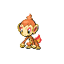
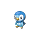
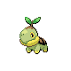

# Important Trainers

### PKMN Trainer Barry

=== "Turtwig"

	| Pokémon | Attributes | Item | Moves |
	|:-------:|------------|:----:|-------|
	|  | **Lv. 5** Chimchar **Ability:** Blaze **Nature:** ? | No Item | 1. Scratch 2. Leer 3. — 4. — |
	
=== "Chimchar"

	| Pokémon | Attributes | Item | Moves |
	|:-------:|------------|:----:|-------|
	|  | **Lv. 5** Piplup **Ability:** Torrent **Nature:** ? | No Item | 1. Pound 2. Growl 3. — 4. — |
	
=== "Piplup"

	| Pokémon | Attributes | Item | Moves |
	|:-------:|------------|:----:|-------|
	|  | **Lv. 5** Turtwig **Ability:** Overgrow **Nature:** ? | No Item | 1. Tackle 2. Withdraw 3. — 4. — |
	
