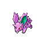

### Walking

| Sprite | Pokémon | Encounter Type | Level | Chance |
|:------:|---------|:--------------:|-------|--------|
|  | Starly | {: style='max-width: 24px;' } | 4 - 5 | 30% |
|  | Bidoof | {: style='max-width: 24px;' } | 4 - 5 | 30% |
|  | Pidgey | {: style='max-width: 24px;' } | 4 - 5 | 10% |
|  | Kricketot | {: style='max-width: 24px;' } | 4 - 5 | 10% |
|  | Nidoran M | {: style='max-width: 24px;' } | 4 - 5 | 10% |
|  | Nidoran F | {: style='max-width: 24px;' } | 4 - 5 | 10% |
|  | Starly | {: style='max-width: 24px;' } | 4 - 5 | 30% |
|  | Bidoof | {: style='max-width: 24px;' } | 4 - 5 | 30% |
|  | Pidgey | {: style='max-width: 24px;' } | 4 - 5 | 20% |
|  | Nidoran M | {: style='max-width: 24px;' } | 4 - 5 | 10% |
|  | Nidoran F | {: style='max-width: 24px;' } | 4 - 5 | 10% |
|  | Starly | {: style='max-width: 24px;' } | 4 - 5 | 30% |
|  | Bidoof | {: style='max-width: 24px;' } | 4 - 5 | 30% |
|  | Hoothoot | {: style='max-width: 24px;' } | 4 - 5 | 10% |
|  | Kricketot | {: style='max-width: 24px;' } | 4 - 5 | 10% |
|  | Nidoran M | {: style='max-width: 24px;' } | 4 - 5 | 10% |
|  | Nidoran F | {: style='max-width: 24px;' } | 4 - 5 | 10% |
|  | Doduo | {: style='max-width: 24px;' } | 4 - 5 | 22% |

